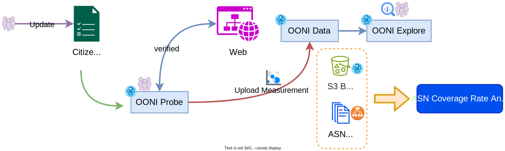

# ASN Coverage - OONI 觀測資料與 ASN 涵蓋率分析

> 分析 OONI 測量資料在各區域 ASN 的涵蓋狀況，協助識別測量盲點



ASN Coverage 是 Anoni.net 專案的資料分析工具，用於解析 OONI（Open Observatory of Network Interference）觀測資料與各區域已知的 [ASN（自治系統編號）](https://www.cloudflare.com/zh-tw/learning/network-layer/what-is-an-autonomous-system/) 涵蓋狀況，評估測量資料是否平均分散在不同電信商與網路架構中。

## 🎯 專案目標

- **資料涵蓋分析**: 評估 OONI 測量在各區域 ASN 的分布情況
- **盲點識別**: 發現測量不足的網路區域與電信商
- **歷史追蹤**: 回溯歷史資料，分析涵蓋率變化趨勢
- **資料視覺化**: 產生 CSV 格式報告，支援後續圖表製作

## 📊 研究方法

1. **資料採集**: 從 OONI AWS S3 公開資料集下載指定時間與地區的測量資料
2. **ASN 統計**: 統計每個 ASN 的測量次數與網路類型分布
3. **資料比對**: 與 RIPE 全球 ASN 列表進行比對，識別缺失的網路
4. **報告生成**: 輸出 CSV 格式分析報告，支援時間序列分析

## 🛠️ 工具組成

### ooni.py - OONI 資料分析工具

從 OONI AWS S3 下載並分析測量資料的主要工具。

**主要命令：**

- `lookback` - 回溯最近 N 個時間單位的資料
- `span` - 分析指定時間區間的資料
- `sheetrow` - 將原始資料轉換為易讀的行格式

### ripe.py - ASN 資訊工具

從 RIPE NCC 獲取全球 ASN 資訊。

**主要命令：**

- `list` - 列出指定地區的 ASN
- `save` - 儲存 ASN 列表到 CSV 檔案

## 🚀 快速開始

### 環境需求

- **Python**: 3.12+
- **套件管理**: uv
- **網路**: 可存取 AWS S3 與 RIPE FTP

### 安裝

```bash
cd asn_coverage
uv sync
```

### 基本使用

#### 1. 回溯最近的測量資料

回溯最近 36 小時的台灣（TW）測量資料：

```bash
uv run python ooni.py lookback --units=36 --loc=TW --frame=hours
```

**參數說明：**
- `--units`: 回溯的時間單位數量（預設：36）
- `--loc`: 地區代碼（例如：TW, JP, KR, HK）
- `--frame`: 時間單位（hours, days, weeks, months）

**輸出檔案：**
```
lookback_TW_20260208_36_hours.csv
```

#### 2. 分析指定時間區間

分析 2025 年 1 月的台灣測量資料：

```bash
uv run python ooni.py span --start=2025/01/01 --end=2025/01/31 --loc=TW --chunk=40
```

**參數說明：**
- `--start`: 開始日期（格式：YYYY/MM/DD）
- `--end`: 結束日期（格式：YYYY/MM/DD）
- `--loc`: 地區代碼
- `--chunk`: 平行處理的批次大小（預設：40）

**輸出檔案：**
```
span_TW_20250101_20250131.csv
```

#### 3. 轉換為行格式

將原始 CSV 轉換為更易分析的行格式：

```bash
uv run python ooni.py sheetrow --path=./lookback_TW_20260208_36_hours.csv
```

**輸出檔案：**
```
rows_lookback_TW_20260208_36_hours.csv
```

**行格式範例：**
```csv
loc,date,hour,asn,count
TW,2026/02/08,00,AS3462,150
TW,2026/02/08,00,AS9924,89
TW,2026/02/08,01,AS3462,142
```

#### 4. 獲取 ASN 資訊

列出台灣的 ASN：

```bash
uv run python ripe.py list --loc=TW
```

儲存到 CSV 檔案：

```bash
uv run python ripe.py save --loc=TW
```

**輸出檔案：**
```
asns_20260208T12.csv
```

## 📁 專案結構

```
asn_coverage/
├── ooni.py           # OONI 資料分析主程式
├── ripe.py           # RIPE ASN 資料工具
├── pyproject.toml    # 專案依賴設定
├── img/              # 圖片資源
│   └── ooni-asn.svg  # 資料流程圖
└── asn_datas/        # 資料輸出目錄
```

## 🔧 技術實作

### 資料來源

**OONI AWS S3 公開資料集：**
- Bucket: `ooni-data-eu-fra` (eu-central-1)
- 路徑格式: `raw/{YYYYMMDD}/{HH}/{COUNTRY}/webconnectivity/*.jsonl.gz`
- 參考文件:
  - [OONI Data Mining](https://ooni.org/post/mining-ooni-data)
  - [AWS Open Data Registry](https://registry.opendata.aws/ooni/)

**RIPE NCC ASN 資料：**
- URL: `https://ftp.ripe.net/ripe/asnames/asn.txt`
- 格式: 純文字，包含 ASN 編號、組織 ID、註冊商、國家代碼

### 核心技術

- **多執行緒處理**: 使用 Python Threading 平行下載與處理資料，提升效能
- **批次處理**: 支援 chunk 分批處理，避免記憶體溢出
- **進度顯示**: 即時顯示下載進度條
- **無簽章存取**: 使用 `signature_version=UNSIGNED` 存取 AWS 公開資料
- **GZIP 解壓**: 即時解壓 `.jsonl.gz` 檔案並解析 JSON

### 資料結構

**CSV 輸出格式（原始格式）：**
```csv
loc,date,hour,statistics
TW,2026/02/08,00,"{""counts"":{""AS3462"":150,""AS9924"":89},""network_type"":{""wifi"":120,""mobile"":119}}"
```

**CSV 輸出格式（行格式）：**
```csv
loc,date,hour,asn,count
TW,2026/02/08,00,AS3462,150
TW,2026/02/08,00,AS9924,89
```

**統計資訊包含：**
- `counts`: 每個 ASN 的測量次數
- `network_type`: 網路類型分布（wifi, mobile 等）

## 💡 使用案例

### 案例 1：評估地區涵蓋率

比較不同地區的 ASN 涵蓋情況：

```bash
# 收集台灣資料
uv run python ooni.py lookback --units=168 --loc=TW --frame=hours

# 收集日本資料
uv run python ooni.py lookback --units=168 --loc=JP --frame=hours

# 收集韓國資料
uv run python ooni.py lookback --units=168 --loc=KR --frame=hours
```

### 案例 2：長期趨勢分析

分析整個月份的資料變化：

```bash
uv run python ooni.py span --start=2026/01/01 --end=2026/01/31 --loc=TW --chunk=50
```

### 案例 3：識別測量盲點

1. 獲取地區所有 ASN 列表
2. 收集 OONI 測量資料
3. 比對找出測量次數為 0 或過低的 ASN

```bash
# 取得台灣 ASN 列表
uv run python ripe.py save --loc=TW

# 收集測量資料
uv run python ooni.py lookback --units=720 --loc=TW --frame=hours

# 轉換為行格式便於分析
uv run python ooni.py sheetrow --path=./lookback_TW_*.csv
```

## ⚠️ 已知問題

1. **ASN 地區標籤不準確**
   - 例如：`AS38136` 註冊為 HK，但在 TW 測量資料中出現
   - 原因：某些 ISP 的 ASN 註冊地與實際服務地區不一致

2. **測量 UID 對應問題**
   - `measurement_uid` 目前無法直接對應到 S3 raw data
   - 建議使用 `report_id` 進行資料追蹤

3. **S3 存取工具限制**
   - 無法使用 `s3cmd` 存取公開 bucket
   - 建議使用本工具內建的 boto3 或 [s5cmd](https://github.com/peak/s5cmd)

## 📊 效能優化

- **平行下載**: 預設使用 5 個執行緒同時下載檔案
- **批次處理**: `span` 命令支援 `--chunk` 參數調整批次大小
- **記憶體管理**: 使用串流方式處理 GZIP 資料，避免一次載入整個檔案
- **進度追蹤**: 即時顯示下載進度，方便監控長時間任務

## 🔍 疑難排解

### 下載速度過慢

調整 boto3 的 timeout 設定（已內建於程式碼）：

```python
Config(
    connect_timeout=120,
    read_timeout=120,
)
```

### 記憶體不足

減少 `--chunk` 參數值：

```bash
uv run python ooni.py span --start=2026/01/01 --end=2026/01/31 --loc=TW --chunk=10
```

### 無法存取 S3

確認網路連線正常，程式已設定無簽章存取公開 bucket。

## 📝 開發指南

### 依賴套件

- `arrow`: 時間處理
- `boto3`: AWS S3 客戶端
- `click`: 命令列介面
- `orjson`: 高效能 JSON 解析
- `requests`: HTTP 請求

### 程式碼風格

- Python 版本：3.12+
- 使用 `autopep8` 和 `isort` 格式化程式碼

### 擴展開發

如需新增其他資料來源或分析功能，可參考：

- `OONIS3` 類別：S3 資料存取
- `count_asn()` 函數：ASN 統計邏輯
- `RIPEData` 類別：RIPE 資料獲取

## 📄 授權

Apache License 2.0 - 詳見 [LICENSE](LICENSE) 檔案

## 🔗 相關資源

- [OONI 官方網站](https://ooni.org/)
- [OONI Data Mining 指南](https://ooni.org/post/mining-ooni-data)
- [AWS OONI Open Data](https://registry.opendata.aws/ooni/)
- [RIPE NCC](https://www.ripe.net/)
- [ASN 介紹](https://www.cloudflare.com/zh-tw/learning/network-layer/what-is-an-autonomous-system/)

---

# ASN Coverage - OONI Measurement Data and ASN Coverage Analysis

> Analyze OONI measurement data coverage across regional ASNs to help identify measurement blind spots


ASN Coverage is a data analysis tool for the Anoni.net project, designed to parse OONI (Open Observatory of Network Interference) measurement data and analyze the coverage of known [ASNs (Autonomous System Numbers)](https://www.cloudflare.com/learning/network-layer/what-is-an-autonomous-system/) in various regions, assessing whether measurement data is evenly distributed across different ISPs and network infrastructures.

## 🎯 Project Goals

- **Coverage Analysis**: Assess the distribution of OONI measurements across regional ASNs
- **Blind Spot Identification**: Discover network regions and ISPs with insufficient measurements
- **Historical Tracking**: Review historical data to analyze coverage trends
- **Data Visualization**: Generate CSV format reports for subsequent chart creation

## 📊 Research Methodology

1. **Data Collection**: Download measurement data for specific times and regions from OONI AWS S3 public dataset
2. **ASN Statistics**: Count measurements per ASN and network type distribution
3. **Data Comparison**: Compare with RIPE global ASN list to identify missing networks
4. **Report Generation**: Output CSV format analysis reports supporting time series analysis

## 🛠️ Tool Components

### ooni.py - OONI Data Analysis Tool

Main tool for downloading and analyzing measurement data from OONI AWS S3.

**Main Commands:**

- `lookback` - Look back N time units of recent data
- `span` - Analyze data within a specified time range
- `sheetrow` - Convert raw data to readable row format

### ripe.py - ASN Information Tool

Retrieve global ASN information from RIPE NCC.

**Main Commands:**

- `list` - List ASNs for a specified region
- `save` - Save ASN list to CSV file

## 🚀 Quick Start

### Requirements

- **Python**: 3.12+
- **Package Manager**: uv
- **Network**: Access to AWS S3 and RIPE FTP

### Installation

```bash
cd asn_coverage
uv sync
```

### Basic Usage

#### 1. Look Back Recent Measurement Data

Look back 36 hours of Taiwan (TW) measurement data:

```bash
uv run python ooni.py lookback --units=36 --loc=TW --frame=hours
```

**Parameters:**
- `--units`: Number of time units to look back (default: 36)
- `--loc`: Region code (e.g., TW, JP, KR, HK)
- `--frame`: Time unit (hours, days, weeks, months)

**Output File:**
```
lookback_TW_20260208_36_hours.csv
```

#### 2. Analyze Specified Time Range

Analyze Taiwan measurement data for January 2025:

```bash
uv run python ooni.py span --start=2025/01/01 --end=2025/01/31 --loc=TW --chunk=40
```

**Parameters:**
- `--start`: Start date (format: YYYY/MM/DD)
- `--end`: End date (format: YYYY/MM/DD)
- `--loc`: Region code
- `--chunk`: Batch size for parallel processing (default: 40)

**Output File:**
```
span_TW_20250101_20250131.csv
```

#### 3. Convert to Row Format

Convert raw CSV to more analyzable row format:

```bash
uv run python ooni.py sheetrow --path=./lookback_TW_20260208_36_hours.csv
```

**Output File:**
```
rows_lookback_TW_20260208_36_hours.csv
```

**Row Format Example:**
```csv
loc,date,hour,asn,count
TW,2026/02/08,00,AS3462,150
TW,2026/02/08,00,AS9924,89
TW,2026/02/08,01,AS3462,142
```

#### 4. Retrieve ASN Information

List Taiwan ASNs:

```bash
uv run python ripe.py list --loc=TW
```

Save to CSV file:

```bash
uv run python ripe.py save --loc=TW
```

**Output File:**
```
asns_20260208T12.csv
```

## 📁 Project Structure

```
asn_coverage/
├── ooni.py           # OONI data analysis main program
├── ripe.py           # RIPE ASN data tool
├── pyproject.toml    # Project dependencies
├── img/              # Image resources
│   └── ooni-asn.svg  # Data flow diagram
└── asn_datas/        # Data output directory
```

## 🔧 Technical Implementation

### Data Sources

**OONI AWS S3 Public Dataset:**
- Bucket: `ooni-data-eu-fra` (eu-central-1)
- Path format: `raw/{YYYYMMDD}/{HH}/{COUNTRY}/webconnectivity/*.jsonl.gz`
- Reference documentation:
  - [OONI Data Mining](https://ooni.org/post/mining-ooni-data)
  - [AWS Open Data Registry](https://registry.opendata.aws/ooni/)

**RIPE NCC ASN Data:**
- URL: `https://ftp.ripe.net/ripe/asnames/asn.txt`
- Format: Plain text containing ASN number, organization ID, registrar, country code

### Core Technologies

- **Multi-threading**: Uses Python Threading for parallel download and processing to improve performance
- **Batch Processing**: Supports chunk-based processing to avoid memory overflow
- **Progress Display**: Real-time download progress bar
- **Unsigned Access**: Uses `signature_version=UNSIGNED` to access AWS public data
- **GZIP Decompression**: Real-time decompression of `.jsonl.gz` files and JSON parsing

### Data Structure

**CSV Output Format (Raw):**
```csv
loc,date,hour,statistics
TW,2026/02/08,00,"{""counts"":{""AS3462"":150,""AS9924"":89},""network_type"":{""wifi"":120,""mobile"":119}}"
```

**CSV Output Format (Row):**
```csv
loc,date,hour,asn,count
TW,2026/02/08,00,AS3462,150
TW,2026/02/08,00,AS9924,89
```

**Statistics Include:**
- `counts`: Number of measurements per ASN
- `network_type`: Network type distribution (wifi, mobile, etc.)

## 💡 Use Cases

### Case 1: Assess Regional Coverage

Compare ASN coverage across different regions:

```bash
# Collect Taiwan data
uv run python ooni.py lookback --units=168 --loc=TW --frame=hours

# Collect Japan data
uv run python ooni.py lookback --units=168 --loc=JP --frame=hours

# Collect Korea data
uv run python ooni.py lookback --units=168 --loc=KR --frame=hours
```

### Case 2: Long-term Trend Analysis

Analyze data changes over an entire month:

```bash
uv run python ooni.py span --start=2026/01/01 --end=2026/01/31 --loc=TW --chunk=50
```

### Case 3: Identify Measurement Blind Spots

1. Get list of all ASNs in region
2. Collect OONI measurement data
3. Compare to find ASNs with zero or low measurement counts

```bash
# Get Taiwan ASN list
uv run python ripe.py save --loc=TW

# Collect measurement data
uv run python ooni.py lookback --units=720 --loc=TW --frame=hours

# Convert to row format for easier analysis
uv run python ooni.py sheetrow --path=./lookback_TW_*.csv
```

## ⚠️ Known Issues

1. **Inaccurate ASN Region Labels**
   - Example: `AS38136` registered as HK but appears in TW measurement data
   - Reason: Some ISPs' ASN registration location differs from actual service region

2. **Measurement UID Mapping Issues**
   - `measurement_uid` cannot currently be directly mapped to S3 raw data
   - Recommend using `report_id` for data tracking

3. **S3 Access Tool Limitations**
   - Cannot use `s3cmd` to access public buckets
   - Recommend using built-in boto3 or [s5cmd](https://github.com/peak/s5cmd)

## 📊 Performance Optimization

- **Parallel Download**: Default uses 5 threads for simultaneous downloads
- **Batch Processing**: `span` command supports `--chunk` parameter to adjust batch size
- **Memory Management**: Uses streaming to process GZIP data, avoiding loading entire files
- **Progress Tracking**: Real-time download progress display for monitoring long-running tasks

## 🔍 Troubleshooting

### Slow Download Speed

Adjust boto3 timeout settings (already built into code):

```python
Config(
    connect_timeout=120,
    read_timeout=120,
)
```

### Insufficient Memory

Reduce `--chunk` parameter value:

```bash
uv run python ooni.py span --start=2026/01/01 --end=2026/01/31 --loc=TW --chunk=10
```

### Cannot Access S3

Verify network connection is normal; program is configured for unsigned access to public bucket.

## 📝 Development Guide

### Dependencies

- `arrow`: Time handling
- `boto3`: AWS S3 client
- `click`: Command-line interface
- `orjson`: High-performance JSON parsing
- `requests`: HTTP requests

### Code Style

- Python version: 3.12+
- Use `autopep8` and `isort` for code formatting

### Extension Development

For adding other data sources or analysis features, refer to:

- `OONIS3` class: S3 data access
- `count_asn()` function: ASN statistics logic
- `RIPEData` class: RIPE data retrieval

## 📄 License

Apache License 2.0 - See [LICENSE](LICENSE) file

## 🔗 Related Resources

- [OONI Official Website](https://ooni.org/)
- [OONI Data Mining Guide](https://ooni.org/post/mining-ooni-data)
- [AWS OONI Open Data](https://registry.opendata.aws/ooni/)
- [RIPE NCC](https://www.ripe.net/)
- [ASN Introduction](https://www.cloudflare.com/learning/network-layer/what-is-an-autonomous-system/)

---

**Copyright © 2023-2025 Anoni.net ASN Coverage Project**
