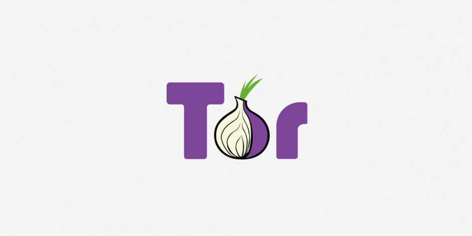

# Is Your Tor Browser Affected? CVE-2026-10702 and Firefox's Two Branches

{style="border-radius: 10px;"}

In late July 2026 several security outlets ran variations of the same headline: researchers had shown that visiting a single malicious web page could compromise Tor Browser.[^1] The CVE behind those headlines is CVE-2026-10702, a flaw in the JIT compiler of Firefox's JavaScript engine. The demo page published by the research team, Nebula Security, is specific about its target: a Firefox for Android 151.0 build (installer `fenix-151.0.multi.android-arm64-v8a.apk`) running on an ARM64 Android 17 device, with no mention of Tor Browser anywhere on the page.[^2] Their technical writeup, however, contains the line "We also used it to pwn Tor Browser". The claim about Tor Browser comes from the researchers themselves, and that writeup never says which version, which channel, or which platform.[^3]

Putting the sources side by side, Tor Browser stable is not affected. Stable is built on the Firefox ESR branch, and the code behind this flaw only landed in Firefox 147, so 140 ESR never carried it. No primary source shows this flaw being exploited in the wild either: the SSVC assessment that CISA added to the CVE record marks Exploitation as none.[^4]

!!! tip "First, check which build you have"

    If you downloaded Tor Browser from torproject.org and let it update itself, you are on stable and this flaw does not affect you. To read your version number, open the hamburger menu at the top right, choose Help, then About Tor Browser. The 15.0.x number is your Tor Browser version. Unless you deliberately downloaded a build labelled Alpha, you are on stable.

    The other number on that screen, 140.13.0esr, is the Firefox version underneath. That is the number that decides whether a Firefox CVE reaches you, and it is the one this post keeps coming back to.

<!-- more -->

## ESR and Rapid Release are two separate branches

Tor Browser stable follows Firefox ESR (Extended Support Release). The 15.0.x series is built on 140 ESR, and 15.0.19, released on 21 July 2026, moved that base to 140.13.0esr, with GeckoView on Android moving to the same base.[^5]

Tor Browser Alpha took a different path. In a December 2025 post, the Tor Project announced that the Alpha channel would follow Firefox Rapid Release starting with 16.0a1, and spelled out the trade-off: shipping upstream features to users quickly also means shipping upstream bugs to them quickly. The same post is blunt about who should stay away: "If you are an at-risk user, concerned about your privacy, or just need a reliably working web-browser, you SHOULD NOT use Tor Browser Alpha."[^6] The base actually changed with 16.0a6 on 7 May 2026, whose release notes state "Tor Browser Alphas are now based on Firefox's betas" and move the base to Firefox 150.0a1. Alphas before that were still built on ESR.[^7] On 23 July 2026, 16.0a9 moved back to ESR, this time Firefox 153.0esr, in preparation for the next stable series.[^8]

Mozilla fixed the flaw in Firefox 151.0.3, released on 2 June 2026.[^9] When the code arrived in Firefox is a matter of public record: Bugzilla `1995077` ("Replace Object.keys with specialized iterator in Scalar Replacement") has a target milestone of 147 Branch and `firefox147` marked fixed, while the esr140 tracking field is empty.[^10] The ESR advisory from the same period, MFSA-2026-58 (Firefox ESR 140.12, 16 June), lists 28 CVEs and this is not one of them.[^11] Red Hat's CSAF VEX document marks the firefox packages across RHEL 6 through 10 as `known_not_affected`, and what RHEL ships is the ESR build.[^12] Three independent lines of evidence point the same way: the 140 ESR branch never carried this code. Laid out by target:

| Target | Firefox base | Affected? | What to do |
|---|---|---|---|
| Not sure which build you have | Almost certainly stable, 140 ESR | Not affected | Let it finish updating, then confirm on the About screen |
| Tor Browser 15.0.x stable | 140 ESR | Not affected | Stay on the latest release |
| Tor Browser for Android stable | GeckoView 140.13.0esr | Not affected | Stay on the latest release |
| Tor Browser Alpha 16.0a6 (2026-05-07) | Firefox 150.0a1 | Affected | Move to 16.0a8 or later, or switch back to stable |
| Tor Browser Alpha 16.0a7 (2026-06-03) | Firefox 151.0a1 | Affected | Move to 16.0a8 or later, or switch back to stable |
| Tor Browser Alpha 16.0a8 (2026-07-02) | Firefox 152.0a1 | Not affected | Stay on the latest release |
| Tor Browser Alpha 16.0a9 onwards (2026-07-23) | Firefox 153.0esr | Not affected | Stay on the latest release |
| Firefox desktop and Android, general | Rapid Release, 151.0.2 and earlier | Affected | Update to 151.0.3 or later |
| Tor Browser inside Tails | Tails 7.10 ships 15.0.19 | Not affected | Update with Tails |

Both 16.0a6 and 16.0a7 sit on bases that predate 151.0.3, so this post treats both as affected. Every verdict in the table is inferred from the Firefox base, because the Tor Project has never published a per-version statement about this CVE. The Tails row follows the Tails 7.10 release notes, which ship Tor Browser 15.0.19.[^13]

## A three-step method

The next time you see a Firefox CVE number, work through these three checks. In most cases they are enough to reach a verdict on your own. The first two are cross-checks. If you would rather not dig through vulnerability databases, skip to step three.

**Step one: check whether Mozilla published an ESR advisory at the same time.** Mozilla issues separate MFSA numbers for the ESR branch. Here, MFSA-2026-54 covers only the two CVEs fixed in Firefox 151.0.3, and the ESR advisory from the same period, MFSA-2026-58, does not include this one. A rule of thumb worth remembering: for a Firefox CVE, Tor Browser stable is usually only a concern when Mozilla ships an ESR advisory alongside it.

**Step two: check Red Hat's VEX data.** RHEL ships the ESR build of Firefox, so Red Hat's verdict on a given CVE is effectively a verdict on the ESR branch. Here their CSAF VEX document marks the firefox packages across RHEL 6 through 10 as `known_not_affected`. With some luck the Mozilla Bugzilla entry is public too. In this case `1995077` shows exactly which branch the code landed on.

**Step three: check the Firefox base of the Tor Browser build you are running.** For Firefox security updates, Tor Browser release notes do not enumerate individual CVEs; they only say "includes important security updates to Firefox", so you have to work backwards from the base version. Our [Tor changelog](../../changelog/tor.md) tracks the Firefox base for recent releases on both the stable and Alpha channels. The English version currently goes back to 15.0.15 and 16.0a7, with older entries available only in the traditional Chinese version. Anything earlier means going to the upstream release notes.

**Do not stop at the CVSS score.** The same flaw is scored very differently across databases: on the NVD page, CISA-ADP gives it CVSS 3.1 4.3 (Medium), Red Hat gives 7.5 (High), and Mozilla rates it high.[^14] The gap comes from what CVSS measures. It scores a single flaw in isolation, and code execution inside the renderer looks limited on its own because the sandbox still stands. What makes this flaw matter is that it is the first stage of a complete chain, which is what the next two sections take apart.

## Root cause: the compiler was misled by its own annotation

A JIT (Just-In-Time) compiler turns repeatedly executed JavaScript into machine code, making hot paths run tens of times faster than line-by-line interpretation. To do that well, the compiler needs to know whether each operation can modify memory. If an operation only reads, the compiler can safely skip a later load from the same location and reuse the value it already has.

Picture a warehouse where the manifest notes that a particular visitor will only count stock and will not move anything. That visitor in fact moves an entire rack to a new location and dismantles the old one. Everyone downstream reads the manifest, concludes that nothing has changed, and goes to the original address for their goods. The rack is gone, and someone else's crates may already be stacked in its place.

In SpiderMonkey, Firefox's JavaScript engine, the `MObjectToIterator` operation was annotated as read-only when `skipRegistration` was set. That annotation did not match its behaviour: while resolving a lazy property, the operation can allocate a new dynamic slots buffer and free the old one.

The optimisation stage that runs next is global value numbering, whose job is to find and eliminate redundant computation. Reading an annotation that said nothing had changed, it concluded that the later load of the slots pointer was redundant and reused the earlier pointer, which by then referred to freed memory. The generated machine code therefore read and wrote memory through a dangling pointer, giving an attacker an arbitrary read and write primitive and code execution inside the renderer process. Global value numbering belongs to the IonMonkey optimisation pipeline; the chain is called IonStack, and the researchers never explained the name.

At this point the attacker's code is still confined to the renderer sandbox. Reaching your files and everything else takes a second flaw.

Mozilla's fix removed the alias set that branched on `skipRegistration`, so the operation is always treated as one that can modify memory. The advisory is MFSA-2026-54, rated high, crediting Nebula Security. The flaw is classified under both CWE-843 (type confusion) and CWE-733 (compiler optimisation removal or modification of security-critical code); the latter is a precise description of a bug that lives in an optimisation decision. Bugzilla `2040903` is still access-restricted, so the account above of the mechanism and the fix comes from the researchers' public writeup.[^3]

## The IonStack chain: from browser to root

The researchers place this flaw at the first stage of a chain: it provides code execution inside the browser's renderer sandbox, and a second stage breaks out of that sandbox to take over the device. Together they are called IonStack, demonstrated on an ARM64 Android 17 device.

The second stage is CVE-2026-43499, known as GhostLock, in the futex priority inheritance code of the Linux kernel, the machinery behind glibc's `PTHREAD_PRIO_INHERIT` mutexes. When a lock operation fails and unwinds, the cleanup path clears the wrong side's record, and the waiting task returns to userspace still holding a pointer into its own kernel stack. That stack memory is then reused by something else, and a later walk of the priority chain lands on freed stack, a use-after-free. The researchers call it a stack-UAF and note that bugs of this class usually live on the heap, making the kernel stack an unusual place to find one.[^15]

This stage attacks your operating system, not your browser. The affected file is `kernel/locking/rtmutex.c`, the bug has been present since Linux 2.6.39 in 2011 through v7.1-rc1, and mainline fixed it in 7.1.[^16] The only condition is a kernel built with `CONFIG_FUTEX_PI`, which in practice every distribution enables, so treat everything as affected. On Google's kernelCTF x86 target (lts-6.12.80, with `RANDOMIZE_KSTACK_OFFSET` off), the exploit goes from unprivileged code to root in roughly five seconds at about 97% reliability, and works from inside a container running a standard kernel. Upstream received the report on 18 April, fixed it on 20 April, backported on 4 May, and the research went public on 7 July. A crash introduced by the first fix was briefly assigned CVE-2026-53166, fixed on 2 June, and that identifier was later withdrawn by the Linux CNA on 10 July.[^17]

As long as the kernel goes unpatched, any future browser flaw that yields code execution in a renderer can be chained onto the same escalation. Fixing the browser only closes this particular entry point.

## What to do now

**Update Tor Browser to the current release.** Leave the browser open and let it update itself, or download it again from torproject.org. This flaw does not reach stable, but 15.0.19 still carries other security fixes backported from Firefox 153.

**Update regular Firefox to 151.0.3 or later.** Both desktop and Android.

**Do not use the Alpha channel as a daily browser.** That is the Tor Project's own advice, and this is a good illustration of why.

**Setting the Security Level to Safer or Safest blocks this entire class of JIT flaw.** Both levels turn off `javascript.options.ion` and `javascript.options.baselinejit`, which disables the JIT outright and removes any chance of triggering a compiler-level defect.[^18] To change it, click the shield icon next to the address bar, choose Change, then pick a level. You do not need to touch `about:config`. Know the cost first: Safer disables JavaScript on HTTP sites along with some fonts, and Safest disables JavaScript by default on all sites, which means some forms will not submit. Our [Tor Browser advanced settings](../../tools/tor-browser-advanced.md) page covers the trade-offs in more detail.

**After changing the Security Level, close every Tor Browser window and start it again.** The Tor Project's own security levels page never mentions the JIT, listing only the changes to JavaScript, fonts and media, so official documentation alone will not tell you this. In May 2025, Privacy Guides tested Tor Browser 14.5.1 and found the JIT still running when the browser had not been restarted, even though the interface already showed Safer.[^19] Tor Browser 15.x on desktop has since fixed that silent failure and prompts for a restart when you switch levels (tor-browser issue `43783`); the equivalent integration on Android only landed for 16.0. The principle is unchanged: change the level, then restart.

**On Windows and macOS, the steps above are all you need.** The second stage of the chain is a Linux kernel flaw and does not apply to either platform.

**On Linux desktops, update the kernel and reboot.** A kernel update does nothing until you reboot, and that is the step people skip. Afterwards, run `uname -r` to confirm what is actually running, and check your distribution's advisory status for CVE-2026-43499 rather than assuming it has been handled. Build-time mitigations such as `CONFIG_STATIC_USERMODE_HELPER` require recompiling the kernel and are out of reach for ordinary desktop users. If you run your own servers or relays, consider the `randomize_kstack_offset=on` boot parameter, which only works if your distribution's kernel was built with `CONFIG_RANDOMIZE_KSTACK_OFFSET`. It adds roughly five bits of guessing cost, so treat it as delay rather than a fix.

**On Android, you are waiting on your device vendor.** There is no user-side remedy for a kernel-level escalation, and when the update arrives depends on the vendor and the carrier.

## A CVE number alone cannot tell you the blast radius

Once one codebase is split across two release lines, those lines are two different bodies of code. This flaw's code only landed in Firefox 147, so the 140 ESR branch that stable follows never had it, while the Alpha channel that follows the rapid line did. That is the question the three-step method answers: did Mozilla publish an ESR advisory, what did Red Hat say about the ESR packages, and what Firefox base is under the build in your hands.

The claim that Tor Browser was compromised comes from the researchers themselves. They did not name a version or a channel, and the headlines did not add that distinction. A reader is left with a CVE number and an unversioned claim, and everything after that is their own to check. The next time a headline like this appears, start by asking which branch it is talking about.

## What this post could not establish

- The researchers never say which Tor Browser build they compromised. "We also used it to pwn Tor Browser" in IonStack Part I is the whole of it, with no version, channel or platform, and neither the demo page nor the press coverage adds any. That leaves open the possibility that it was an Alpha build, and it leaves other possibilities open too.
- The Firefox bases of Tor Browser 16.0a6 and 16.0a7 predate the 151.0.3 fix, which is why this post lists them as affected. Those builds are no longer on the dist directory, so the binaries cannot be checked for the fix.
- Which channel the Tor Browser inside Whonix follows could not be established from any official page, so Whonix is not in the table above. The Whonix documentation only recommends using the stable release.
- The Tor Project has published no statement of any kind about this CVE.
- Bugzilla `2040903` is access-restricted, so the original patch could not be read.

## Glossary

| Term | Meaning |
|---|---|
| JIT (Just-In-Time) | Compiling frequently executed code to machine code at runtime for speed |
| SpiderMonkey | Firefox's JavaScript engine |
| IonMonkey, Warp | SpiderMonkey's optimising compiler pipeline; Warp is the front end, IonMonkey handles later optimisation and code generation |
| global value numbering | An optimisation stage that finds and eliminates redundant computation |
| lazy property | An object property that is only materialised when something accesses it |
| dynamic slots | The dynamically sized storage for an object's property values, reallocated when it runs out of room |
| dangling pointer | A pointer to memory that has already been freed |
| use-after-free | Using memory after it has been freed, a common exploitable bug class |
| stack-UAF | A use-after-free where the freed memory lives on the kernel stack rather than the heap |
| type confusion | Treating data of one type as if it were another |
| renderer process | The browser process that parses and draws page content, confined by a sandbox |
| privilege escalation | Gaining higher privileges than you started with |
| ESR (Extended Support Release) | Firefox's long-lived branch: slow feature changes, long security support |
| Rapid Release | Firefox's fast-moving channel, roughly one version every four weeks as of July 2026 |
| channel | A distinct release line of the same software, such as stable versus Alpha |
| rebase | Moving Tor Browser onto a newer Firefox version as its base |
| backport | Porting a newer fix back onto an older maintenance branch |
| futex | Fast userspace mutex, the Linux userspace locking primitive |
| priority inheritance | A locking mechanism that stops high-priority work from being blocked behind low-priority work |
| CWE | The classification scheme for what kind of defect a flaw is |
| CVSS | A scoring system that rates severity from 0 to 10 |
| SSVC | Another vulnerability assessment framework; CISA uses it to record fields such as whether exploitation has been observed |
| VEX | Vulnerability Exploitability eXchange, how vendors state whether their products are affected by a CVE |
| MFSA | Mozilla Foundation Security Advisory, Mozilla's advisory identifier |

## Related reading

- [Tor Browser advanced settings](../../tools/tor-browser-advanced.md)
- [Tor changelog](../../changelog/tor.md)
- [Tails vs Whonix vs Qubes](../../tools/tails-vs-whonix-vs-qubes.md)
- [Building a threat model](../../basics/threat-model.md)

[^1]: [Researchers Show a Single Malicious Webpage Visit Can Compromise Tor Browser, The Hacker News 2026-07](https://thehackernews.com/2026/07/researchers-show-single-malicious.html){target="_blank"}
[^2]: [IonStack demo page, Nebula Security](https://rootme.nebusec.io/){target="_blank"}
[^3]: [IonStack Part I: CVE-2026-10702, Nebula Security](https://nebusec.ai/research/ionstack-part-1-cve-2026-10702/){target="_blank"}
[^4]: [CVE-2026-10702 record, including CISA-ADP's SSVC assessment, CVE Program](https://cveawg.mitre.org/api/cve/CVE-2026-10702){target="_blank"}
[^5]: [New Release: Tor Browser 15.0.19, The Tor Project 2026-07-21](https://blog.torproject.org/new-release-tor-browser-15019/){target="_blank"}
[^6]: [The Future of Tor Browser Alpha, The Tor Project 2025-12-01](https://blog.torproject.org/future-of-tor-browser-alpha/){target="_blank"}
[^7]: [New Alpha Release: Tor Browser 16.0a6, The Tor Project 2026-05-07](https://blog.torproject.org/new-alpha-release-tor-browser-160a6/){target="_blank"}
[^8]: [New Alpha Release: Tor Browser 16.0a9, The Tor Project 2026-07-23](https://blog.torproject.org/new-alpha-release-tor-browser-160a9/){target="_blank"}
[^9]: [Security Vulnerabilities fixed in Firefox 151.0.3 (MFSA-2026-54), Mozilla](https://www.mozilla.org/en-US/security/advisories/mfsa2026-54/){target="_blank"}
[^10]: [Bug 1995077: Replace Object.keys with specialized iterator in Scalar Replacement, Mozilla Bugzilla](https://bugzilla.mozilla.org/show_bug.cgi?id=1995077){target="_blank"}
[^11]: [Security Vulnerabilities fixed in Firefox ESR 140.12 (MFSA-2026-58), Mozilla](https://www.mozilla.org/en-US/security/advisories/mfsa2026-58/){target="_blank"}
[^12]: [CVE-2026-10702 CSAF VEX, Red Hat](https://security.access.redhat.com/data/csaf/v2/vex/2026/cve-2026-10702.json){target="_blank"}
[^13]: [Tails 7.10, Tails 2026-07-23](https://blog.torproject.org/new-release-tails-7_10/){target="_blank"}
[^14]: [NVD - CVE-2026-10702](https://nvd.nist.gov/vuln/detail/CVE-2026-10702){target="_blank"}
[^15]: [IonStack Part II: GhostLock, Nebula Security](https://nebusec.ai/research/ionstack-part-2/){target="_blank"}
[^16]: [CVE-2026-43499, Linux kernel CNA](https://git.kernel.org/pub/scm/linux/security/vulns.git/plain/cve/published/2026/CVE-2026-43499.mbox){target="_blank"}
[^17]: [CVE-2026-53166, withdrawn, CVE Program](https://cveawg.mitre.org/api/cve/CVE-2026-53166){target="_blank"}
[^18]: [SecurityLevel.sys.mjs, Tor Browser 15.0.19 source, The Tor Project](https://gitlab.torproject.org/tpo/applications/tor-browser/-/blob/tor-browser-140.13.0esr-15.0-1-build2/toolkit/components/securitylevel/SecurityLevel.sys.mjs){target="_blank"}
[^19]: [A Flaw With the Security Level Slider in Tor Browser, Privacy Guides 2025-05-02](https://www.privacyguides.org/articles/2025/05/02/tor-security-slider-flaw/){target="_blank"}
