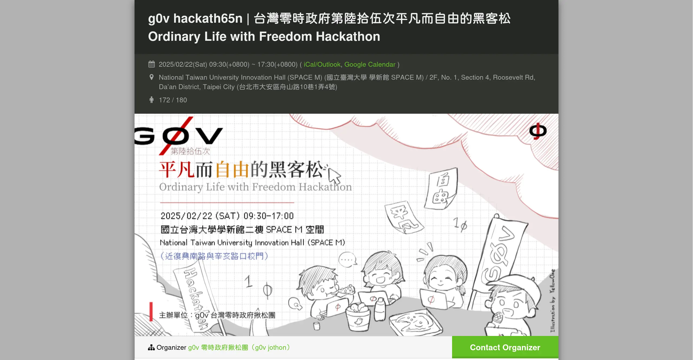

# Project proposals at g0v Hackath65n, the 65th g0v hackathon

Alongside [the workshop on 23 February](./rightscon25-pre-event.md){target="_blank"}, we have also signed up for [g0v Hackath65n](https://jothon.g0v.tw/){target="_blank"}, the 65th hackathon run by g0v, on the day before. Our proposal there starts the 2025 OONI research goals.

There were still a few places left at the time of writing. If our projects interest you and you would like to contribute, come and join us on the day, whatever your background or field.

- **When**: Saturday 22 February 2025, 09:30 to 17:30 (UTC+8)
- **Where**: SPACE M, Sinsheng Building, National Taiwan University

!!! info "About g0v"

    g0v (pronounced "gov zero") is a decentralized civic tech community in Taiwan, formed in 2012, which runs a hackathon roughly every two months. Projects are proposed and worked on openly by whoever turns up, with no membership and no organizational hierarchy. Several widely used Taiwanese civic tech tools started there.

<!-- more -->

## What we want to move forward

Three projects on the day:

1. [Updating the OONI website testing list](../../regional/ooni-checklist.md)
2. [ASN observation data analysis](../../regional/ooni-asn-coverage.md)
3. [Localization and terminology review](../../community/i18n.md)

### Updating the OONI website testing list

The list has not been substantially updated since 2017. Alongside continuing to update it, we plan to work on **establishing and adding** the URLs that should be under observation. What the inclusion criteria should be, and how to automate the maintenance, are questions we want to think through together on the day.

[:material-arrow-right-circle-outline: Background on this project](../../regional/ooni-checklist.md){ .md-button target="_blank" }

### ASN observation data analysis

Given that OONI's observation data for Taiwan lacks diversity, how do we monitor the quality of that data continuously? Can a quantitative indicator capture the state of it quickly? And how do we build that? At the hackathon we will work through the data pipeline architecture and the automated analysis. We also need to think about how to get more people contributing OONI observations in the first place.

[:material-arrow-right-circle-outline: Where this project currently stands](../../regional/ooni-asn-coverage.md){ .md-button target="_blank" }

### Localization and terminology review

Our annual terminology alignment is due. The existing Traditional Chinese translations contain terms that are used inconsistently or read awkwardly, and this is the moment to go through them and bring them into line with how people here actually write.

[:material-arrow-right-circle-outline: The full list of products we translate](../../community/i18n.md){ .md-button target="_blank" }

## :fontawesome-regular-circle-question: Related

- [:fontawesome-regular-circle-question: What is OONI?](../../tools/what-is-ooni.md)
- [:fontawesome-regular-circle-question: Why networked freedom matters](../../basics/internet-freedom.md)
- [:octicons-mark-github-24: Development environment setup](../../community/setup-repo.md)

