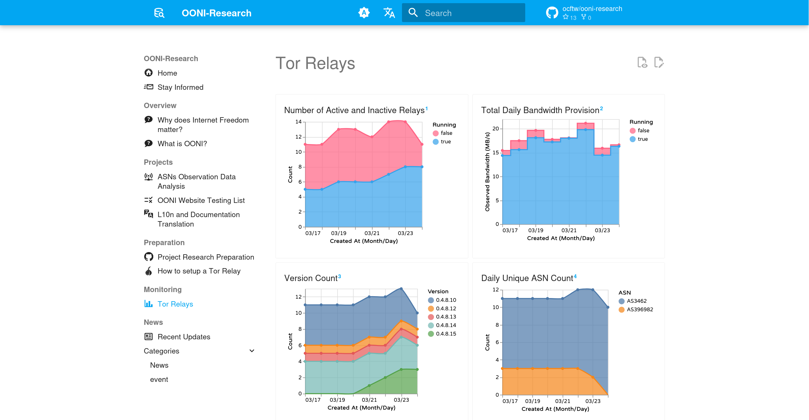

# 2025/03 Project Status and Updates

Time flies, and March is almost over! The first quarter of 2025 is also coming to an end. Let's review the current progress and some achievements of the project. In this update, we will mention the follow-up plans after the workshop, the OONI team's release of the implementation concept of 'anonymous credentials,' the current translation achievements of the project, and the establishment of the Tor Relays observation station!

<!-- more -->

## After Workshop

{style="border-radius: 5px; border: 1px solid #cdcdcd;"}

RightsCon 2025 was successfully held in the last week of February. The day before the event, we [organized](./rightscon25-pre-event.md){target="_blank"} a workshop with the Tor/Tails and OONI teams, attracting over 300 participants. It was somewhat surprising to have such a large number of registrations, and we appreciate the support from the Tor/Tails and OONI teams. We also thank the volunteers and other partners from the Open Culture Foundation for their support in assisting RightsCon, providing us with strong support despite the shortage of manpower.

After the event, we compiled a summary article and presentation collection from this workshop and lecture. Whether you participated on the day or wish to review the event's content, you can refer to the contents of [this article](./rightscon25-tor-tails-ooni-after.md){target="_blank"}.

### Continuation of the Workshop

In this event, participants in the Tor/Tails and OONI workshop gained a preliminary understanding of issues related to 'internet freedom' and 'anonymous networks.' They also engaged in hands-on practice with tools to enhance their security and privacy defenses. After the event, we received valuable feedback and suggestions regarding the workshop arrangements. As a result, we have decided to apply for a workshop session at this year's COSCUP to continue promoting these topics, adjusting them to better align with Taiwan's local context and language.

COSCUP is scheduled to be held on August 9th and 10th at National Taiwan University of Science and Technology. We plan to host a workshop on one of those days. Before August, we need to adjust our presentations and materials to include content in Mandarin and Taiwanese terminology. Additionally, we need to start recruiting team members to prepare for the workshop and train workshop assistants. If you are interested in the workshop, please remember to contact us. We anticipate starting the preparations in the second week of April.

## Anonymous Credentials

Recently, we translated an article from the OONI team that discusses their plans to improve and enhance the verification of anonymously submitted data. This includes ways to advance privacy and data credibility while combating the impact of malicious, false data submissions on the overall database. If you're interested, you can [read the article](https://ooni-research.ocf.tw/docs/blog/2025/03/2025-probe-security-without-identification/){target="_blank"}.

The article provides a literature review of the relevant field and outlines the future implementation process of 'anonymous credentials' by the OONI team. The content is somewhat technical and might be challenging to read, but we highly recommend spending some time to understand it, or feel free to discuss and share your suggestions with us!

This concept might relate to the same field as the [digital wallets](https://wallet.gov.tw/){target="_blank"} recently promoted by the Ministry of Digital Affairs!

## Translated Articles

In addition to the previously mentioned article about 'anonymous credentials,' we will also translate other significant articles released by Tor, Tails, and OONI. For example, did you know that Tor plans to implement using Rust? The project is named Arti. Tor was originally constructed using the C programming language, but C requires careful handling of memory operations, which, if not managed well, can lead to security issues. Therefore, they have decided to use Rust to develop a more secure Tor application. The Arti project is currently in the process of gradually implementing the functionalities of the C-based Tor. If you're interested, you can refer to this already [translated article](https://ooni-research.ocf.tw/docs/blog/2025/03/arti_1_4_1_released/){target="_blank"}.

{style="border-radius: 5px;"}

Additionally, we are currently translating a project website for the [Tor University Challenge](https://toruniversity.eff.org/){target="_blank"}, a collaborative initiative by [EFF](https://www.eff.org/){target="_blank"} and Tor. We hope to complete this translation by the end of March, and we will provide more detailed information at that time.

## Tor Relays Observation Station

{style="border:1px solid #cdcdcd; border-radius: 5px;"}

A Tor Relays observation station has been added to the project page. This page is primarily for observing the number and operational status of Tor Relays in Taiwan. The official Tor website provides a [Tor Metrics](https://metrics.torproject.org/){target="_blank"} query site, from which we retrieve recorded information hourly and transform it into easily readable charts. This helps create a more compelling narrative when promoting the project.

Currently, this page is still under development and testing, and we cannot guarantee it will operate 24/7 (we are working on solving stability issues XD). The development code has not yet been merged into the main branch. Interested partners can refer to the '[pulse](https://github.com/ocftw/ooni-research/compare/main...pulse?expand=1){target="_blank"}' and '[api](https://github.com/ocftw/ooni-research/compare/main...api?expand=1){target="_blank"}' branches, or you can freely experiment on the [API documentation page](https://ooni-research.ocf.tw/api/docs){target="_blank"}. We are using Python's [FastAPI](https://fastapi.tiangolo.com/){target="_blank"} and [Pydantic](https://docs.pydantic.dev/latest/){target="_blank"} as the development framework.

Of course, we are also looking for partners familiar with processing large volumes of data. If interested, please feel free to contact us directly!

## Lastly

The above outlines the current progress of this project. We will continue to translate important articles, import observation data from Tor and OONI, and prepare for the workshop activities in August. We welcome you to keep following us or subscribe to updates from [this page](../index.md){target="_blank"} via RSS.
