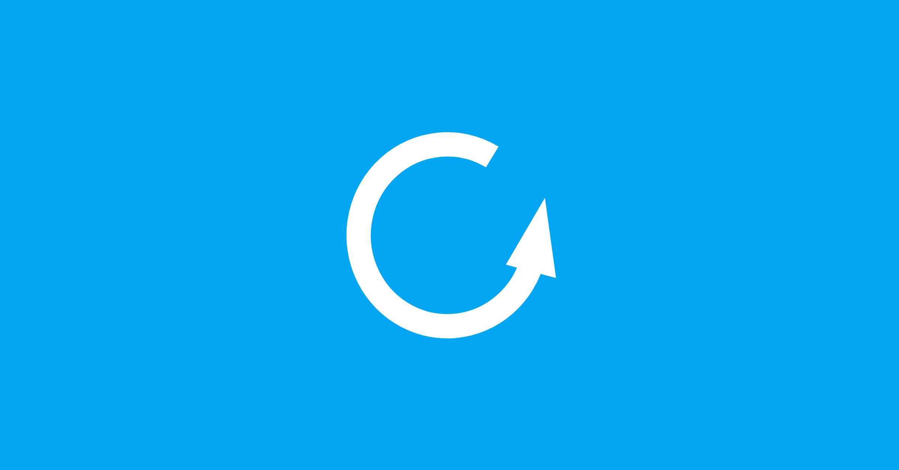

# 2026/03 Community Update

{style="border-radius: 10px;box-shadow:1px 1px 0.6rem #00aeff;"}

We're excited to share that the Tor Project invited us to contribute a guest blog post about our experience running a Tor relay on a university network in Taiwan. You can read the full article here: [Setting up a Tor Relay at a university in Taiwan](https://blog.torproject.org/setting-up-tor-university-relay-taiwan/){target="_blank"}.

Taiwan occupies a unique position in the global internet freedom landscape. While the country enjoys relatively open access to the web, it operates under persistent geopolitical pressure and is regularly targeted by sophisticated cyber operations. In this context, privacy tools like Tor aren't fringe utilities — they're practical infrastructure for journalists, researchers, civil society organizations, and anyone who needs to communicate or organize without being observed. Building awareness and local capacity around these tools is part of what our community is working toward.

<!-- more -->

## Community Updates

We've secured a two-day community track at [COSCUP 2026](https://coscup.org/){target="_blank"} (August), Taiwan's largest open source conference. The track will mix talks and hands-on workshops, covering topics like privacy, campus anonymous network infrastructure, and anonymous payments. A call for proposals will follow — stay tuned.

One thing worth noting: COSCUP does not require registration or identity verification to attend, which means anyone can participate anonymously. For a conference focused in part on privacy and anonymity, that's a meaningful feature.

### Running a Tor Relay at a University in Taiwan

Getting a Tor relay approved and running at a university isn't purely a technical challenge. It's also a cultural and institutional one. Universities in Taiwan, like many in Asia, tend to have cautious IT departments that are unfamiliar with Tor's legitimate use cases and wary of anything that might attract regulatory attention.

Our experience at National Taiwan Normal University involved explaining the difference between a relay (which only passes encrypted traffic) and an exit node, framing the project in terms of academic contribution and digital rights education, and working through the university's internal approval process. The result wasn't just a running relay — it was a template for how similar conversations might be approached at other institutions.

If you're involved with a university network in Taiwan or elsewhere in Asia and are curious about how to start this kind of project, we're happy to share what we learned. Join our [Public Space](https://matrix.to/#/#community:im.anoni.net){target="_blank"} on Matrix and say hello.

### Cryptpad Localization and the zh_Hant / zh_Hans Split

We recently completed the Traditional Chinese (`zh_Hant`) localization of Cryptpad and submitted [PR #2254](https://github.com/cryptpad/cryptpad/pull/2254){target="_blank"} to properly split the legacy `zh` locale into `zh_Hant` (Traditional) and `zh_Hans` (Simplified). The PR has been included in the Spring Release (2026.3.0) milestone.

This might seem like a minor technical detail, but it matters: conflating Traditional and Simplified Chinese into a single `zh` locale erases a real distinction. Traditional Chinese is used primarily in Taiwan, Hong Kong, and Macau — communities with distinct cultural identities. Correct locale support is a basic form of respect, and it also affects tool accessibility for users who aren't comfortable switching to English.

Cryptpad itself is worth a closer look if you haven't tried it. Think of it as a privacy-first alternative to Google Docs — documents, spreadsheets, presentations, and kanban boards, all end-to-end encrypted before they reach the server. Our community runs our own instance at [cryptpad.anoni.net](https://cryptpad.anoni.net){target="_blank"}, offering 50 MB of free storage. Accounts are open — feel free to sign up and try it out.
