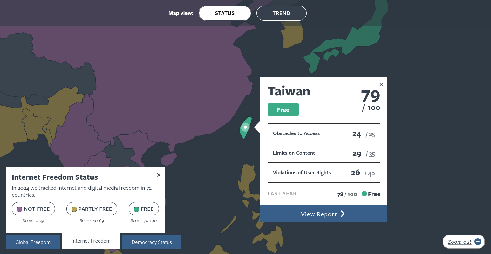
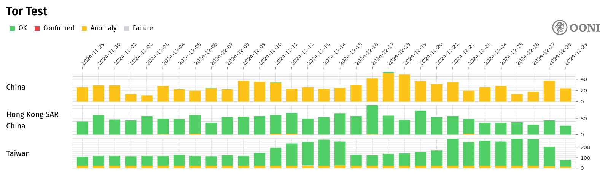
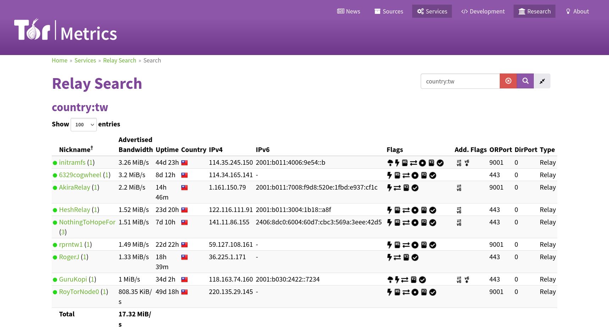

# :material-chat-question: 网络自由为什么重要

在这里，**网络自由**关注人们能否在免于不当干预的情况下取得信息、表达意见，以及选择自己信任的工具与连线方式。它与「匿名、隐私、规避审查」常一起出现，但侧重点不同，可先对照阅读[什么是匿名网络？](../tools/what-is-anonymity-network.md)。

!!! info "关于 anoni.net"

    本站由 anoni.net 编写，社群基地在台湾。本页讨论网络自由的普遍性问题，台湾会作为其中一个例子出现。其他地区（中国大陆、香港、星马、海外华人）的具体环境差异需要读者结合自身脉络判断。

除了政府封锁与大规模监控，跨境平台规则、账号处置、算法可见度与数据留存，也会塑造谁能说话、谁能被看见。多地的诽谤、国安或信息治理相关法规争议，会带来制度性的寒蝉效应。对想要参与公共讨论的人而言，这些因素会直接影响「网络自由是否稳固」。

以下先以东亚、东南亚为例，说明几种常见的压力模式。细节与新闻案例会随时间改变，建议搭配 [Freedom on the Net](https://freedomhouse.org/explore-the-map){target="_blank"} 国别页与本地报导交叉阅读。

## 东亚

中国的「长城防火墙[^1]」长期过滤大量国际网站与服务，并对境内平台内容进行政治、宗教与社会议题上的审查。朝鲜则将一般民众与全球互联网几乎隔绝，仅能使用国家管控下的内部网络「光明网[^2]」。香港则在 2020 年《国安法》生效后出现具体的网站封锁，警方依《国安法》第 43 条要求 ISP 以 DNS 篡改封锁 HKChronicles（香港编年史）、Hong Kong Watch 等网站，2024 年《维护国家安全条例》（基本法 23 条立法）进一步扩大调查与下架权限[^hk]。

2025 年 9 月，大量长城防火墙内部资料外流（约 500GB 到 600GB，来自承包商 Geedge Networks 与中国科学院信息工程研究所旗下的 MESA Lab），文件显示这套审查与监控技术已向外输出，至少涵盖哈萨克斯坦、埃塞俄比亚、缅甸、巴基斯坦等国，并提及另一个未具名国家[^11]。这让「把审查系统当产品输出」从外界推测，变成有内部文件层级的佐证。

区域内各地的开放程度差异很大。即使是相对开放的地区（如台湾[^10]），也面对跨境平台治理、信息安全与政治性操纵的讨论，以及对新闻与倡议工作者的法律与舆论压力。各国分数与叙事会随调查年度更新，建议用 Freedom House 互动地图逐国查阅。

!!! note "香港读者请注意"

    上面「相对开放的地区」这个框架不适用于香港。香港在 2020 年《国安法》生效后已从「相对开放」进入有具体法律后果与个案的阶段，阅读本站其他文章、评估自身威胁模型时，不要把「目前还相对宽松」的假设套用到香港的处境。

<figure markdown="span">
    
    <capture>Freedom House「Freedom on the Net」互动地图（各国分数随年度报告更新，画面为站内示意截图）</capture>
</figure>

## 东南亚

越南政府曾要求国际平台配合下架政治性批评内容[^3]。印尼对特定类别网站采取封锁或限制[^4]。马来西亚曾出现针对调查报导媒体与博客的封锁[^5]。菲律宾对独立新闻媒体的撤照与施压，长期压缩新闻自由空间[^6]。泰国对皇室相关言论的刑事追诉，长期影响线上表意空间[^7]。

缅甸在 2021 年政变后反复断网、封锁社群与镇压独立媒体[^8][^9]，是「冲突与戒严情境下网络成为战场」的极端例子。

除了封锁网站，管制也延伸到工具与用户本身。印尼自 2026 年 3 月起，率先在东南亚禁止未满 16 岁者使用社交媒体[^12]。缅甸则在 2025 年通过网络安全法（Cybersecurity Law），把未经许可提供 VPN 服务入罪[^13]。

## 观测与匿名连线

亚太地区的封锁与干预，需要可被验证的公开纪录。[OONI](https://ooni.org/){target="_blank"} 透过志工与探测数据，让特定网络与规避工具的可及性以图表与开放数据呈现。下方截图为历史区间范例，实际曲线与国家筛选请以 [OONI Explorer](https://explorer.ooni.org/chart/circumvention?since=2025-07-01&until=2026-03-31&probe_cc=CN%2CHK%2CTW){target="_blank"} 为准。

<figure markdown="span">
    
    <capture>OONI Explorer：规避工具观测（画面为站内保留之示意截图，区间与数据以网站为准）</capture>
</figure>

[Tor](https://www.torproject.org/){target="_blank"} 则透过多层路由与中继网络，协助使用者在高风险环境下维持匿名与连线。Tor 中继是去中心化的志愿基础建设，可从 Tor Metrics 逐国查询分布状况。下图是台湾节点分布范例（anoni.net 社群所在地），其他国家或地区可在同一介面切换查看。

<figure markdown="span">
    
    <capture>Tor Metrics：台湾地区中继与守护节点（画面随网络状态变动）</capture>
</figure>

无论是跑 OONI 测试、架设 Tor 中继，或协助翻译与教学，都是在具体支撑网络自由。在香港这类国安监控升高的地区，公开架设或宣传 Tor 中继的政治风险与台湾不同，参与前应按在地处境分开评估。你可以从下方项目列表挑一项开始。

## :fontawesome-solid-diagram-project: 下一步可参与的项目

- [:material-chat-question: 什么是匿名网络？](../tools/what-is-anonymity-network.md)
- [:material-access-point-network: ASNs 自治网络观测数据分析](../taiwan/ooni-asn-coverage.md)
- [:material-list-status: OONI 网站检测列表](../taiwan/ooni-checklist.md)
- [:material-translate-variant: 中文化与文件翻译](../community/i18n.md)

[^1]: [4所大学团队每日测试4亿个网域研究「防火长城」，发现有31万个网域被挡下、部分的封锁只是「意外」](https://www.thenewslens.com/article/153597){target="_blank"} - TNL The News Lens 关键评论网
[^2]: [光明网 (朝鲜)：朝鲜国家管控的内部网络](https://zh.wikipedia.org/zh-cn/%E5%85%89%E6%98%8E%E7%BD%91_%28%E6%9C%9D%E9%B2%9C%29){target="_blank"} - 维基百科，自由的百科全书
[^3]: [【人权焦点】让我们呼吸! 越南政府的网络审查 与科技巨头的共谋](https://www.amnesty.tw/news/3805){target="_blank"} - 国际特赦组织台湾分会
[^4]: [印尼预计6月落实网络新规定，恐剥夺社交平台言论自由](https://www.thenewslens.com/article/164619){target="_blank"} - TNL The News Lens 关键评论网（法规细节请以印尼官方与最新报导为准）
[^5]: [马来西亚局内人](https://zh.wikipedia.org/zh-tw/%E9%A9%AC%E6%9D%A5%E8%A5%BF%E4%BA%9A%E5%B1%80%E5%86%85%E4%BA%BA){target="_blank"} - 维基百科，自由的百科全书
[^6]: [菲律宾「Rappler」撤照风波：杜特蒂杀向记者的复仇印记？](https://global.udn.com/global_vision/story/8663/6435){target="_blank"} - 转角国际 udn Global
[^7]: [泰国王室骂不得！男子脸书PO文惹祸 遭判刑50年破纪录](https://udn.com/news/story/6812/7721452){target="_blank"} - 联合新闻网
[^8]: [缅甸被彻底剥夺的新闻自由：报导飓风灾害的记者遭军政府判刑20年监禁](https://feja.org.tw/72219/){target="_blank"} - 卓越新闻奖基金会
[^9]: [封锁、断网、审查：从缅甸政变看「网络中立权」的重要性](https://lab.ocf.tw/2022/02/12/mymmar-block/){target="_blank"} - OCF Lab 开放实验室
[^10]: [Freedom House：Taiwan（Freedom on the Net 国别条目）](https://freedomhouse.org/country/taiwan/freedom-net/2025){target="_blank"}（年度与网址随报告更新，若链接失效请改从[互动地图](https://freedomhouse.org/explore-the-map)进入）
[^11]: [Geedge & MESA Leak: Analyzing the Great Firewall's Largest Document Leak](https://gfw.report/blog/geedge_and_mesa_leak/en/){target="_blank"} - GFW Report
[^12]: [Indonesia social media ban for minors comes into effect](https://www.jurist.org/news/2026/03/indonesia-social-media-ban-for-minors-comes-into-effect/){target="_blank"} - JURIST。另见 [Indonesia Starts First Southeast Asia Social Media Ban for Kids](https://www.bloomberg.com/news/articles/2026-03-28/indonesia-starts-first-southeast-asia-social-media-ban-for-kids){target="_blank"} - Bloomberg（付费墙，标题即点明东南亚首例）
[^13]: [Myanmar enacts cybersecurity law that aims to restrict use of VPNs](https://www.rfa.org/english/myanmar/2025/01/02/cybersecurity-law-vpn/){target="_blank"} - Radio Free Asia
[^hk]: 香港网站封锁案例见 [Internet censorship in Hong Kong](https://hongkongfp.com/2024/10/12/internet-censorship-in-hong-kong/){target="_blank"} - Hong Kong Free Press。2024 年《维护国家安全条例》（基本法 23 条立法）见 [Hong Kong: New Security Law a Full-Scale Assault on Rights](https://www.hrw.org/news/2024/03/19/hong-kong-new-security-law-full-scale-assault-on-rights){target="_blank"} - Human Rights Watch。香港自由度评级见 [Hong Kong: Freedom in the World 2026](https://freedomhouse.org/country/hong-kong/freedom-world/2026){target="_blank"} - Freedom House。
