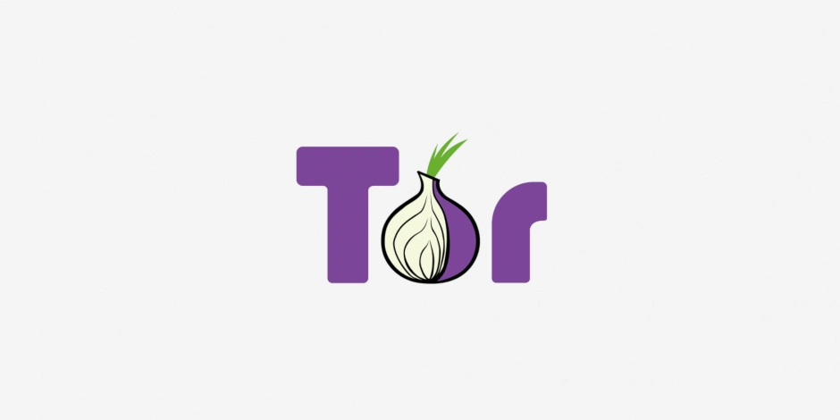

# Arti 2.2.0 发布：HTTP CONNECT、RPC 与 relay 开发进展

!!! info ""

    以下内容的原文翻译来自这篇文章，叙述主语为 Tor Project：

    - [Arti 2.2.0 released: HTTP CONNECT, RPC, and Relay development. | March 31, 2026](https://blog.torproject.org/arti_2_2_0_released/){target="_blank"}

Arti 是 Tor Project 正在以 Rust 开发的新一代 Tor 实现。2.2.0 版的核心重点，是把先前偏实验性质的连接方式推进到更可落地的状态：**HTTP CONNECT 现在在完整构建中可用，并默认启用**。此外，RPC 客户端与管理能力也有明显升级，并同步修复了一项低严重度安全问题。

对在企业网络、校园网络或公共网络中使用 Tor 的人来说，HTTP CONNECT 可用性提升非常关键；对把 Arti 集成到现有服务的开发者来说，RPC 的非阻塞与事件循环集成也能降低实现成本。整体来看，这是一个同时推进“可部署性”与“可运维性”的版本。

<!-- more -->

## 本版重点

### HTTP CONNECT 正式纳入完整构建，并默认启用

Arti 2.2.0 新增（并推进）通过 **HTTP CONNECT** 接入 Tor 网络的能力。这项功能过去偏向实验性，现在已包含在完整构建并默认启用，且与 SOCKS 共用同一端口。

这意味着在某些 SOCKS 不便部署、但 HTTP 代理路径更常见的环境中，Arti 的落地门槛有望降低。对需要在受限网络场景下维持匿名连接能力的用户与团队，这是切实可感知的改进。

### RPC：非阻塞请求、事件循环集成与 superuser 管理能力

`arti-rpc-client-core` 现在支持非阻塞请求（non-blocking requests），并能更好地集成应用事件循环。这让 Arti 更容易嵌入既有服务架构，例如高并发或长连接管理场景。

同时，RPC 系统新增了通过 **superuser** 管理 Arti 实例的能力。对自动化部署、观测与运维流程来说，这为更细粒度的管理控制打开了空间。

### 安全修复：TROVE-2026-005

本版修复了低严重度安全问题 [TROVE-2026-005](https://gitlab.torproject.org/tpo/core/arti/-/issues/2418){target="_blank"}。官方说明指出，在特定且不常见的嵌入式构建配置中，该问题会削弱一部分抗 DoS 能力。

虽然影响条件较为有限，但能在同一版本中完成修复，仍体现 Arti 团队在功能推进与安全维护之间的平衡。

## 幕后进展：relay、circuits 与目录服务

官方也提到持续投入 relay 支持，包括 relay channels、circuits，以及目录服务器功能（mirrors 与 authorities）。这些工作多属于中长期基础设施，短期可能不如前端功能显眼，但对 Arti 未来能否承担更完整的 Tor 角色非常关键。

也就是说，2.2.0 除了带来可见的新功能外，也同步把 Arti 的长期架构蓝图往前推进了一步。

## 台湾语境下可关注的三个方向

1. **受限网络可用性**：在校园、企业与公共网络场景，HTTP CONNECT 可能降低初始接入门槛，但仍需评估代理策略、流量特征与本地阻断模型。
2. **本地工具链集成**：RPC 非阻塞能力使 Arti 更容易接入常见服务框架（如 Python/Node.js 的事件驱动服务），可用于健康检查、告警与策略控制。
3. **安全与治理节奏**：从 [TROVE-2026-005](https://gitlab.torproject.org/tpo/core/arti/-/issues/2418){target="_blank"} 修复到 relay 基础设施推进，可观察 Arti 在“快速演进”与“风险控制”之间如何保持节奏，这对数字人权与安全社区都有参考价值。

## 延伸阅读

- [Arti 2.2.0 官方 changelog 条目](https://gitlab.torproject.org/tpo/core/arti/-/blob/main/CHANGELOG.md#arti-220--30-march-2026){target="_blank"}
- [Arti 项目 README](https://gitlab.torproject.org/tpo/core/arti/-/blob/main/README.md){target="_blank"}
- [`arti` binary 文档](https://gitlab.torproject.org/tpo/core/arti/-/blob/main/crates/arti/README.md){target="_blank"}

!!! info "关于 Arti 项目"

    Arti 是 Tor Project 正在开发的新一代 Tor 实现（implementation），使用 Rust 编写。我们的目标是在维持 Tor 网络匿名性与隐私保护特性的前提下，提供一个更加现代化、更易维护、也更便于集成的函数库与工具集。相比已经服役多年的传统 C 语言 Tor 实现（常被称为「C Tor」或 Tor daemon），Arti 采用更加模块化、结构更清晰的设计，让我们可以更安全、也更灵活地演进 Tor 的功能。

    Arti 目前仍在积极开发中：在客户端场景，它已经可以支撑相当多的实际使用需求；而在中继（relay）与洋葱服务（onion services）等领域，我们也在持续投入资源，循序渐进地扩展能力。如果你想进一步了解 Arti 的设计目标与最新进展，建议可以参考 Arti 的官方网站和源码仓库：

    - [Arti 官方网站与总览](https://arti.torproject.org/){target="_blank"}
    - [Arti 源码仓库（GitLab）](https://gitlab.torproject.org/tpo/core/arti/){target="_blank"}

!!! info "参考资料"

    本文整理自 Tor Project 官方公告 [Arti 2.2.0 released: HTTP CONNECT, RPC, and Relay development.](https://blog.torproject.org/arti_2_2_0_released/){target="_blank"}。
