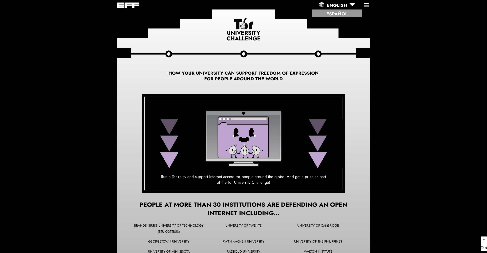

# 2025/03 项目进度更新

时间过得飞快，三月份将近过完！2025 第一季度也即将告一段落，让我们回顾一下项目当前的进度与一些成果。这期更新会提到工作坊后续规划、OONI 团队发布「匿名凭证」的实施概念、项目当前的翻译成果与 Tor Relays 观测站的建立！

<!-- more -->

## 工作坊活动

{style="border-radius: 5px; border: 1px solid #cdcdcd;"}

RightsCon 2025 顺利在二月最后一周举办完毕，我们在活动前一天与 Tor/Tails、OONI 团队[一同举办](./rightscon25-pre-event.md){target="_blank"}了工作坊，总参加人次达三百多人，是一个报名人数意料之外踊跃的活动，也感谢 Tor/Tails、OONI 团队的支持。这次活动也感谢志愿者伙伴的协助，开放文化基金会的其他伙伴都分别协助 RightsCon 的支持，在人手不够的状态下给予了我们有力的帮助！

活动后，我们整理了这场工作坊、讲座的重点摘要文章、简报收集。无论当天是否有参与或是想要回顾活动内容的，都可以参考[这篇文章](./rightscon25-tor-tails-ooni-after.md){target="_blank"}的内容。

### 工作坊的延续

在这次的活动中，Tor/Tails、OONI 工作坊的参与者对「网络自由」、「匿名网络」议题上有着初步的理解，并动手操作工具来提升安全与隐私的抵御能力。活动后，我们收到了许多关于工作坊安排的反馈与建议，因此决定申请今年 COSCUP 开源人年会的工作坊议程，继续把此议题调整得更切合台湾本地的脉络与语言进行推广。

COSCUP 预计在 8/9、10 于台湾科技大学举办，我们会在这两天的其中一天举办工作坊。在八月前，我们需要针对简报、教材调整成华语与台湾用语的内容。另外也需要开始招募工作伙伴筹备工作坊活动与培训工作坊小助手。如果你对工作坊活动有兴趣，请记得与[我们联系](../../contact.md){target="_blank"}，预计在四月的第二周开始启动筹备。

## 「匿名凭证」

最近我们翻译了一篇来自 OONI 团队如何计划改善与增强匿名数据提供的验证，如何在保有隐私与数据可信度上做出改进、抵御来自恶意上传脏数据影响整体数据库的解决方法。有兴趣的可以阅读[这篇文章](./2025-probe-security-without-identification.md){target="_blank"}。

这篇文章提供了相关领域的文献回顾，以及未来 OONI 团队要如何实施「匿名凭证」的流程。这篇文章稍微有点专业硬领域，可能不太好阅读，但非常推荐稍微花点时间了解，或与我们讨论并提供建议！

或许与最近由数位发展部推动的[数字皮夹](https://wallet.gov.tw/){target="_blank"}是同一领域的概念！

## 翻译文章

除了前面所提到的「匿名凭证」的文章外，我们也会针对 Tor、Tails、OONI 所发布较重要的文章进行翻译，例如：你知道吗？Tor 也打算用 Rust 来实现，其项目名称为 Arti。Tor 是使用 C 语言构建的，由于 C 语言在内存操作上的挑战，处理不好可能会造成资安问题，因此决定使用 Rust 语言来重新打造一个较为安全的 Tor 应用程序。Arti 项目目前也逐步实现 C 语言 Tor 的功能，有兴趣可以参考[这篇已翻译的文章](./arti-141.md){target="_blank"}。

{style="border-radius: 5px;"}

此外，我们现在也正在翻译一个项目网站，来自 [EFF](https://www.eff.org/){target="_blank"} 与 Tor 合作推出的 [Tor 大学挑战赛计划](https://toruniversity.eff.org/){target="_blank"}，希望可以在三月底前完成，到时候会有更详细的说明。

## Tor Relays 观测站

{style="border:1px solid #cdcdcd; border-radius: 5px;"}

在项目页面新增了 [Tor Relays 观察站](../../watcher-tor-relays.md){target="_blank"}，此页面主要是观察当前台湾的 Tor Relays 中继站的数量、运作状况。Tor 官方网站提供了一个 [Tor Metrics](https://metrics.torproject.org/){target="_blank"} 的查询网站，我们每小时会通过抓取网站上的记录信息、整理成易于阅读的图表，方便我们在推广时有一个便于讲故事的页面。

目前这个页面还在开发与尝试中，不保证 24 小时都能运作（我们正在解决稳定性问题 XD），开发的代码也还没有合并到主线上，有兴趣的伙伴可以参考 [pulse](https://github.com/anoni-net/docs/compare/main...pulse?expand=1){target="_blank"} 与 [api](https://github.com/anoni-net/docs/compare/main...api?expand=1){target="_blank"} 这两个分支，或是在 [API 文档页面](https://tor-watcher.toomore.net/api/docs){target="_blank"}随意尝试，目前用到 Python 语言的 [FastAPI](https://fastapi.tiangolo.com/){target="_blank"}、[Pydantic](https://docs.pydantic.dev/latest/){target="_blank"} 作为开发的框架。

当然，我们也在找寻熟悉大量处理数据的伙伴，有兴趣也可以直接与[我们联系](../../contact.md){target="_blank"}！

## 最后

以上，是目前此项目的活动进度，我们会持续翻译重要的文章、继续导入 Tor、OONI 的观测数据，以及准备八月的工作坊活动筹备事项！欢迎持续关注我们或通过 RSS 的方式[订阅此页面](../index.md){target="_blank"}的信息发布。
