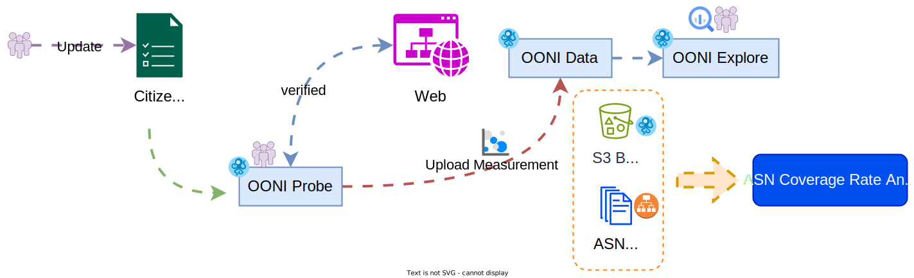

# :material-list-status: OONI 网站检测清单

<figure markdown="span">
    
    <caption>OONI Probe 检测流程</caption>
</figure>

OONI Probe 每次检测都依据一份事先列举的网站清单，逐一检查每个网址的连接状况。这份清单由 [Citizen Lab](https://citizenlab.ca/){target="_blank"} 维护的 [test-lists](https://github.com/citizenlab/test-lists){target="_blank"} 项目管理，分成本地（local）与全球（global）两种，分别收录各地与全球的热门网址。

全球名单以英文网站为主。本地名单由各地区社群协助搜集，贴近当地脉络、用当地语言呈现。在有互联网审查的国家，本地清单也会收录已被封锁的网站，方便后续观测。

名单收录标准大致分为四大类：

1. **政治**：与现任政府立场不同的网站。人权、言论自由、少数族群权利、宗教运动等延伸主题也包含在内。
2. **社会**：性别、赌博、非法药物、酒精，以及其他在当地被视为敏感的议题。
3. **冲突、安全**：武装冲突、边界争议、分裂运动、激进团体相关的内容。
4. **互联网工具**：电子邮件、云端空间、搜索、翻译、网络电话（VoIP）、规避审查工具等服务。

## 台湾观察名单现况

台湾的名单 [tw.csv](https://github.com/citizenlab/test-lists/blob/master/lists/tw.csv){target="_blank"} 大多在 2017 年建立，之后没有持续维护，现在名单上有不少网站已经停止运营或换了品牌网址，也有许多项目仍是 `http://` 开头，需要先整理一轮。

!!! note "http:// → https://"

    有些网站不会自动把 `http://` 通过 [`301 Moved Permanently`](https://developer.mozilla.org/zh-CN/docs/Web/HTTP/Status/301){target="_blank"} 或 [`308 Permanent Redirect`](https://developer.mozilla.org/zh-CN/docs/Web/HTTP/Status/308){target="_blank"} 重定向到 `https://`，这会让 OONI 检测误判。现在 TLS/SSL 证书取得门槛已经很低，加密传输也是网站基本配备，清单上的网址默认应该用 `https://`。

## 名单更新

如同现况的问题，第一步我们需要逐一检查目前在 [tw.csv](https://github.com/citizenlab/test-lists/blob/master/lists/tw.csv){target="_blank"} 上列举的网站状况，标记：需更新或可弃用。然后提交一份 [Pull Request](https://gitbook.tw/chapters/github/pull-request){target="_blank"} 到 [citizenlab/test-lists](https://github.com/citizenlab/test-lists){target="_blank"} 请求更新。

!!! info "PR #1444"

    社群在 2023/09/28 [提交过一份检测名单修正](https://github.com/citizenlab/test-lists/pull/1444){target="_blank"}，后续持续整理中。

## 名单新增

由于名单是在 2017 年建立的，已有约 8 年未进行修正与调整，因此需要重新审视当前需要加入检测的网站清单。

## :fontawesome-solid-diagram-project: 下一步

- [:material-chat-question: 什么是 OONI？](../tools/what-is-ooni.md)
- [:material-chat-question: 网络自由为什么重要](../basics/internet-freedom.md)
- [:octicons-mark-github-24: 项目研究预先准备](../community/setup-repo.md)

