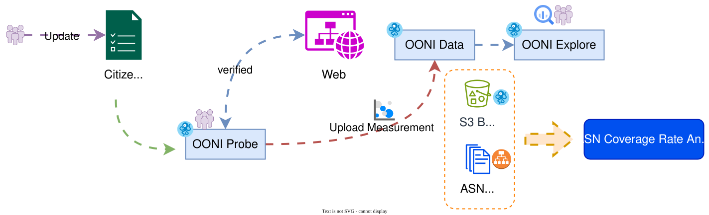

# :material-list-status: OONI 网站检测清单

<figure markdown="span">
    <a target="_blank"
       href="../assets/images/ooni_asn.svg">
        
    </a>
    <figcaption>OONI Probe 检测流程</figcaption>
</figure>

OONI Probe 每次检测都依据一份事先列举的网站清单，逐一检查每个网址的连接状况。这份清单由 [Citizen Lab](https://citizenlab.ca/){target="_blank"} 维护的 [test-lists](https://github.com/citizenlab/test-lists){target="_blank"} 项目管理，分成本地（local）与全球（global）两种，分别收录各地与全球的热门网址。

全球名单以英文网站为主。本地名单由各地区社群协助搜集，贴近当地脉络、用当地语言呈现。在有互联网审查的国家，本地清单也会收录已被封锁的网站，方便后续观测。

名单收录标准粗分为四大主题（实际 CSV 以约 30 个细项分类标记）：

1. **政治**：与现任政府立场不同的网站。人权、言论自由、少数族群权利、宗教运动等延伸主题也包含在内。
2. **社会**：性别、赌博、非法药物、酒精，以及其他在当地被视为敏感的议题。
3. **冲突、安全**：武装冲突、边界争议、分裂运动、激进团体相关的内容。
4. **互联网工具**：电子邮件、云端空间、搜索、翻译、网络电话（VoIP）、规避审查工具等服务。

## 分类决定一个网址多常被测到

四大分类看起来只是整理用的标签，实际上它决定了每个网址被测到的频率。OONI Probe 取得的清单来自 OONI 的 API，是一份排序过的结果，并非直接读取 CSV。排序依据写在 [`prio.py`](https://github.com/ooni/backend/blob/master/api/ooniapi/prio.py){target="_blank"}，分两段计算。

第一段算出每个网址的优先级（priority）。OONI 维护一组规则，每条规则有四个比对字段：分类、域名、完整网址、国家代码，`*` 代表不限。命中的规则全部相加，不互相取代。全局默认那条 `*/*/*/*` 给 50，分类规则再叠上去，所以一则归在新闻媒体（`NEWS`）的网址优先级是 `50 + 100 = 150`，归在电子商务（`COMM`）的是 `50 + 20 = 70`。

目前的分类阶梯（括号内为加上基底 50 之后的实际值）：

| 加权 | 分类 | 实际优先级 |
|---:|---|---:|
| +120 | `GRP` 社交网络 | 170 |
| +100 | `ANON` 匿名与规避工具、`HUMR` 人权、`LGBT`、`NEWS` 新闻媒体、`POLR` 政治批评 | 150 |
| +80 | `COMT` 通讯工具、`MMED` 媒体分享、`PUBH` 公共卫生、`SRCH` 搜索引擎 | 130 |
| +60 | `ENV` 环境、`HOST` 主机与博客、`REL` 宗教、`XED` 性教育 | 110 |
| +40 | `CULTR` 文化、`FILE` 文件分享、`GOVT` 政府、`IGO` 国际组织 | 90 |
| +30 | `ALDR` 酒精与药物、`DATE` 交友、`GMB` 赌博、`HATE` 仇恨言论、`MILX` 武装团体、`PORN`、`PROV` 暴露服饰 | 80 |
| +20 | `COMM` 电子商务、`CTRL` 内容管控、`ECON` 经济、`GAME` 游戏、`HACK` 黑客工具、`MISC` 未分类 | 70 |

方向是社交平台与言论类最高，商业与娱乐最低。最高与最低相差 2.4 倍，落差存在但不到数量级。

第二段把优先级除以近期测量数，得到真正的排序键：

```
weight = priority / max(msmt_cnt, 0.1)
```

`msmt_cnt` 是该网址在本周与上周被测量的次数，范围限定在同一个国家，probe 有回报 ASN 时则限定在同一个 ASN。测得越多，权重掉得越快，排到后面去，让其他网址浮上来。

所以这套机制是反应式的。优先级决定一个网址的预算，测量数决定花掉多少。权重高的分类享有的是比较快的恢复速度，被测掉之后很快又排回前面，并非永远占住前排。

## OONI 用同一组规则应对突发事件

规则表除了分类阶梯，还有两种用法值得知道，第一种是把单一目标顶到最前面。截至 2026-09，`www.aljazeera.net` 在以色列的优先级是 `9999999`，`orda.kz` 在哈萨克斯坦是 `99999`，`eltoque.com` 在古巴是 `6969`，Twitter、Facebook、Instagram、YouTube 四个网址在全球都是 `69999`。这些数字远高于分类阶梯的量级，效果是让该目标在清单里几乎永远排第一，通常对应正在发生或刚发生的封锁事件。

第二种是把优先级设成负值来排除。程序对优先级小于等于零的项目直接跳过，不发给 probe。目前唯一的一组负值全在阿富汗，把酒精与药物、交友、赌博、仇恨言论、`LGBT`、武装团体、`PORN`、性教育八个分类设为 `-9999`。用意是保护当地执行测量的志愿者，不让他们的网络纪录里出现可能带来危险的内容。

台湾目前没有任何国家层级的专属规则，`tw.csv` 的每一则都只吃「50 加上分类加权」。这代表分类写对是唯一能影响抽样的杠杆。归错分类的网址不会有人发现，它只是被测得比应有的频率少，或者多。提交清单修正时把分类判断清楚，价值跟找到一个值得收录的网站一样大。

完整规则表可以在 [`api.ooni.io/api/_/url-priorities/list`](https://api.ooni.io/api/_/url-priorities/list){target="_blank"} 查到，设计背景见 OONI 的 [Building a smart URL list system](https://ooni.org/post/ooni-smart-url-list-system/){target="_blank"}。

## 台湾观察名单现况

台湾的名单 [tw.csv](https://github.com/citizenlab/test-lists/blob/master/lists/tw.csv){target="_blank"} 大多在 2017 年建立，之后没有持续维护，现在名单上有不少网站已经停止运营或换了品牌网址，也有许多项目仍是 `http://` 开头，需要先整理一轮。

!!! note "http:// → https://"

    有些网站不会自动把 `http://` 通过 [`301 Moved Permanently`](https://developer.mozilla.org/zh-CN/docs/Web/HTTP/Status/301){target="_blank"} 或 [`308 Permanent Redirect`](https://developer.mozilla.org/zh-CN/docs/Web/HTTP/Status/308){target="_blank"} 重定向到 `https://`，这会让 OONI 检测误判。现在 TLS/SSL 证书取得门槛已经很低，加密传输也是网站基本配备，清单上的网址默认应该用 `https://`。

## 名单更新

如同现况的问题，第一步我们需要逐一检查目前在 [tw.csv](https://github.com/citizenlab/test-lists/blob/master/lists/tw.csv){target="_blank"} 上列举的网站状况，标记：需更新或可弃用。然后提交一份 [Pull Request](https://gitbook.tw/chapters/github/pull-request){target="_blank"} 到 [citizenlab/test-lists](https://github.com/citizenlab/test-lists){target="_blank"} 请求更新。

!!! info "PR #1444"

    社群在 2023/09/28 [提交过一份检测名单修正](https://github.com/citizenlab/test-lists/pull/1444){target="_blank"}，后续持续整理中。

## 名单新增

由于名单是在 2017 年建立的，已有约 8 年未进行修正与调整，因此需要重新审视当前需要加入检测的网站清单。

## :fontawesome-solid-diagram-project: 下一步

<div class="grid cards" markdown>

- [:material-chat-question: 什么是 OONI？](../tools/what-is-ooni.md)
- [:material-code-json: OONI 测量数据结构导览](../community/ooni-data-format.md)
- [:material-table-search: OONI 测项速查表](../community/ooni-nettests-map.md)
- [:material-chat-question: 网络自由为什么重要](../basics/internet-freedom.md)
- [:octicons-mark-github-24: 项目研究预先准备](../community/setup-repo.md)

</div>
