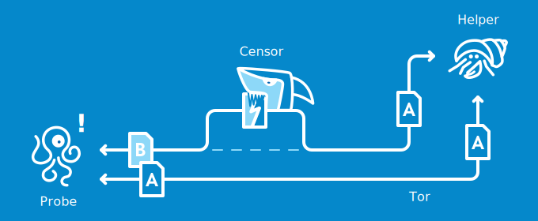
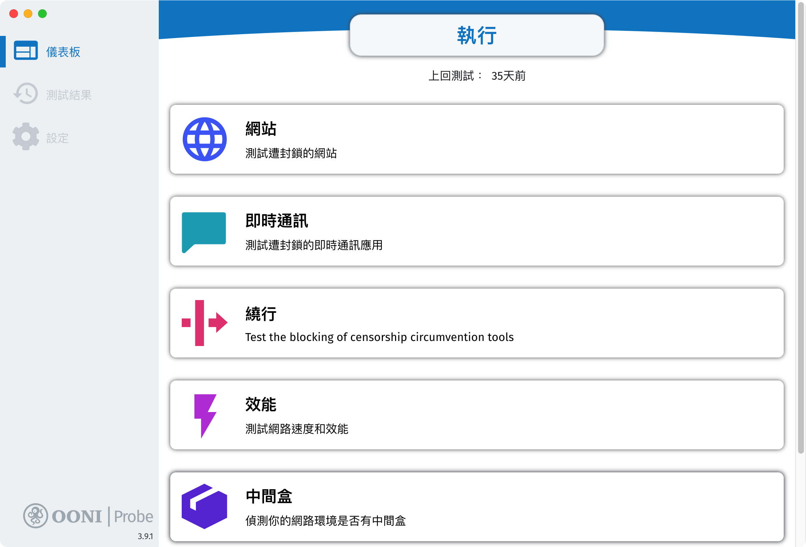
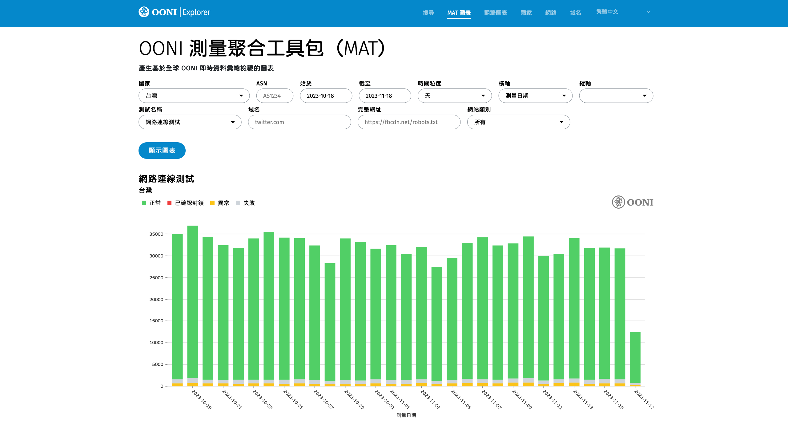
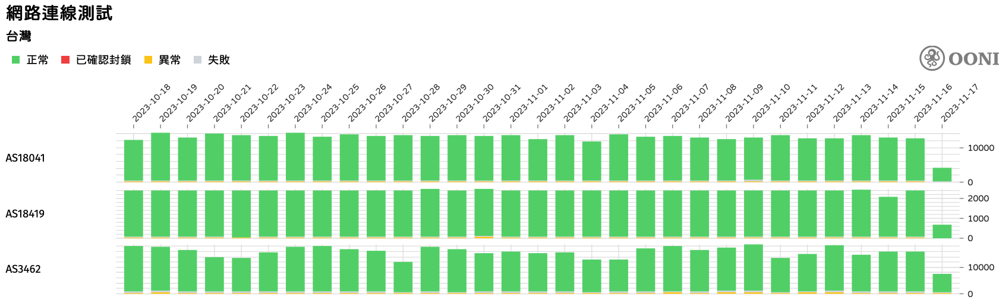

# :material-access-point-network: 什么是 OONI

连不上某个网站时，第一个直觉通常是「是我网络有问题吗？」OONI（Open Observatory of Network Interference，网络干扰开放观测）就是为了把这种感受转成可验证的资料。它提供开源检测工具 [OONI Probe](https://ooni.org/install/){target="_blank"} 与公开资料平台 [OONI Explorer](https://explorer.ooni.org/){target="_blank"}，让任何人都能跑检测、查纪录，把封锁、监控、降速这些行为留下时间、地点、ASN 都对得上的观测痕迹。

OONI 的价值不只在于「有没有被封锁」这个单点问题，而在于它让讨论能以数据为基础。社群、媒体、研究者要佐证一次连线异常时，有可引用、可重现的纪录可用。也因此，[ASN 观测涵盖率](../taiwan/ooni-asn-coverage.md) 在各地区都是值得长期关注的议题：观测点越多元，这份纪录的代表性就越强。

## OONI 计划主要推动事项

OONI 的工作可以拆成四块。核心是 [OONI Probe](https://ooni.org/install/){target="_blank"} 这个检测应用程序，用来检查特定网站或在线服务是否被封锁。跑出来的结果会[公开成数据集](https://ooni.org/data/){target="_blank"}，任何人都能[在线查阅与分析](https://explorer.ooni.org/){target="_blank"}，了解[各地网络](https://explorer.ooni.org/countries){target="_blank"}的审查状况。OONI 同时跟研究人员、倡议者合作，分析这些数据、追踪全球与区域网络干扰的[趋势与影响](https://ooni.org/post/){target="_blank"}，也跟[各地组织](https://ooni.org/partners/){target="_blank"}与在地社群合作，把检测能力铺到更多网络角落。

参与 OONI 的检测活动，等于把你这条网路的观测数据留进公开资料集。当其他人需要佐证封锁事件、追跨境差异、或对照不同 ASN 的状况时，会有更多元的纪录可以引用。

## 如何运作？

<figure markdown="span">
    <a href="../assets/images/how-ooni-works.svg">
        
    </a>
</figure>

- **Probe：**OONI 检测观察程序。
- **Censor：**资料传输过程中的监控者，可能是公司 IT 网络、电信公司、国家级网络架构。网路干预可透过以下方式进行，结果与目的都是阻止检视网站内容：
    1. DNS 篡改（DNS tampering、DNS 异常）
    2. IP 封锁（DNS tampering、TCP/IP 异常）
    3. HTTP 封锁（HTTP blocking，例如：封锁页面）
    4. 基于 TLS 的干扰（例如 TLS 握手期间 ClientHello 信息后出现连线重置或连线逾时（timeout））
- **Tor：**[洋葱路由网络](https://zh.wikipedia.org/zh-cn/%E6%B4%8B%E8%91%B1%E8%B7%AF%E7%94%B1){target="_blank"}，将连线请求透过三层节点的转介传送取得资讯。
- **Helper：**检测目标对象，可能是网站、通讯软件连线、VPN 连线、连线效能等。

!!! info "anoni.net 是台湾的社群"

    下面这段反映 anoni.net 在台湾观察到的善意阻挡与刻意阻挡的边界，其他简中读者可对照当地情境参考。

    在台湾比较熟悉的类似阻挡技术，包括中华电信提供的「[色情守门员](https://hicare.hinet.net/CHT/hicare/){target="_blank"}」、透过 DNS 阻挡广告与恶意网站的 [AdGuard](https://adguard.com/){target="_blank"}、[Pi-Hole](https://pi-hole.net/){target="_blank"}，或是数位发展部与财团法人台湾网络资讯中心（TWNIC）进行域名阻挡的[打击诈骗方式](https://moda.gov.tw/press/press-releases/6303){target="_blank"}，都可算是阻挡网页浏览的实务。

    以上举例通常都是针对恶意网站、网络广告、钓鱼诈骗的善意阻挡（如 [DNS RPZ](https://blog.twnic.tw/2020/09/23/15311/){target="_blank"}），但如果是刻意阻挡某些内容呢？或是来自某些未被观察纪录到 ASN 的阻挡行为？目前观测的资料无大规模阻挡，但因为观测资料多样性不足，集中在中华电信（[AS3462](https://radar.cloudflare.com/as3462){target="_blank"}）的[观测资料](https://explorer.ooni.org/chart/mat?probe_cc=TW&since=2024-10-01&until=2024-12-31&time_grain=month&axis_x=measurement_start_day&axis_y=probe_asn&test_name=web_connectivity){target="_blank"}，因此在「各区域观察资料与 ASN 涵盖率」研究项目中会比对目前在 TW 还有多少 ASN 是未被观测到的。

## OONI 适合做什么、不适合做什么

OONI 的定位跟 [Tor](./what-is-tor.md)、[Tails](./what-is-tails.md) 不一样：Tor 与 Tails 给使用者保护自己用，OONI 给社群、媒体、研究者观测网路环境用。动手前先回头看 [威胁模型如何建立](../basics/threat-model.md) 有助于厘清需求是不是真的对得上 OONI 解决的问题。

**适合**：

- 佐证封锁事件。某个网站某个时段在某个 ASN 连不上，OONI Probe 跑过会留下可引用的纪录。
- 长期观测单一地区的网路环境变化。把 OONI Probe 跑成 cronjob，几个月下来能看到趋势。
- 跨 ASN、跨地区比较。OONI Explorer 上不同 ASN 的观测结果可以对照，找出哪一段网路有差异。
- 媒体、研究、倡议用途。需要外部可验证的数据时，公开资料集是坚实的引用基础。

**不适合**：

- 即时警报。OONI Explorer 上的资料透过 fastpath 接近即时，但仍不是给「现在这一秒网站连不上」做秒级告警用的。S3 原始资料集另有约一小时的批次延迟。
- 判断单一装置中毒或本地 DNS 设错。OONI 看的是网路层的可及性，不是端点安全。
- 辨识深度封包检测（DPI）行为的细节。OONI 观察的是「结果」（连得上/连不上、回应内容是否异常），不是「过程」中的封包细节。
- 取代 Tor 或 VPN。OONI 不会把你的连线匿名化，它只是让你知道网路有没有在干预。

## 如何安装 OONI Probe 观测程序

OONI Probe 观测程序提供[移动装置版本](https://ooni.org/install/){target="_blank"}（Android、iOS）、[桌面版本](https://ooni.org/install/){target="_blank"}（Windows 64bit、macOS），或是无任何桌面界面的[终端程序版本](https://ooni.org/install/cli){target="_blank"}。

<figure markdown="span">
    <a href="../assets/images/ooni_screen_desktop.png">
        
    </a>
</figure>

终端机界面可以使用 `ooniprobe run` 执行所有检测项目，或是设定 `cronjob` 在空闲时间跑观察检测。

``` bash
# 在第 4、10 和 22 小时的第 10 分钟执行。
10 4,10,22 * * * ooniprobe run > /dev/null 2>&1 &
```

!!! warning "自动执行"

    `ooniprobe autorun` 指令目前仅在 macOS 有效。在 Debian/Ubuntu Linux 上安装 CLI 后，背景定期测试预设就会启用，不必另设 cronjob。上面的 cronjob 范例适用于没有自动执行的环境。

## OONI Explorer 观测资料

<figure markdown="span">
    <a href="../assets/images/ooni_explorer.png">
        
    </a>
</figure>

检测到的观察资料会即时回传到 OONI 的资料库，可透过 [OONI Explorer](https://explorer.ooni.org/){target="_blank"} 在线分析各个区域的状况及不同检测项目的结果。也可以直接存取 [S3 储存空间（Registry of Open Data on AWS）](https://registry.opendata.aws/ooni/){target="_blank"}，下载延迟一小时的原始观测资料，用来做更深入的交叉分析。

!!! info "观察 ASN 资料"

    可将「纵轴」项目选成 ASN，筛选分离各 ASN 观测资料状况。

    <figure markdown="span">
        <a href="../assets/images/ooni_explorer_asn.png">
            
        </a>
    </figure>

## 常见问题

??? question "我在家里跑 OONI Probe，会不会被 ISP 标记？"

    OONI Probe 的测试行为（连到一份公开的测试清单上的网站、记录回应）跟一般使用者浏览网页差别不大。以台湾为例，anoni.net 目前没有观察到任何 ISP 因为跑 OONI 而封锁或警告使用者的案例，但这是特定地区的观察，不能直接套用到其他地方。预设清单（[Test List](https://github.com/citizenlab/test-lists){target="_blank"}）排除了多数高敏感类型的网站。香港在 2020 年《国安法》后监控与寒蝉效应升高，跑检测前建议先读 [VPN 的风险与选择](./vpn-guide.md)，评估自身处境。在审查严格的国家（如中国、伊朗）情况又不同，OONI 官方文件有额外的风险说明，启用前建议查阅。

??? question "OONI 检测会不会误判？"

    会。OONI 看到的是「连线结果与一般情况不同」，不会自动断定原因。常见误判来源：对方网站本身故障、CDN 负载平衡造成 IP 变动、本地 DNS 设定错误、企业或校园网路的合规过滤。OONI Explorer 把判断逻辑（DNS、TCP、TLS、HTTP 各层的观察结果）公开，误判可以被追查与修正。要做严谨结论前，建议交叉比对多个 ASN、多个时段的纪录。

??? question "善意的 DNS 阻挡（防钓鱼、防恶意网站）算审查吗？"

    OONI 的角色是观测与记录，不是判定。它会把「在这个 ASN、这个时段、这个网站 DNS 解析异常」如实写下来。是不是「审查」、是不是「合理」要靠人去诠释。这也是为什么观测资料的价值在于「公开、可重现」，而不是「谁说了算」。

??? question "可以同时跑 OONI Probe 跟 Tor 吗？"

    可以，但要分清楚目的。OONI Probe 是观测工具，跑检测时走的是你本地的 ISP 连线（这样才能观测到当地的网路环境）。如果让 OONI 走 Tor，观测到的是 Tor 出口节点的网路环境，不是你本地的，失去意义。Tor Browser 与 OONI Probe 在同一台电脑上可以共存，各跑各的。

??? question "最简单的贡献方式是什么？"

    手机装 [OONI Probe](https://ooni.org/install/){target="_blank"}，每天让它跑一次自动检测就是有效贡献。如果家里有 Linux 主机，照本文「如何安装」段的 cronjob 范例设定，就能持续累积。想再进一步可以参考 [OONI 网站检测清单](../taiwan/ooni-checklist.md) 补充本地关注的网站，或读 [ASN 观测涵盖率](../taiwan/ooni-asn-coverage.md) 了解哪些 ASN 还缺观测点。

## :material-chat-question: 一同了解

<div class="grid cards" markdown>

- [:material-chat-question: 威胁模型如何建立](../basics/threat-model.md)
- [:material-chat-question: 网路自由为什么重要](../basics/internet-freedom.md)
- [:material-chat-question: 什么是匿名网路](./what-is-anonymity-network.md)

</div>

## :fontawesome-solid-diagram-project: 下一步可参与的项目

<div class="grid cards" markdown>

- [:material-list-status: OONI 网站检测清单](../taiwan/ooni-checklist.md)
- [:material-access-point-network: ASN 自治网络观测资料分析](../taiwan/ooni-asn-coverage.md)
- [:material-server-network: Tor Relay 观测点](../taiwan/tor-relay-watcher.md)

</div>
