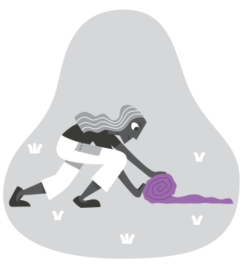
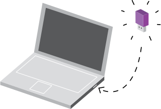

# :simple-tails: 什么是 Tails？

[Tails](https://tails.net/){target="_blank"}（The Amnesic Incognito Live System，无记忆的匿踪系统）是一个从 USB 随身碟或外接硬盘启动的操作系统。它把 Tor、加密邮件、密码管理器、档案 Metadata 清除工具预先打包好，关机后整个内存被清空，不留下任何使用痕迹。

Tails 解决的场景很具体：采访敏感议题的记者要保护消息来源、研究员要处理外来档案而不污染主机、行动现场要在不熟悉的网路环境工作、机敏档案要审阅但不希望留在笔电上。这些场景下，「我这台日常电脑」的长期使用痕迹是个大破口，Tails 把任务切到一个临时的干净环境，做完抽 USB 走人。

Tails 基于 [Debian Linux](https://zh.wikipedia.org/zh-cn/Debian){target="_blank"}，由独立非营利组织开发，跟 Tor Project 长期合作。

!!! info "anoni.net 是台湾的社群"

    社群在 2025 年 2 月跟 Tails、Tor 团队在台北办过一场 [Pre-RightsCon 工作坊](../blog/posts/rightscon25-pre-event.md)，后续会持续推。其他简中读者如果对在地的 Tails 工作坊有兴趣，可参考 anoni.net 的活动页关注。

## Tails 的三个设计选择

Tails 真正的价值在三个刻意的设计选择所组合出来的工作环境。理解这三点，才知道什么时候该用、什么时候用了没意义。

### 一、无记忆（Amnesic）

<figure markdown="span">
    
    <capture>Tails 关闭后会自动遗忘，重启后如同全新的环境不留下踪迹[^1]</capture>
</figure>

Tails 完全跑在内存里，不写硬盘。关机时内存清空，这台电脑没有任何使用纪录、没有浏览历史、没有开过的档案、没有暂存。下次开机是全新环境。

对比一般操作系统，即使在「无痕模式」、即使删除档案，主机都会留下痕迹：你连过的 Wi-Fi、文件系统的暂存、浏览器的 cookie 与缓存、剪贴板、开过的 USB 装置。Tails 从根本上不写，没有这层问题。

例外是「永久储存」（Persistent Storage），让你在 USB 上保留一块加密区存放金钥、书签、文件。需要时可以开、不需要时关掉，预设不启用。

### 二、预设强制走 Tor

<figure markdown="span">
    
    <capture>Tails 在网际网路上不留下踪迹[^1]</capture>
</figure>

Tails 的所有网路流量都经过 [Tor](./what-is-tor.md)。任何应用程序试图绕过 Tor 直接连网，会被防火墙拦下并显示警告。这跟「自己装 Tor Browser 但其他应用走一般网路」的差别很大：你在 Tails 里看到的网站不知道你的真实 IP、你下载的 Email 不洩漏连线位置、你连的云端硬盘看不到你在哪。

审查严重地区的使用者，Tails 也支援开机时设定 [Tor 桥接（Bridge）](./what-is-tor.md#中继点与桥接点)，把「正在使用 Tor」这件事本身藏起来。

### 三、从 USB 启动，跟主机系统彻底分开

<figure markdown="span">
    
    <capture>Tails 可运行在 USB 随身碟或外接硬盘中[^1]</capture>
</figure>

Tails 跑在 USB 上，开机选择从 USB 启动，主机原本的硬盘不会被读写。这意味着：

- 主机本来有恶意软件，不会影响 Tails 工作阶段（前提是恶意软件没渗到固件层）。
- Tails 工作阶段内做的事，不会留在主机上。
- 你可以在不信任的电脑上执行高敏感任务（网咖、合作夥伴的笔电），抽 USB 走后，现场那台电脑看不到你做了什么。

要警告的是，Tails 对固件层攻击（BIOS、Intel ME 等）跟硬体键盘侧录器无法防御。在最高威胁模型下，要连硬体都自己控。

## Tails 适合做什么、不适合做什么

Tails 是「特定情境的工具」，不是日常操作系统替代品。动手前回头看 [威胁模型怎么想](../basics/threat-model.md) 对齐预期。

**适合**：

- 高风险的单次或短期任务：审阅外来机敏档案、处理可疑附件、敏感主题的访谈纪录。
- 不信任手边电脑的场景：在合作夥伴电脑、出差住宿提供的工作站、共用空间电脑上工作。
- 行动现场的干净工作环境：抗议、选举观察、跨境采访等。
- 跟记者、爆料者的初次接触与档案交换（搭配 [OnionShare](./onionshare.md) 在 Tor 上传档）。
- 想体验一个强隐私预设的工作环境，不想动到日常电脑。

**不适合**：

- 日常操作系统。Tails 每次开机都重置，要重装书签、重设定、重连 Wi-Fi。长期持续工作用 Tails 很折磨，这是它的设计目标决定的。
- Apple Silicon（M1 到 M4）笔电。Tails 仍然不支援，要在 Mac 上用要找 Intel 时代的旧机。
- 智慧型手机与平板。Tails 是 x86-64 设计，不在 ARM 上跑（Raspberry Pi 也不行）。
- 需要持久状态的工作。要写长期专案、要持续的开发环境、要常用本机重型应用程序（例如 Adobe 全家桶、特定设计工具），就不要选 Tails。
- 已经被固件攻击或硬体侧录的场景。Tails 的安全保证从 USB 开机那一刻起算，硬体层被入侵就管不着。

## 跟 Whonix、Qubes 的差别

Tails、[Whonix](https://www.whonix.org/){target="_blank"}、[Qubes OS](https://www.qubes-os.org/){target="_blank"} 是匿名操作系统的三个常被比较对象，设计取舍不同：

- **Tails**：USB 启动、即用即丢、关机遗忘。适合短期任务、不信任手边主机。
- **Whonix**：两台虚拟机（一台闸道走 Tor、一台工作站），跑在你日常操作系统里。适合长期需要 Tor 环境又不想换主机。
- **Qubes OS**：把整台电脑切成多个隔离的虚拟机，每个应用程序群组跑在自己的「qube」里。适合最高安全需求、愿意付学习成本的进阶使用者。

完整的选择逻辑与适合谁见 [Tails、Whonix、Qubes 的差别](./tails-vs-whonix-vs-qubes.md)。

## 怎么安装

Tails 可以从 Windows、macOS、Ubuntu/Linux 制作 USB 开机磁碟，[官方安装页](https://tails.net/install/index.en.html){target="_blank"} 有逐步指引。下载大小约 1.6 GB，安装时间约半小时。

??? warning "硬体相容性"

    Tails 可以运行在大部分不超过 10 年的 Intel 处理器电脑上。

    Tails 不能运行在：

    - Apple Silicon（M1 到 M4）。
    - 智慧型手机与平板。
    - Raspberry Pi、ARM 或 32 位元处理器。

    Tails 或许不能运行在：

    - 内存不足 2 GB 的旧电脑上。
    - 部分新显卡未被 Linux 良好支援的机型，特别是 Nvidia 与 AMD Radeon 显卡常有相容性问题。

    了解更多目前已知的[硬体问题](https://tails.net/support/known_issues/index.en.html){target="_blank"}。

??? info "建议的硬体需求"

    - 至少 8 GB 大小的 USB 随身碟。安装时 USB 上的资料会全部清空。
    - 可以从 USB 启动的装置。
    - 64 位元 [x86-64](https://zh.wikipedia.org/zh-cn/X86-64){target="_blank"} 处理器。
    - 至少 2 GB 的内存，避免使用时卡顿。

## 预装的工具

Tails 内建一系列预设安全的开源工具：

- **Tor 浏览器**搭配 **uBlock Origin**：日常浏览。
- **Thunderbird**：加密电子邮件。
- **KeePassXC**：密码管理（[密码管理器入门](./password-manager.md) 有更多说明）。
- **LibreOffice**：文书处理。
- **[OnionShare](./onionshare.md)**：透过 Tor 起临时 onion service 收发档案、聊天、架站。
- **Metadata Cleaner**：清除档案的 EXIF、文件作者等隐藏资讯（为什么重要见 [Metadata 是什么](../basics/metadata.md)）。
- 完整清单见 [Tails 官方功能页](https://tails.net/doc/about/features/index.en.html){target="_blank"}。

预设的安全保证：应用程序试图绕过 Tor 连网会被拦截、永久储存内容自动加密、关机时内存清空。

## 常见问题

??? question "可以装在 M 系列 Mac 上吗？"

    目前不行。Tails 跟 Apple Silicon（M1 到 M4）不相容，原因是 Tails 用的 Linux 开机机制跟 Apple 的客制启动流程不对接。要在 Mac 上跑 Tails 需要找 Intel 时代的旧机型。如果手边没有 Intel Mac，考虑在另一台 PC 上做这件事，或改用 Whonix（在现有操作系统里跑虚拟机，跨平台支援好）。

??? question "Tails 跟 Tor Browser 的差别？"

    Tor Browser 是「我这台日常电脑上多装一个浏览器」，它让你的浏览走 Tor，但其他应用程序（Email、云端、IDE）仍然走一般网路、仍然会在主机上留下使用痕迹。Tails 是「整个工作阶段都在独立环境里」，整台机器的所有流量都走 Tor、关机后所有使用纪录消失。要保护的是「单次浏览」就用 Tor Browser，要保护的是「整个工作流程」就用 Tails。

??? question "永久储存（Persistent Storage）安全吗？"

    永久储存是 USB 上的一块加密区，用 LUKS 全磁碟加密保护，需要密码才能解锁。设计上很坚固，但有两个前提：你的密码要够强（建议用 [KeePassXC](./password-manager.md) 产生）、你的 USB 不能在没锁定的状态下离开你（被插上其他电脑读取就破功）。预设不启用，需要时再开。

??? question "Wi-Fi 自动连线会不会洩漏我的位置？"

    Tails 预设启动 MAC 位址随机化，对 Wi-Fi 热点而言，每次开机看到的是不同的硬体 ID。这对「你在哪里」的辨识有帮助。但如果你连到一个跟你长期身分绑定的 Wi-Fi（例如你家或公司网路），Tails 没办法保护「这个地点存在过 Tails 连线」这件事。匿名性最高的场景是用陌生网路（咖啡店、图书馆、行动热点）。

??? question "可以同时保留两个 USB，一个工作一个个人吗？"

    可以，这是社群常见做法。一个 USB 对应一个工作情境（例如「采访 A 议题」、「行动现场 B」），各自的永久储存独立、各自的金钥独立。只要不在同一次开机里混用两个 USB 即可。

??? question "Tails 多久更新一次？"

    约四週一个更新週期[^2]。建议定期更新，每次新版会修补 Debian、Tor、浏览器的安全更新。Tails 内建的更新工具会在连网时提醒你。重大版本更新有时需要手动下载新版镜像重做 USB。

## 接下来

下载 [Tails 安装指引](https://tails.net/install/index.en.html){target="_blank"}，按官方步骤做一支 USB。如果你是记者、研究者、行动工作者，可以延伸看 [记者保护消息来源](../scenarios/journalist.md) 与 [上传机敏资讯流程](../community/upload-sensitive.md) 把工作流程一起设计起来。

## :material-chat-question: 一同了解

- [:material-chat-question: 威胁模型怎么想](../basics/threat-model.md)
- [:material-chat-question: Tails、Whonix、Qubes 的差别](./tails-vs-whonix-vs-qubes.md)
- [:material-share-variant-outline: OnionShare](./onionshare.md)

## :fontawesome-solid-diagram-project: 下一步可参与的项目

- [:material-newspaper-variant-outline: 记者保护消息来源](../scenarios/journalist.md)
- [:material-upload-outline: 上传机敏资讯流程](../community/upload-sensitive.md)
- [:material-list-status: OONI 网站检测清单](../taiwan/ooni-checklist.md)

[^1]: [图片来源自 tails.net](https://tails.net/){target="_blank"}
[^2]: [Should I update Tails using apt upgrade or Synaptic?](https://tails.net/support/faq/index.en.html#upgrade){target="_blank"}
