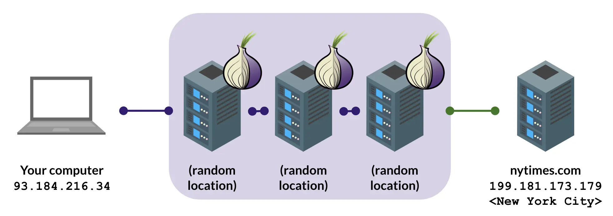
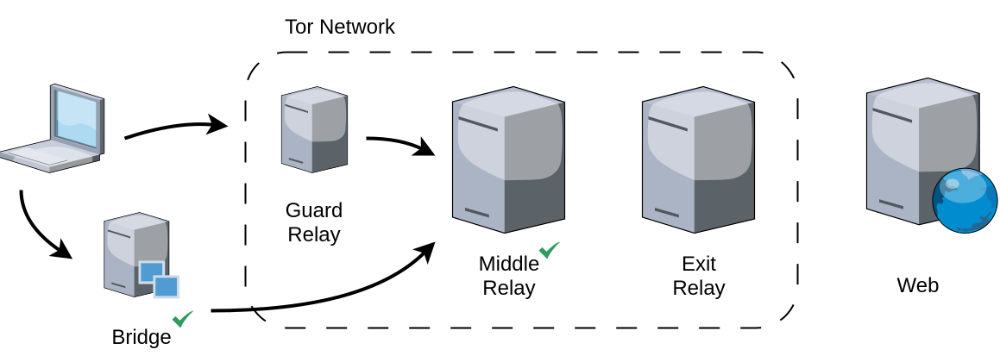

# :simple-torproject: 什么是 Tor？

<figure markdown="span">
    
    <caption>Tor Relay 运作流程</caption>
</figure>

[Tor（The Onion Router）](https://www.torproject.org/){target="_blank"} 是由志工营运、透过多层加密与随机路径把网路连线匿名化的开源网路。Tor 解决的问题很具体：连上一个网站时，预设会把 IP 位址、浏览指纹、连线时序留给对方与沿路所有观察者。Tor 把这条连线拆成三段，让没有任何单一节点同时知道「你是谁」与「你在连什么」。

跟 VPN 的差别常被混淆。VPN 把流量集中到一个信任的服务提供者：你信任 VPN 业者不记录、不交资料，业者本身就是单点。Tor 不需要信任任一节点，就能达成「没有任何节点同时看到完整路径」这件事。要看更完整的对照与选择逻辑，可以接着读 [什么是匿名网路](./what-is-anonymity-network.md) 与 [威胁模型如何建立](../basics/threat-model.md)。VPN 本身的具体风险、怎么挑值得信任的服务、什么时候 VPN 够用而不必动用 Tor，见 [VPN 的风险与选择](./vpn-guide.md)。

## Onion routing 如何运作

每次发送请求时，Tor 客户端会挑选一条包含三个节点的随机路径。资料先用最内层加密，再用中层，再用外层。离开你的电脑后，每经过一个节点剥一层加密，像剥洋葱一样，到达出口节点时才看到原始连线。

关键设计是「每个节点只看得到前后一站」：

- **入口节点**（Guard Relay）知道你的真实 IP，但只看到「你要连下一个 Tor 节点」。它不知道你最终要连哪个网站。
- **中间节点**（Middle Relay）什么都不知道。它前后都是 Tor 节点，连你的 IP 都看不到。
- **出口节点**（Exit Relay）看得到你最终要连的网站，但看到的来源 IP 是中间节点，不是你。

要把这三段资讯兜起来才能识别你，必须有人同时控制入口跟出口节点，并做时序分析。Tor 网路全球超过 8,000 个节点分散在不同国家、不同运营者手上（大学、非营利组织、托管公司、个人志工），这个攻击成本本身就是 Tor 的安全来源。实时节点数可查 [Tor Metrics](https://metrics.torproject.org/networksize.html){target="_blank"}。

<figure markdown="span">
    
    <caption>Tor Relay 类型</caption>
</figure>

## 中继点与桥接点

Tor 的节点分两类：公开的中继点（Relay）与隐藏的桥接点（Bridge）。

中继点清单是公开的，这是 Tor 设计的一部分：任何人都能验证网路上有哪些节点、谁在跑、跑多久了。公开可查也是 Tor 比起私有匿名网路（例如某些 VPN）多一层信任的原因。

但公开清单也是封锁的目标。在中国、伊朗、白俄罗斯这类严重审查地区，当地 ISP 会直接封锁所有公开的 Tor 中继 IP。为了让这些地区的人仍能连上 Tor，社群另外设计了**桥接点（Bridge）**：IP 不公开、靠官方网页、Email、Telegram 等管道分发给有需要的人。

桥接点还可以搭配 **Pluggable Transports** 进一步伪装流量：

- **Obfs4**：把 Tor 流量看起来像随机乱码，避免被 DPI 直接特征识别。
- **meek**：把流量包装成连到 Microsoft Azure 这类大型云端服务（早年也用过 Google、Cloudflare，后来这些业者陆续关闭了 domain fronting），审查者要嘛全挡这些服务，要嘛放行。
- **[Snowflake](./tor-snowflake.md)**：把流量包装成 WebRTC（视讯会议常用协议），由全球志工的浏览器分页临时当桥接。

!!! info "anoni.net 是台湾的社群"

    在审查不重的地区（如台湾），使用 Tor 不需要桥接（直接用公开中继就连得上），但可以开 [Snowflake 浏览器分页](./tor-snowflake.md) 变成桥接给审查地区的人用。这是门槛最低的网路自由贡献方式。

## Tor 适合做什么、不适合做什么

Tor 不是万能匿名钮。把它用在不对的场景，会付出效能代价但拿不到你以为的保护。动手前回头看 [威胁模型如何建立](../basics/threat-model.md) 对齐预期。

**适合**：

- 敏感议题的浏览与研究（医疗、性、政治、金融困境），想避免浏览行为被广告网路或 ISP 收集。
- 跨境连线、规避地区封锁。
- 跟记者、爆料者、跨境合作对象的初次接触（搭配 [.onion 服务](./tor-browser-advanced.md) 或 [OnionShare](./onionshare.md)）。
- 需要把连线跟你个人「彻底切开」的单次任务（搭配 [Tails](./what-is-tails.md) 效果更完整）。

**不适合**：

- 登入会绑定你个人身分的服务（网银、Gmail、政府服务）。Tor 不会让你比较匿名，反而可能触发风控、要你做额外验证。
- 需要本地 IP 的金流服务（许多银行、政府服务只接受当地 IP）。
- 高频宽即时应用（4K 影音、在线游戏、视讯会议）。Tor 的多层加密与多跳路径会让延迟明显。
- 点对点档案分享（BitTorrent 等）。Tor 出口节点频宽有限，这类流量会伤害网路给其他人用的容量，也容易暴露你的真实 IP。
- 「我所有上网都走 Tor 就比较安全」的全包式期待。Tor 处理的是连线层匿名，跟浏览器指纹、登入身分绑定、档案 [Metadata](../basics/metadata.md) 是不同层级的问题。

## 常见问题

??? question "Tor 跟 VPN 哪个比较匿名？"

    Tor。VPN 把信任集中到一个业者身上：业者宣称不记录不代表不能记录，且该业者一被司法传唤就有风险。Tor 把信任分散到三个独立节点，没有任何一方同时知道你的真实 IP 与目的网站，不需要假设任何一方诚实。VPN 的优势在速度与相容性（解地理限制、看串流），Tor 的优势在「结构性不需要信任」。

??? question "出口节点不是看得到我的明文流量吗？"

    对，所以 Tor 必定要搭配 HTTPS 用。出口节点看得到你连的目标网站与未加密内容，但看不到你的真实 IP。HTTPS 加密后出口节点只看得到「有人连 example.com」，看不到具体传输内容。Tor Browser 内建 HTTPS-Only 模式，没走 HTTPS 的网站会警告。

??? question "用 Tor 连 Gmail 安全吗？"

    技术上没问题，但要想清楚目的。如果你登入既有 Gmail 账号，Google 会看到「同一个账号从 Tor 出口节点登入」，可能触发风控、要你二步验证。连线本身是安全的，但 Google 已经知道你是谁。匿名邮件可以考虑 [Proton Mail 的 .onion 站](https://proton.me/tor){target="_blank"} 或 [Tuta](https://tuta.com/){target="_blank"}，并用独立账号搭配 Tor 开通。

??? question "ISP 看得到我在用 Tor 吗？"

    在不开桥接的情况下，看得到。ISP 看到你的 IP 连到一个公开 Tor 入口节点的 IP（公开清单查得到），它会知道你在用 Tor，但看不到你接下来连什么。在敏感工作场所或审查环境里，可以开桥接 + Pluggable Transports 把这层也藏起来。

??? question "Tor 速度为什么这么慢？"

    三层加密 + 三跳节点 + 出口节点频宽有限是物理结构，不会大改善。但有两个简单的调整能改善体感：在 Tor Browser 设定里换出口节点地区（避开壅塞国家）、避免高频宽内容（看 8K 影片不是 Tor 的设计目的）。整体的 Tor 网路容量取决于全球有多少志工愿意跑节点，[Tor Relay 校园建立](../community/relay-on-campus.md) 等社群推动也是为了把更多本地频宽接进网路。

??? question "Tor 真的不会被破解吗？"

    没有绝对安全。已知攻击面包括：同时控制入口与出口的时序关联分析（学界研究、极大规模才可能）、浏览器指纹（Tor Browser 已强化但不是零）、使用者操作失误（在 Tor 里登入带身分的账号就破功）。对多数连线层匿名需求，Tor 是目前被广泛采用的工具，但仍要依自己的威胁模型评估是否足够。要看更深的攻击面讨论可以从 [威胁模型如何建立](../basics/threat-model.md) 开始。

## 接下来

下载安装 Tor Browser 是起点，[Tor 官方下载页](https://www.torproject.org/download/){target="_blank"} 有 Windows、macOS、Linux、Android 版本（iOS 因为平台限制官方推荐 Onion Browser）。装好后先读 [Tor Browser 进阶设定](./tor-browser-advanced.md) 处理桥接、安全等级、隔离策略，再看 [Tor Snowflake](./tor-snowflake.md) 学习如何贡献一个分页的桥接。

更投入的人可以接 [如何搭建 Tor Relay](../community/setup-tor-relay.md) 或 [Tor Relay 校园建立](../community/relay-on-campus.md)，把本地频宽接进全球网路。

## :material-chat-question: 一同了解

- [:material-chat-question: 威胁模型如何建立](../basics/threat-model.md)
- [:material-chat-question: 匿名与隐私不一样](../basics/anonymity-vs-privacy.md)
- [:material-chat-question: 什么是匿名网路](./what-is-anonymity-network.md)

## :fontawesome-solid-diagram-project: 下一步可参与的项目

- [:material-snowflake: 启动 Tor Snowflake 桥接](./tor-snowflake.md)
- [:material-school-outline: Tor Relay 校园建立](../community/relay-on-campus.md)
- [:material-server-network: 如何搭建 Tor Relay](../community/setup-tor-relay.md)

