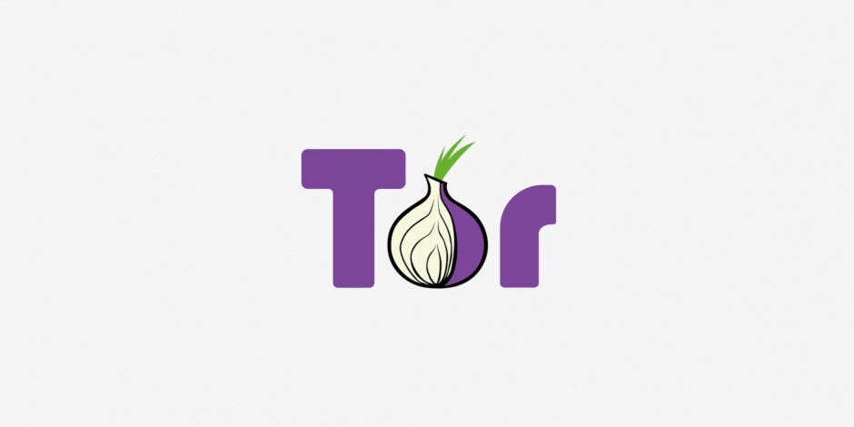

# 你的 Tor Browser 受影響嗎：CVE-2026-10702 與 Firefox 的兩條分支

{style="border-radius: 10px;"}

2026 年 7 月底，幾家安全媒體同時出現類似的標題，說研究者證明造訪一個惡意網頁就能攻陷 Tor Browser。[^1] 標題說的漏洞編號是 CVE-2026-10702，一支 Firefox JavaScript 引擎的 JIT 編譯器缺陷。研究團隊 Nebula Security 的示範頁把對象寫得很明確，是一支 Firefox for Android 151.0（安裝檔 `fenix-151.0.multi.android-arm64-v8a.apk`），執行在 Android 17 的 ARM64 裝置上，該頁沒有提到 Tor Browser。[^2] 不過他們的技術文章裡有一句「We also used it to pwn Tor Browser」，攻陷 Tor Browser 的說法出自研究者本人，而那篇文章沒有說是哪一版、哪一個通道、哪個平台。[^3]

對照各方資料，Tor Browser 穩定版沒有受這支漏洞影響，原因在於穩定版建立在 Firefox ESR 這條分支上，而這支漏洞的程式碼在 Firefox 147 才進入，140 ESR 沒有它。目前也沒有一手資料顯示這支漏洞在野利用（exploited in the wild），CVE 記錄裡 CISA 的 SSVC 評估把 Exploitation 標為 none。[^4]

!!! tip "先確認你手上這一版"

    從 torproject.org 下載、平常讓它自動更新的人，用的就是穩定版，沒有受這支漏洞影響。要確認版本號，開啟右上角的漢堡選單，選 Help，再選 About Tor Browser，畫面上的 15.0.x 就是你的版本。除非你刻意去下載過標示 Alpha 的測試版，你的就是穩定版。

    畫面上另外那組 140.13.0esr 是它內部使用的 Firefox 版本，判讀漏洞影響範圍時看的是這一組，本文後面會用到。

<!-- more -->

## ESR 與 Rapid Release 是兩條分支

Tor Browser 穩定版跟隨 Firefox ESR（Extended Support Release，延長支援版本），15.0.x 系列建立在 140 ESR 上，2026 年 7 月 21 日的 15.0.19 把基底換到 140.13.0esr，Android 版的 GeckoView 同步換成同一個基底。[^5]

Tor Browser Alpha 走另一條路。Tor Project 在 2025 年 12 月的公告裡宣布，Alpha 通道自 16.0a1 起改成跟隨 Firefox 的快速發布線，並寫下這個取捨，快速把上游功能送給使用者，也會快速把上游的錯誤一起送過去。同一份公告寫得更直接：「如果你是高風險使用者、在意自己的隱私，或只是需要一個穩定可用的瀏覽器，你不應該使用 Tor Browser Alpha。」[^6] 依本站 [Tor 更新日誌](../../changelog/tor.md) 的記錄，實際換基底發生在 2026 年 5 月 7 日的 16.0a6，該版起改以 Firefox beta 通道為基底，在此之前的 Alpha 仍建立在 ESR 上。2026 年 7 月 23 日的 16.0a9 又換回 ESR，基底是 Firefox 153.0esr，銜接下一代穩定版。[^7]

Mozilla 在 2026 年 6 月 2 日發布的 Firefox 151.0.3 修掉這支漏洞。[^8] 這段程式碼何時進入 Firefox 有一手記錄可查，Bugzilla `1995077`（Replace Object.keys with specialized iterator in Scalar Replacement）的 target milestone 是 147 Branch，`firefox147` 標記為 fixed，而 esr140 的追蹤欄位是空的。[^9] 同期的 ESR 公告 MFSA-2026-58（Firefox ESR 140.12，6 月 16 日）列了 28 支 CVE，沒有這一支。[^10] Red Hat 的 CSAF VEX 也把 RHEL 6 到 10 的 firefox 套件全部標記為 `known_not_affected`，而 RHEL 隨附的正是 ESR 版。[^11] 三條獨立線索指向同一個結論，140 ESR 這條線沒有這段程式碼。把各個對象排開來看：

| 對象 | Firefox 基底 | 是否受影響 | 你要做什麼 |
|---|---|---|---|
| 不確定自己用哪一版 | 幾乎都是穩定版，140 ESR | 未受影響 | 讓它更新完，再用 About 畫面確認一次 |
| Tor Browser 15.0.x 穩定版 | 140 ESR | 未受影響 | 保持最新版 |
| Tor Browser for Android 穩定版 | GeckoView 140.13.0esr | 未受影響 | 保持最新版 |
| Tor Browser Alpha 16.0a6（2026-05-07） | Firefox 150.0a1 | 受影響 | 升到 16.0a8 以上，或換回穩定版 |
| Tor Browser Alpha 16.0a7（2026-06-03） | Firefox 151.0a1 | 受影響 | 升到 16.0a8 以上，或換回穩定版 |
| Tor Browser Alpha 16.0a8（2026-07-02） | Firefox 152.0a1 | 未受影響 | 保持最新版 |
| Tor Browser Alpha 16.0a9 起（2026-07-23） | Firefox 153.0esr | 未受影響 | 保持最新版 |
| 一般 Firefox 桌面版與 Android 版 | Rapid Release，151.0.2 以前 | 受影響 | 升到 151.0.3 以上 |
| Tails 內建的 Tor Browser | Tails 7.10 內含 15.0.19 | 未受影響 | 隨 Tails 更新 |

16.0a6 與 16.0a7 的基底都早於修補落地的 151.0.3，兩版一律當成受影響處理。表格裡的判定都是從基底版本反推而來，Tor Project 沒有逐版說明過。Tails 那一列依據 Tails 7.10 的公告，該版內含 Tor Browser 15.0.19。[^12]

## 三步判讀法

下次看到一支 Firefox 的 CVE 編號，依序檢查這三件事，多數情況能自己得出結論。前兩步是交叉驗證，若你不想查英文資料庫，直接看第三步。

**第一步，看 Mozilla 有沒有同時發 ESR 公告。** Mozilla 為 ESR 分支發布獨立的 MFSA 編號。這次 MFSA-2026-54 只列出 Firefox 151.0.3 的兩支 CVE，而同期的 ESR 公告 MFSA-2026-58 不含這一支。換成一句好記的判斷：Tor Browser 穩定版遇到 Firefox 的 CVE，通常只有在 Mozilla 同時發 ESR 公告時才需要緊張。

**第二步，看 Red Hat 的 VEX 資料。** RHEL 隨附的 Firefox 是 ESR 版本，所以 Red Hat 對某支 CVE 的判定，實質上就是對 ESR 分支的判定。這次 Red Hat 的 CSAF VEX 文件把 RHEL 6 到 10 的 firefox 套件全部標記為 `known_not_affected`。若運氣好，Mozilla 的 Bugzilla 編號也可能是公開的，像這次的 `1995077` 就能直接看到程式碼落在哪一個 Branch。

**第三步，看手上這個 Tor Browser 版本的 Firefox 基底。** Tor Browser 的公告在 Firefox 安全更新這一項不列個別 CVE 編號，一律只寫「includes important security updates to Firefox」，所以需自己從基底版本反推。本站的 [Tor 更新日誌](../../changelog/tor.md) 整理了近期版本的 Firefox 基底，穩定版與 Alpha 通道都有，目前回溯到 15.0.11。更舊的版本需回上游的 release notes 查。

**別只看 CVSS 分數。** 同一支漏洞在不同資料庫的評分差距很大，NVD 頁面上 CISA-ADP 給的 CVSS 3.1 是 4.3（Medium），Red Hat 給 7.5（High），Mozilla 自己評 High。[^13] 差距來自評分方法本身，CVSS 只評估單一漏洞在孤立情況下的影響，而 renderer 內的程式碼執行看起來影響有限，因為沙箱還在。這支漏洞的實際份量來自它是一條完整攻擊鏈的第一段，把它放回鏈裡看才準確，後面兩節就在拆解這條鏈。

## 漏洞原理：編譯器被自己的標記騙了

JIT（Just-In-Time，即時編譯）的工作是把反覆執行的 JavaScript 轉成機器碼，讓熱點程式碼的執行速度比逐行解譯快上數十倍。要編得快，編譯器必須知道每個操作會不會改動記憶體。若某個操作只讀取資料，後面再次讀取同一個位置時，編譯器可以放心省略那次載入，直接沿用先前取得的值。

倉庫的管理員在清單上註明某位訪客只會清點貨物、不會搬動任何東西。這位訪客實際上把整櫃貨搬到新位置，還把舊櫃子拆了。後面的人依照清單判斷「反正沒人動過」，繼續照原地址去取貨，那個位置已經拆掉，還可能已經堆上別人搬進來的箱子。

Firefox 的 JavaScript 引擎 SpiderMonkey 裡的 `MObjectToIterator` 操作，在 `skipRegistration` 開啟時被標記成只會讀取資料。實際行為並非如此，它在解析延遲屬性（lazy property）的過程中會配置一塊新的動態儲存區（dynamic slots）緩衝區，並且釋放掉舊的那一塊。

接手的最佳化階段稱為 global value numbering（全域值編號），職責是找出重複計算並消除。它看到標記寫著這裡什麼都沒改，於是判斷後面那次載入 slots 指標的動作是多餘的，直接沿用先前那個指標，而那個指標指向的記憶體已經被釋放。編譯出來的機器碼因此握著一個懸空指標（dangling pointer）讀寫記憶體，攻擊者由此取得任意讀寫能力，在 renderer 行程內執行自己的程式碼。global value numbering 屬於 IonMonkey 這條最佳化管線，攻擊鏈名為 IonStack，研究者沒有解釋命名由來。

到這一步，攻擊者的程式碼仍被關在 renderer 的沙箱裡，要碰到你的檔案與其他資料，還需要第二支漏洞。

Mozilla 的修補移除了那個依 `skipRegistration` 分岔的別名集合，讓這個操作一律被當成會改動記憶體。公告編號 MFSA-2026-54，評級 High，回報者記為 Nebula Security。分類上這支同時對應 CWE-843（類型混淆，type confusion）與 CWE-733（編譯器最佳化移除或改動安全關鍵程式碼），後者精準描述了問題出在最佳化決策本身。對應的 Bugzilla 編號 `2040903` 目前仍限制存取，上面的機制描述與修補內容來自研究者公開的技術文章。[^3]

## 攻擊鏈 IonStack：從瀏覽器一路到 root

研究團隊把這支漏洞放在攻擊鏈的第一段，負責在瀏覽器的 renderer 沙箱內取得程式執行能力，第二段負責跳出沙箱、取得整台裝置的控制權。兩段合起來稱為 IonStack，示範平台是 Android 17 的 ARM64 裝置。

第二段是 CVE-2026-43499，別名 GhostLock，位置在 Linux kernel 的 futex 優先權繼承（priority inheritance）程式碼，也就是 glibc `PTHREAD_PRIO_INHERIT` 互斥鎖背後的機制。上鎖操作失敗並回退時，清理程式碼清掉了錯誤那一方的紀錄，等待中的 task 帶著一個仍指向自己核心堆疊的指標返回使用者空間。那塊堆疊記憶體隨後被別的東西用掉，後續走訪優先權鏈時就踩在已釋放的堆疊上，屬於釋放後使用（use-after-free）。研究者自己把它稱為 stack-UAF，並指出這類漏洞多半發生在堆積上，落在核心堆疊的少見。[^14]

這一段攻擊的是你的作業系統，與瀏覽器無關。受影響檔案是 `kernel/locking/rtmutex.c`，問題從 2011 年的 Linux 2.6.39 就存在，一路到 v7.1-rc1，主線在 7.1 修好。[^15] 唯一的條件是 kernel 編譯時開了 `CONFIG_FUTEX_PI`，實務上等同每個發行版都開，可以直接當成全部受影響。在 Google kernelCTF 的 x86 靶機上（lts-6.12.80，且未開啟 `RANDOMIZE_KSTACK_OFFSET`），這支 exploit 從一般權限取得 root 約需 5 秒，穩定度約 97%，在使用標準 kernel 的容器內同樣有效。上游 4 月 18 日收到回報、4 月 20 日修好，5 月 4 日 backport，7 月 7 日公開。第一版修補引入的當機問題曾另編為 CVE-2026-53166，6 月 2 日修好，該編號後於 7 月 10 日被 Linux CNA 撤回。[^16]

只要 kernel 沒有更新，未來任何一支能在 renderer 內執行程式碼的瀏覽器漏洞，都能接上同一段提權。修好瀏覽器只擋掉了這一次的入口。

## 現在該做的事

**Tor Browser 更新到最新版。** 開著瀏覽器讓它自己更新，或從 torproject.org 重新下載。這支漏洞影響不到穩定版，15.0.19 仍帶了從 Firefox 153 backport 的其他安全修補。

**一般 Firefox 升到 151.0.3 以上。** 桌面版與 Android 版都要。

**Alpha 通道不要當日常瀏覽器用。** 這是 Tor Project 自己的建議，這次剛好是實例。

**安全等級調到 Safer 或 Safest 可以擋掉整類 JIT 漏洞。** 這兩個等級會關閉 `javascript.options.ion` 與 `javascript.options.baselinejit`，JIT 直接停用，編譯器層的缺陷就失去觸發機會。[^17] 操作是點網址列旁的盾牌圖示，選 Change，再選等級，不需要進 `about:config` 改任何設定。代價要先知道：Safer 會關掉 HTTP 站點的 JavaScript 與部分字型，Safest 預設關閉全站 JavaScript，部分網站的表單會送不出去。更詳細的取捨可以參考本站的 [Tor Browser 進階設定](../../tools/tor-browser-advanced.md)。

**改完安全等級要關掉所有 Tor Browser 視窗再重新開啟。** Tor Project 官方的安全等級說明頁沒有提到 JIT，只列出 JavaScript 與字型、影音的變化，所以光看官方文件不會知道 JIT 這件事。Privacy Guides 在 2025 年 5 月測 Tor Browser 14.5.1 時發現，沒有重新啟動的話 JIT 仍在運作，介面卻已經顯示成 Safer。[^18] 15.x 桌面版已經修掉這個沉默失敗，切換等級會提示重啟（tor-browser issue `43783`），Android 版的同一套整合到 16.0 才完成。原則不變，改完就重啟。

**Windows 與 macOS 使用者只需做上面這些。** 攻擊鏈的第二段是 Linux kernel 的漏洞，這兩個平台不適用。

**Linux 桌面使用者更新 kernel，並且重新開機。** kernel 更新沒有重開機不會生效，這一步最常被漏掉。更新後用 `uname -r` 確認正在運作的版本，並對照發行版對 CVE-2026-43499 的公告狀態，不要假設已經處理好。編譯期的緩解選項（例如 `CONFIG_STATIC_USERMODE_HELPER`）需重新編譯 kernel，一般桌面使用者做不到。自行維運伺服器或 relay 的人可以評估開機參數 `randomize_kstack_offset=on`，前提是發行版的 kernel 已帶入 `CONFIG_RANDOMIZE_KSTACK_OFFSET`，它只增加約 5 個 bit 的猜測成本，算是拖延而非修補。

**Android 使用者需等裝置廠商的系統更新。** kernel 層的提權在使用者端沒有自救方式，更新何時送達取決於裝置廠商與電信商。

## 一支 CVE 編號不足以判斷影響範圍

同一份原始碼分成兩條發布線之後，兩條線就是兩份不同的程式碼。這支漏洞的程式碼在 Firefox 147 才進入，穩定版跟隨的 140 ESR 沒有它，而跟隨快速發布線的 Alpha 通道有。三步判讀法要回答的就是這件事，看 Mozilla 有沒有發 ESR 公告、看 Red Hat 對 ESR 版套件的判定、看手上這個版本的 Firefox 基底。

攻陷 Tor Browser 的說法出自研究者本人，他們沒有指明版本與通道，媒體標題也沒有補上這個區分。讀者手上只有一個 CVE 編號與一句沒有版本的宣稱，剩下的只能自己往下查。下次遇到類似的標題，先問它說的是哪一條分支。

## 沒有把握的部分

- 研究者沒有說明他們攻陷的是哪一版 Tor Browser。〈IonStack Part I〉只有「We also used it to pwn Tor Browser」這一句，沒有版本、通道與平台，示範頁與媒體報導也都沒有。這無法排除他們攻陷的是 Alpha 通道，也無法排除其他可能。
- Tor Browser 16.0a6 與 16.0a7 的 Firefox 基底早於修補落地的 151.0.3，本文據此列為受影響。dist 目錄已不再提供這兩版，無法對二進位檔驗證是否含有修補。
- Whonix 內建的 Tor Browser 走哪一條通道，查不到可以支撐的官方頁面，所以沒有列進對照表。Whonix 的文件只建議使用穩定版。
- Tor Project 至今沒有針對這支 CVE 發過任何公開說明。
- Bugzilla 編號 `2040903` 需要權限才能存取，無法讀到原始修補內容。

## 名詞對照

正文出現的英文詞與縮寫都收在這裡，讀到卡住時可以回來查。

| 名詞 | 說明 |
|---|---|
| JIT（Just-In-Time） | 即時編譯，把反覆執行的程式碼轉成機器碼以加速 |
| SpiderMonkey | Firefox 的 JavaScript 引擎 |
| IonMonkey、Warp | SpiderMonkey 裡負責最佳化編譯的管線，Warp 是前端，IonMonkey 負責後續最佳化與產生機器碼 |
| global value numbering | 全域值編號，找出重複計算並消除的最佳化階段 |
| lazy property（延遲屬性） | 等到被存取時才真正建立的物件屬性 |
| dynamic slots（動態儲存區） | 物件屬性值的動態儲存區，容量不足時會重新配置 |
| dangling pointer（懸空指標） | 指向已被釋放記憶體的指標 |
| use-after-free（釋放後使用） | 記憶體釋放後仍被使用，常見的可利用漏洞型態 |
| stack-UAF | 釋放後使用的一種，被釋放的記憶體位於核心堆疊而非堆積 |
| type confusion（類型混淆） | 程式把某型別的資料當成另一型別處理 |
| sandbox（沙箱） | 限制程式能碰到哪些資源的隔離機制，瀏覽器用它把網頁內容關起來 |
| renderer 行程 | 瀏覽器負責解析與繪製網頁內容的行程，受沙箱限制 |
| root | 作業系統的最高權限帳號，取得它等於控制整台裝置 |
| 提權（privilege escalation） | 從低權限取得高權限的攻擊手法 |
| exploit | 實際利用某支漏洞的程式或步驟 |
| ESR（Extended Support Release） | Firefox 的延長支援版本，功能更新慢、修補期長 |
| Rapid Release | Firefox 的快速發布通道，2026 年 7 月時約四週一個版本 |
| 通道（channel） | 同一個軟體的不同發布線，例如穩定版與 Alpha 測試版 |
| 基底、rebase | Tor Browser 建立在某個 Firefox 版本之上，換到新版本的動作稱為 rebase |
| backport | 把新版的修補移植回舊的維護分支 |
| futex | fast userspace mutex，Linux 的使用者空間鎖定機制 |
| priority inheritance（優先權繼承） | 避免高優先權工作被低優先權工作卡住的鎖定機制 |
| CWE | 漏洞類型的分類編號系統，描述問題屬於哪一類 |
| CVSS | 漏洞評分系統，給出 0 到 10 的嚴重度分數 |
| SSVC | 另一套漏洞評估框架，CISA 用它標記是否已遭利用等欄位 |
| VEX | 漏洞可利用性交換格式，廠商用來聲明自家產品是否受某支 CVE 影響 |
| MFSA | Mozilla Foundation Security Advisory，Mozilla 的安全公告編號 |

## 相關閱讀

- [Tor Browser 進階設定](../../tools/tor-browser-advanced.md)
- [Tor 更新日誌](../../changelog/tor.md)
- [什麼是 Tor](../../tools/what-is-tor.md)
- [威脅模型如何建立](../../basics/threat-model.md)

[^1]: [Researchers Show a Single Malicious Webpage Visit Can Compromise Tor Browser, The Hacker News 2026-07](https://thehackernews.com/2026/07/researchers-show-single-malicious.html){target="_blank"}
[^2]: [IonStack 示範頁, Nebula Security](https://rootme.nebusec.io/){target="_blank"}
[^3]: [IonStack Part I：CVE-2026-10702, Nebula Security](https://nebusec.ai/research/ionstack-part-1-cve-2026-10702/){target="_blank"}
[^4]: [CVE-2026-10702 記錄（含 CISA-ADP 的 SSVC 評估）, CVE Program](https://cveawg.mitre.org/api/cve/CVE-2026-10702){target="_blank"}
[^5]: [New Release: Tor Browser 15.0.19, The Tor Project 2026-07-21](https://blog.torproject.org/new-release-tor-browser-15019/){target="_blank"}
[^6]: [The Future of Tor Browser Alpha, The Tor Project 2025-12-01](https://blog.torproject.org/future-of-tor-browser-alpha/){target="_blank"}
[^7]: [New Alpha Release: Tor Browser 16.0a9, The Tor Project 2026-07-23](https://blog.torproject.org/new-alpha-release-tor-browser-160a9/){target="_blank"}
[^8]: [Security Vulnerabilities fixed in Firefox 151.0.3（MFSA-2026-54）, Mozilla](https://www.mozilla.org/en-US/security/advisories/mfsa2026-54/){target="_blank"}
[^9]: [Bug 1995077：Replace Object.keys with specialized iterator in Scalar Replacement, Mozilla Bugzilla](https://bugzilla.mozilla.org/show_bug.cgi?id=1995077){target="_blank"}
[^10]: [Security Vulnerabilities fixed in Firefox ESR 140.12（MFSA-2026-58）, Mozilla](https://www.mozilla.org/en-US/security/advisories/mfsa2026-58/){target="_blank"}
[^11]: [CVE-2026-10702 CSAF VEX, Red Hat](https://security.access.redhat.com/data/csaf/v2/vex/2026/cve-2026-10702.json){target="_blank"}
[^12]: [Tails 7.10, Tails 2026-07-23](https://blog.torproject.org/new-release-tails-7_10/){target="_blank"}
[^13]: [NVD - CVE-2026-10702](https://nvd.nist.gov/vuln/detail/CVE-2026-10702){target="_blank"}
[^14]: [IonStack Part II：GhostLock, Nebula Security](https://nebusec.ai/research/ionstack-part-2/){target="_blank"}
[^15]: [CVE-2026-43499, Linux kernel CNA](https://git.kernel.org/pub/scm/linux/security/vulns.git/plain/cve/published/2026/CVE-2026-43499.mbox){target="_blank"}
[^16]: [CVE-2026-53166（已撤回）, CVE Program](https://cveawg.mitre.org/api/cve/CVE-2026-53166){target="_blank"}
[^17]: [SecurityLevel.sys.mjs（Tor Browser 15.0.19 原始碼）, The Tor Project](https://gitlab.torproject.org/tpo/applications/tor-browser/-/blob/tor-browser-140.13.0esr-15.0-1-build2/toolkit/components/securitylevel/SecurityLevel.sys.mjs){target="_blank"}
[^18]: [A Flaw With the Security Level Slider in Tor Browser, Privacy Guides 2025-05-02](https://www.privacyguides.org/articles/2025/05/02/tor-security-slider-flaw/){target="_blank"}
