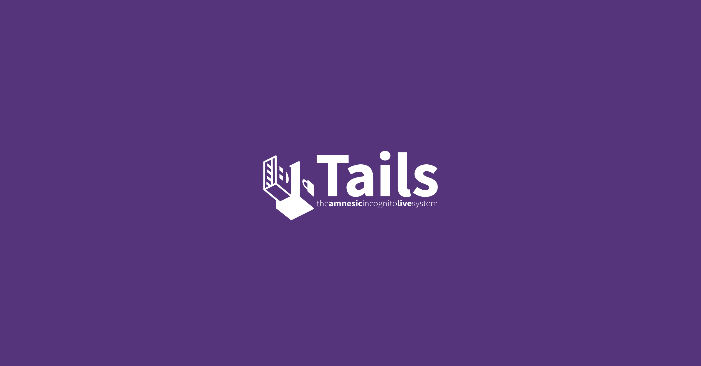

# Tails 7.6 發佈說明

{style="border-radius: 10px;"}

[Tails 7.6](https://tails.net/news/version_7.6/){target="_blank"} 於 2026 年 3 月 26 日公告。此版在**對抗網路審查**與**桌面整合**兩方面都有可感知的改動：Tor 連線流程可直接協助你取得橋接器；密碼管理則改由 GNOME [Secrets](https://gitlab.gnome.org/World/secrets){target="_blank"} 擔綱，取代內建的 [KeePassXC](https://keepassxc.org/){target="_blank"}。

## 新功能

### 自動 Tor 橋接器

你現在可以在 Tails 的 **Tor 連線助理**裡，直接了解什麼是 **Tor 橋接器**（Tor bridges）。

Tor 橋接器是**不公開列舉**的 Tor 中繼站，用來**隱藏你正在連線到 Tor** 的事實。若你所在網路會**封鎖連到 Tor**，可以把橋接器當成進入 Tor 網路的第一站，藉此繞過審查。

在 Tails 7.6 中，開啟 Tor 連線時可選擇 **自動連線到 Tor**（Connect to Tor automatically）。若無法直接連上 Tor 網路，橋接設定畫面會多一項 **依你所在區域請求 Tor 橋接器**（Ask for a Tor bridge based on your region）。

此功能與 Tails 以外的 [Tor Browser 自 11.5 版起](https://blog.torproject.org/new-release-tor-browser-115/){target="_blank"}（2022 年 7 月）在連線助理採用的技術相同。Tails 會透過 Tor Project 的 [Moat API](https://gitlab.torproject.org/tpo/anti-censorship/rdsys/-/blob/main/doc/moat.md){target="_blank"} 下載**較可能在你所在區域有效**的橋接資訊；為了規避審查，這段連線會以 [網域前置](https://en.wikipedia.org/wiki/domain%20fronting){target="_blank"}（domain fronting）偽裝成連向其他網站。

給**台灣**以及**東亞／東南亞**各地的讀者：各地的審查模式不盡相同，但**套路**往往似曾相識——TLS 攔截、路由上的花招，或是只對部分應用程式「看似放行」的**軟性**封鎖。若 Tails 映像能在**產品介面內**直接呈現取得**橋接器**的流程，就能降低門檻，減輕記者、律師與公民社會志工在承擔營運風險之餘，還得從部落格文章背下整套橋接流程的負擔。

### GNOME Secrets

在 Tails 7.6 中，[Secrets](https://gitlab.gnome.org/World/secrets){target="_blank"} 密碼管理器取代 **KeePassXC**。

Secrets 介面較簡潔，且與 **GNOME 桌面**整合較佳；例如螢幕小鍵盤、游標大小等**無障礙**相關功能，在 Secrets 上可再次正常搭配使用。

Secrets 與 KeePassXC 使用**相同的檔案格式**儲存密碼，因此可**自動嘗試解鎖**你先前在 KeePassXC 使用的資料庫。若你仍需要 KeePassXC 的進階功能，可將 KeePassXC 安裝為[附加軟體](https://tails.net/doc/persistent_storage/additional_software/index.en.html){target="_blank"}。

Secrets 主要快捷鍵與 KeePassXC 類似，並多搭配 **Shift**（與 **Ctrl** 併用）：

- Shift+Ctrl+C：複製密碼
- Shift+Ctrl+V：複製網址
- Shift+Ctrl+B：複製使用者名稱
- Shift+Ctrl+T：複製一次性密碼（OTP）

若要查看 Secrets 的完整快捷鍵列表，請按 **Ctrl+?**。

<!-- more -->

## 變更與更新

- 將 Electrum 自 4.5.8 更新至 [4.7.0](https://github.com/spesmilo/electrum/blob/master/RELEASE-NOTES){target="_blank"}。
- 將 Tor Browser 更新至 [15.0.8](https://blog.torproject.org/new-release-tor-browser-1508/){target="_blank"}。
- 將 Thunderbird 更新至 [140.8.0](https://www.thunderbird.net/en-US/thunderbird/140.8.0esr/releasenotes/){target="_blank"}。
- 更新多數韌體套件，改善較新硬體的支援（顯示、Wi‑Fi 等）。

## 問題修正

- 翻譯在儲存語言與鍵盤配置到 USB 隨身碟前所顯示的確認對話框。（[#21448](https://gitlab.tails.boum.org/tails/tails/-/issues/21448){target="_blank"}）
- 修正 Thunderbird 遷移通知中「了解更多」按鈕。（[#21455](https://gitlab.tails.boum.org/tails/tails/-/issues/21455){target="_blank"}）
- 修正土耳其語環境下的自動升級。（[#21466](https://gitlab.tails.boum.org/tails/tails/-/issues/21466){target="_blank"}）

如需完整細節，請參閱官方 [changelog](https://gitlab.tails.boum.org/tails/tails/-/blob/master/debian/changelog){target="_blank"}。

## 取得 Tails 7.6

### 升級現有 Tails USB 並保留持久儲存

自 **Tails 7.0** 起可自動升級至 7.6。

若無法自動升級，或自動升級後無法開機，請改試[手動升級](https://tails.net/doc/upgrade/index.en.html#manual){target="_blank"}。

### 在新 USB 上安裝 Tails 7.6

請依官方安裝說明：

- [從 Windows 安裝](https://tails.net/install/windows/index.en.html){target="_blank"}
- [從 macOS 安裝](https://tails.net/install/mac/index.en.html){target="_blank"}
- [從 Linux 安裝](https://tails.net/install/linux/index.en.html){target="_blank"}
- [從 Debian 或 Ubuntu 以命令列與 GnuPG 安裝](https://tails.net/install/expert/index.en.html){target="_blank"}

若選擇**重新安裝**而非升級，隨身碟上的持久儲存將會**被清除**。

### 僅下載映像檔

- [USB 映像檔](https://tails.net/install/download/index.en.html){target="_blank"}
- [ISO 映像檔（光碟與虛擬機）](https://tails.net/install/download-iso/index.en.html){target="_blank"}

!!! info "參考資料"

    本篇整理自 Tails 官方公告 [Tails 7.6](https://tails.net/news/version_7.6/){target="_blank"}。
