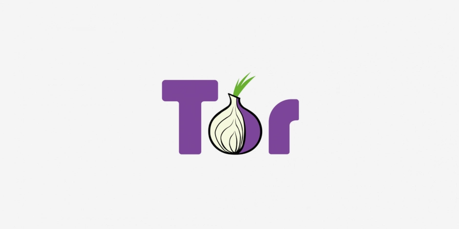

# Arti 1.4.1 更新發佈

!!! info ""

    以下內容原文翻譯來自以下文章，主詞角色為 Tor Project：

    - [Arti 1.4.1 is released: Family improvements, groundwork for Conflux, by nickm | March 3, 2025](https://blog.torproject.org/arti_1_4_1_released/){target="_blank"}
    - [Arti 1.4.0 is released: onion services, RPC, relay development, and more, by Diziet | February 7, 2025 ](https://blog.torproject.org/arti_1_4_0_released/){target="_blank"}

Arti 是我們正在進行中的專案，用於使用 Rust 開發新一代的 Tor 使用者端。我們現在宣布最新版本 Arti 1.4.1 的釋出。

此版本新增了使用者端對 [Family IDs](https://spec.torproject.org/proposals/321-happy-families.html){target="_blank"}（也稱為「Happy Families」）的實作功能，當此功能被全面採用時，將可節省中繼節點管理員的時間與頻寬。此外，此版本也開始為全面實作 [Conflux](https://spec.torproject.org/proposals/329-traffic-splitting.html){target="_blank"} 打好基礎，透過多路徑傳輸流量來提升效能。

若想了解我們完成的所有細節，以及許多較小且不那麼顯眼的更動資訊，請參閱 [CHANGELOG](https://gitlab.torproject.org/tpo/core/arti/-/blob/main/CHANGELOG.md#arti-141--3-march-2025){target="_blank"}。感謝所有對此版本做出貢獻的人，包括 kpcyrd 和 Neel Chauhan。
同時，也特別感謝我們的各位[贊助者](https://www.torproject.org/about/sponsors/){target="_blank"}對 Arti 開發的支持與資助！

<!-- more -->

## 補充 1.4.0 更新

此版本提供了一個全新的 [RPC 介面](https://gitlab.torproject.org/tpo/core/arti/-/tree/main/doc/dev/rpc-book/src){target="_blank"}，是 Arti 取代 C Tor [控制端口](https://spec.torproject.org/control-spec/index.html){target="_blank"}的替代方案，並帶來了許多改進。此外，還進行了大量關於支援中繼節點的準備工作、錯誤修復，以及針對服務端洋蔥服務的抗拒絕服務攻擊的相關開發。

若想了解我們完成的所有細節，以及許多較小且不那麼顯眼的更動資訊，請參閱 [CHANGELOG](https://gitlab.torproject.org/tpo/core/arti/-/blob/main/CHANGELOG.md#arti-140--7-february-2025){target="_blank"}。

隨著此版本的釋出，我們很高興地宣布 [Arti 的官方網站](https://arti.torproject.org/){target="_blank"}已進行了全面的大改版。這個網站將用來提供關於 Arti 專案的一般資訊，例如範例程式碼、文件等。感謝 DocumentWrite 的夥伴們協助我們完成新網站的設計與實作！

### 緬懷與致謝

Arti 1.4.0 的釋出獻給 Jérémy Bobbio (1982-2024) 的紀念，他在我們的社群中被稱為 Lunar。Lunar 是一位 Tor 的志工、自由軟體開發者以及社群組織者。

在 Tor 社群內，Lunar 因帶領 Tor 舊版《每週新聞》電子報的努力，以及他對組織和組織周邊人的深切關懷而被記住。

在 Tor 社群外，Lunar 參與了許多成功的自由軟體專案，例如 Debian 專案。他也致力於建構 Reproducible Builds（可重現建構）專案的基礎設施與工具化，這項專案至今持續造福整體生態系。

Lunar 的離去對我們的社群以及他所參與的眾多其他社群都帶來了深刻的懷念與不舍。

另請參閱其他專案對 Lunar 的紀念與讚譽：

- [The Debian Project](https://www.debian.org/News/2024/20241119){target="_blank"}
- [lunar.anargeek.net](https://lunar.anargeek.net/){target="_blank"}
- [Linux Weekly News](https://lwn.net/Articles/997775/){target="_blank"}
- [The Reproducible Builds Project](https://reproducible-builds.org/news/2024/11/14/reproducible-builds-mourns-the-passing-of-lunar/){target="_blank"}

### 全新 RPC 介面

隨著此版本的釋出，Arti 的 [RPC 介面](https://gitlab.torproject.org/tpo/core/arti/-/tree/main/doc/dev/rpc-book/src){target="_blank"}現已可供使用。

Arti 的 RPC 接口取代了 C Tor 的[控制端口（control port）](https://spec.torproject.org/control-spec/index.html){target="_blank"}，並帶來以下多項改進：

- 協議基於 JSON，減少了開發人員對自定義剖析器（parser）和編碼器（encoder）的需求。
- 協議採用以能力（capabilities）為基礎的設計，以避免應用程式彼此之間無意間影響對 Arti 的使用。
- 協議更明確地支援擴展，並清楚規範了使用者端與 Arti 如何處理非預期的訊息、參數與資料。
- 提供一個[發現機制](https://gitlab.torproject.org/tpo/core/arti/-/blob/main/doc/dev/rpc-book/src/rpc-connect-spec.md){target="_blank"}，讓應用程式更容易找到並配置 RPC 端口的使用。
- 協議支持在單一連線上處理多個同時進行的請求。
- 我們提供了一個預設的使用者端函式庫，並附有 [C](https://gitlab.torproject.org/tpo/core/arti/-/blob/main/crates/arti-rpc-client-core/arti-rpc-client-core.h?ref_type=heads){target="_blank"} 和 [Python](https://gitlab.torproject.org/tpo/core/arti/-/tree/main/python/arti_rpc?ref_type=heads){target="_blank"} 包裝器，以免應用程式開發人員需要自行實作相關邏輯。

目前所支援的功能有限：應用程式可以使用 RPC API 來連線至 Arti，檢查啟動過程，並開啟資料流（data streams）。未來的版本將依照開發人員的需求增加更多功能。我們已經收到來自 [Tails](https://forum.torproject.org/t/defining-an-interface-to-arti/6432/7){target="_blank"} 和 [Tor Browser](https://gitlab.torproject.org/tpo/core/arti/-/issues/1303){target="_blank"} 的願望清單。

我們希望開發人員可以嘗試使用此 API 和客戶端函式庫，並回饋意見，以協助我們確定接下來的開發重點。

這標誌著一個重要的里程碑，使開發人員能更輕鬆地將 Arti 整合到他們的應用程式與服務中，而無需直接嵌入 Arti 的 Rust 函式庫。我們希望這將為外部開發人員帶來更多的發展機會，並讓越來越多重視隱私的使用者享受到 Tor 提供的強大線上保護。

我們預期不會在 RPC API 或客戶端函式庫中進行重大更動，但會在獲得更多開發者的實際經驗後，才正式宣佈其穩定性。

感謝所有對此版本做出貢獻的人，包括 Dimitris Apostolou、hhamud、Neel Chauhan 和 tidely。

同時，一如既往地感謝 [Zcash Community Grants](https://zcashcommunitygrants.org/){target="_blank"}、[Bureau of Democracy](https://www.state.gov/bureaus-offices/under-secretary-for-civilian-security-democracy-and-human-rights/bureau-of-democracy-human-rights-and-labor/){target="_blank"}、[Human Rights and Labor](https://www.state.gov/bureaus-offices/under-secretary-for-civilian-security-democracy-and-human-rights/bureau-of-democracy-human-rights-and-labor/){target="_blank"}，以及其他贊助者對 Arti 開發支持與資助！
