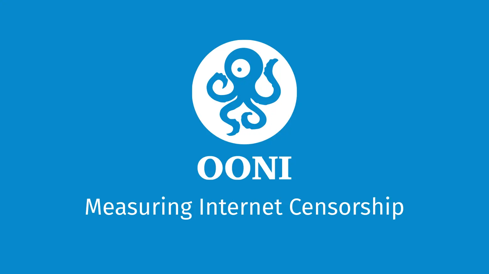

# 政府預告的 30 分鐘降速，卻沒說降到多少：8/13 一起把三家電信測出來

{style="border-radius: 10px;box-shadow:1px 1px 0.6rem #00aeff;"}

8 月 13 日週四 14:30 到 15:00，基隆、台北、新北、桃園、新竹市、新竹縣、宜蘭的行動網路會降速 30 分鐘。降速屬於「城鎮韌性演習」的一部分，三大電信同時執行。官方公告寫明語音通話、簡訊與細胞廣播照常，影音串流、視訊通話、行動支付、雲端同步等高流量服務受影響。

行政院、NCC 與電信業者的公告都載明了時段與受影響的服務，速率數字一個都沒有出現。中華電信與台灣大哥大的演練公告從頭到尾沒有提到降到多少，NCC 對外的說明也只寫「模擬行動網路使用受限」。那 30 分鐘的實際樣貌，目前只有三家電信自己知道。

<!-- more -->

## 8 月 13 日要做的三件事

全部時間為台灣時間（UTC+8）。演練時段是 **14:30 到 15:00**。

### 開始之前，8 月 13 日前先完成

安裝 [OONI Probe](https://ooni.org/install/){target="_blank"}，App Store、Google Play 與 F-Droid 都可下載，開源免費。這套工具由 OONI 開發，用途是把網路封鎖與連線品質變成可驗證的公開資料，完整介紹見[什麼是 OONI](../../tools/what-is-ooni.md)。首次啟動有一段設定流程，當天才安裝會來不及。裝好後先執行一次，確認能正常完成。

接著設三個鬧鐘：`14:15`、`14:35`、`15:10`。下午開會時很容易忘記，設鬧鐘比記憶可靠。

### 一、關閉 Wi-Fi 與 VPN，改用行動數據

固網與 Wi-Fi 在演練中完全不受影響，量測若在 Wi-Fi 上完成，結果等於零。手機常會自動回連辦公室或住家的 Wi-Fi，執行前請先確認已切到行動數據。

VPN、Tailscale 這類會改變連線出口的軟體也要先關閉。流量繞經 VPN 之後，量測結果只反映 VPN 業者那段線路，紀錄下來的 ASN 也會變成對方的，量不到電信商的降速。

量測完成後可在結果頁看到網路名稱與 ASN（電信業者的網路編號），確認那筆確實在行動網路上完成，名稱為自己的電信商。

!!! warning "先確認你的行動數據額度"

    效能組裡的 `ndt` 是吞吐量測試，會盡量用滿當下可用的頻寬。App 在執行前就會標出預估值，畫面上寫的是 5 到 200 MB、約 1 分 30 秒，實際落點隨連線速度而定。降速前的 14:15 那輪最耗流量，降速中的 14:35 那輪因為頻寬被壓低，用量小得多。

    非吃到飽的人可以只參與 14:35 與 15:10 兩輪，仍然有貢獻。

### 二、執行「效能」那組測試

開啟 App 後點「測試」，選「效能」，勾選要執行的測項，再按下執行。效能組包含 `ndt`（連線速度）與 `dash`（影音串流品質）兩個測項，正是量測降速所需，Android 與 iOS 都提供。

<figure markdown="span">
    
</figure>

!!! tip "請不要用 OONI Run 連結"

    直覺會想發一條 [OONI Run v2](../../tools/ooni-run-v2.md) 連結給大家點，本次請避免。OONI Run v2 目前僅支援 Android，iOS 使用者無法開啟。內建的「效能」測試兩個平台皆可使用。

### 三、三個時間點各執行一次

| 台灣時間（UTC+8） | UTC | 用途 |
|---|---|---|
| `14:15` | `06:15` | 降速前的對照點 |
| `14:35` | `06:35` | 降速中 |
| `15:10` | `07:10` | 恢復後 |

三輪都要用同一支手機、同一個門號，每一輪都在行動網路上完成。位置能固定會讓資料更好比對，中途需要移動也不影響參與，只要確認沒有切回 Wi-Fi 就好。

行有餘力的話，8 月 12 日週三 `14:35` 也測一次。多這一筆，隔日同時段的對照會強很多，成本一樣是按一下。

!!! note "只趕上一個時間點也有價值"

    看到本文時已經接近或超過 14:30 的人，直接做 14:35 那輪，之後補做 15:10。單一時間點的資料仍可與其他參與者、與隔日同時段互相參照。

!!! note "降速中上傳失敗屬於正常"

    量測結果需要上傳，而演練期間頻寬已被壓低，上傳可能延遲或失敗。不需要重複執行，OONI Probe 會把結果排入佇列，等網路恢復後自動補傳。

想多做一點的人，14:35 那輪可另外執行含 Tor 與 Psiphon 的那組測試（英文介面為 Circumvention），能看出降速對規避工具的影響。

## 按下執行之前，該知道的隱私影響

OONI 發布的量測結果全部公開，內容包含所處的 ASN 與時間戳記，不包含個人 IP 位址。

效能組的暴露程度比其他測項高。`ndt` 的量測對端是 [M-Lab](https://www.measurementlab.net/){target="_blank"}，而 M-Lab 的[隱私政策](https://www.measurementlab.net/privacy/){target="_blank"}載明測試資料會對外公開，公開內容包含你的 IP 位址與日期時間，並且以長期研究為由無限期保留，公開資料集裡不做匿名化，除非個別行使 GDPR 或 LGPD 的刪除權。

執行 `ndt` 等於把當下的對外 IP 位址寫進一份公開且永久保存的資料集。M-Lab 不認證使用者、不保存個人的測試歷史，行動網路的 IP 又多為浮動，實務上很難對應回特定個人。是否留下這筆紀錄，請自行斟酌。

App 的效能頁面本身也附了免責聲明，說明測試透過第三方伺服器進行，無法保證 IP 位址不被他人收集。只想貢獻網站可達性觀測、不願留下 IP 紀錄的人，可以改執行網頁連線測試（`web_connectivity`，英文介面為 Websites），它不經過 M-Lab。

## 中部場已經示範了後果

8 月 10 日 14:30 到 15:00，同樣的降速在中部七縣市執行過一輪（UTC 時間 `06:30` 到 `07:00`）。演練結束後，我們查詢 OONI 的公開資料庫，看台灣在該時段留下了什麼。

| 測項 | 該時段全台筆數 | 來源網路 |
|---|---|---|
| `ndt`（連線速度） | 1 | `AS131584` 台灣智慧光網，固網 |
| `dash`（影音串流品質） | 1 | 同一個固網 ASN |
| `web_connectivity`（網站可達性） | 803 | 幾乎全在固網，HiNet 佔 593 筆 |

中華電信行動的 `AS17421` 是 0 筆，遠傳的 `AS9674` 是 0 筆。

唯一那筆速度量測執行在固定光纖上，量測的網路並未降速。中部那 30 分鐘等於沒有留下任何獨立觀測，頻寬恢復後，那段時間發生過什麼已無從查證。北部場是本次演習的最後一場。

## 台灣的 OONI 觀測，四成來自 HiNet

中部場的結果反映了台灣 OONI 資料長期的分布。近 30 天全台灣有 658,037 筆 `web_connectivity` 量測，分佈在 25 個 ASN：

| 網路 | 近 30 天筆數 | 佔比 |
|---|---|---|
| `AS3462` HiNet | 259,987 | 39.5% |
| 三家行動業者合計 | 23,451 | 3.6% |
| 　└ `AS24158` 台灣大哥大 | 20,481 | |
| 　└ `AS17421` 中華電信行動 | 2,375 | |
| 　└ `AS9674` 遠傳 | 595 | |

其餘六成多也以固網為主，台灣智慧光網、StarVerse、DaDa Broadband 各有數萬筆，另有幾所大學的校園網路。

真正需要的效能測項，數字更少。近 30 天全台灣只有 1,025 筆 `ndt`，其中中華電信行動 16 筆、遠傳 4 筆。同期 `web_connectivity` 是 658,037 筆。

要說明台灣的網路環境，目前可引用的資料主要反映家用固定寬頻的狀況。台灣有超過三千萬的行動門號，多數人一天裡大半時間透過行動網路上網。

公開的 aggregation API 只提供量測筆數，不提供裝置數，所以上表無法排除少數幾台裝置反覆量測的可能。台灣大哥大同時經營行動與固網，中華電信也是，因此單看一筆 `AS24158` 的量測，判斷不出它來自手機還是家用數據機。

## 為什麼三家要一起測

上面那項辨識問題，正好說明為什麼要挑這個時段。演練已公告時段與縣市範圍，在該時段內、在公告範圍中，`AS24158`、`AS17421`、`AS9674` 出現的行動端量測有明確的情境可對應，ASN 這時才足以定位到業者。平常散在各處的量測沒有這個條件。

同一時段只消除了「時間」這一個變因。地點、基地台負載、手機型號、訊號強度全部還在。十支手機散在七個縣市，得到的仍是一批條件互異的觀測點，結論只能停在粗粒度的判斷，例如三家是否都出現可觀察的吞吐下降、下降的量級是否接近。任何精確的業者排名都超出這批資料能支撐的範圍。

即使如此，三家同時面對同一道指令、同一個 30 分鐘，仍然是難得的對照時機。單獨一家測得再密，也只能得到那一家的曲線。

## 30 分鐘的資料能用在哪裡

**時段與範圍明確的降速樣本。** 網路降速研究最難的一環，是不知道降速從幾點開始、幾點結束、涵蓋哪裡。多數案例由使用者先察覺變慢，研究者事後回推，時間邊界永遠模糊。北部場由政府預告，日期、時段、縣市、業者全部公開，30 分鐘的邊界明確。已知的部分僅限「政策在什麼時間、什麼範圍生效」，處理強度並不包含在內，因為目標速率沒有公布。預告式的斷網在其他國家並非首見，例如考試期間的全國性斷網，比較少見的是預告式的降速，加上可切分到各家業者的粒度。

**台灣行動網路的對照基準。** 有了平時與降速中的對照，未來發生非預期的網路劣化時才有基準可比。少了基準，任何一次異常都只能停在「大家覺得變慢」。價值隨參與量放大，30 支手機只是零星個案，300 支才具備資料的分量。

**部分驗證官方的說法。** 公告稱語音、簡訊、細胞廣播正常，只有高流量服務受影響。三份公告對受影響範圍的描述並不一致，台灣大哥大的公告把 LINE、WhatsApp、M+ 等通訊軟體列進會出現連線延遲與不穩定的範圍，行政院的版本則是文字傳輸正常。`ndt` 與 `dash` 只能檢查高流量那一側，語音、簡訊與細胞廣播不在這兩個測項的能力範圍內。能驗證的只有界線的其中一邊，仍然值得做。公民社會有能力自己驗證公共措施的實際效果，本身就是韌性的一部分。

**規避工具是否被波及。** 頻寬被壓低時，Tor 與 Psiphon 能否建立連線，是社群長期關注的題目，週四的 30 分鐘正好是現成的測試場。

解讀時須留意 `ndt` 的量測對端是 M-Lab 的伺服器，數字裡同時包含最後一哩與到 M-Lab 節點的國際線路，兩者無法從單筆結果中分離。

## 一起來

安裝 [OONI Probe](https://ooni.org/install/){target="_blank"} 並執行一次。設好 `14:15`、`14:35`、`15:10` 三個鬧鐘。把本文轉給住在北部七縣市或在當地工作的朋友。特別歡迎中華電信與遠傳的用戶，兩家目前的效能量測近乎零。以現在的密度來說，每家電信有 10 支手機參與就已經是數量級的改善。

不在北部七縣市的人也可以在同樣的時間點測一次。降速範圍外的量測構成對照組，能協助分辨哪些變化來自演練、哪些屬於當天的一般波動。

測完之後，可在 [OONI Explorer](https://explorer.ooni.org/){target="_blank"} 用自己的 ASN 與時段查到那筆紀錄。社群會在演練後把三個時段、各家業者的結果整理成一篇後續文章。有問題或想一起整理結果的人，歡迎到社群的 [Matrix Public Space](https://matrix.to/#/#community:im.anoni.net){target="_blank"} 討論。

## 延伸：之後如何用 OONI 佐證研究

本次號召針對單一事件，方法本身可以重複使用。OONI 的資料有三個入口，用途各不相同：

- **[OONI Explorer](https://explorer.ooni.org/){target="_blank"}**：網頁介面，適合查單筆量測、看某個國家或 ASN 的趨勢，無須寫程式。
- **Aggregation API**：`https://api.ooni.org/api/v1/aggregation`，免驗證免金鑰，可依國家、測項、ASN、時間切分做統計。本文所有數字皆由此查得。查詢時間一律使用 UTC，台灣時間需減 8 小時。
- **AWS S3 公開資料集**：`ooni-data-eu-fra`，逐筆原始 JSON，適合需要檢視量測細節或做大規模分析的研究。原始資料進入 S3 有數小時到一日的延遲，取用方式與 CSV 輸出格式寫在 [ASN 觀測資料擷取與分析](../../community/asn-coverage-howto.md)，社群維護的擷取程式也在該頁。

以本次演練為例，查詢條件是 `probe_cc=TW`、`test_name=ndt`（或 `dash`）、`since=2026-08-13T06:00:00Z`、`until=2026-08-13T08:00:00Z`，再依 `probe_asn` 切分成 `24158`、`17421`、`9674` 三組。要判斷某個問題該用哪個測項，[OONI 測項速查表](../../community/ooni-nettests-map.md)整理了每個測項量測什麼、規格狀態，以及台灣是否有資料。台灣的 ASN 覆蓋現況見 [ASN 自治網路觀測資料分析](../../taiwan/ooni-asn-coverage.md)。

**異常（anomaly）不等於封鎖。** OONI 的 `anomaly` 只代表測試未照預期完成，成因包含審查、網路不穩、ISP 暫時故障，以及測試程式本身的問題。將 `anomaly` 比率直接視為封鎖率會產生假指控。以 `tor` 測項近 30 天的實測為例，加拿大 `21.2%`、瑞士 `22.2%`、紐西蘭 `41.1%`，皆為沒有審查的國家。中段數值屬於雜訊，只有比率極端高的少數國家與現實相符。

**授權是 CC BY-NC-SA 4.0。** OONI 發布的量測資料禁止商業使用，衍生內容需以相同授權釋出。引用數據時要標註來源，將 OONI 資料與其他來源合併產生新的資料檔，會讓整份成品都受同一授權拘束。

演習細節以[行政院公告](https://www.ey.gov.tw/Page/9277F759E41CCD91/66c2bed1-6ca3-4c30-ba7c-4fa0f90e00ec){target="_blank"}與各電信業者公告為準，時間如有調整依官方最新資訊。

---

**資料來源**：OONI aggregation 與 measurements API（2026-08-10 查詢，量測資料授權 [CC BY-NC-SA 4.0](https://github.com/ooni/license/blob/master/data/LICENSE.md){target="_blank"}）、ASN 名稱取自 [RIPEstat](https://stat.ripe.net/){target="_blank"}、M-Lab 資料處理方式取自 [M-Lab 隱私政策](https://www.measurementlab.net/privacy/){target="_blank"}、演習資訊取自行政院、NCC、[台灣大哥大](https://www.taiwanmobile.com/csonline/service/ann/ann3_20260722_103509.html){target="_blank"}與[中華電信演練公告](https://www.cht.com.tw/home/consumer/customer-service/announce/urban-resilience-exercise){target="_blank"}。
