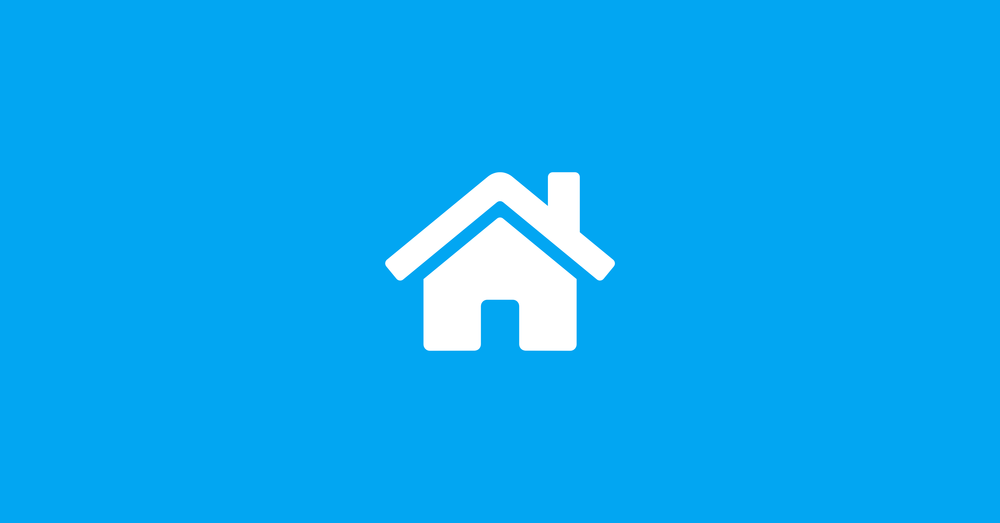

# 一起測週四的行動網路降速：台灣的 OONI 資料還缺三大電信

{style="border-radius: 10px;box-shadow:1px 1px 0.6rem #00aeff;"}

8 月 13 日週四下午 2 點半，基隆、台北、新北、桃園、新竹市、新竹縣、宜蘭的行動網路會降速 30 分鐘。這是「城鎮韌性演習」的一部分，三大電信一起執行，官方公告寫明語音通話、簡訊與細胞廣播照常，受影響的是影音串流、視訊通話、行動支付、雲端同步這類高流量服務。公告沒有寫的是降到多少。中華電信的演練公告從頭到尾沒有出現任何速率數字，行政院的公告也沒有。這 30 分鐘的實際樣貌，目前只有三家電信自己知道。

<!-- more -->

## 中部場已經示範了會發生什麼

8 月 10 日下午 2 點半到 3 點，同樣的降速在中部七縣市執行過一輪。那 30 分鐘結束後，我們去 OONI 的公開資料庫查台灣有留下什麼。

| 測項 | 該時段全台筆數 | 來源網路 |
|---|---|---|
| `ndt`（連線速度） | 1 | AS131584 台灣智慧光網，固網 |
| `dash`（影音串流品質） | 1 | 同一個固網 ASN |
| `web_connectivity`（網站可達性） | 803 | 幾乎全在固網，HiNet 佔 593 筆 |

中華電信行動的 AS17421 是 0 筆，遠傳的 AS9674 是 0 筆。

唯一那筆速度量測執行在固定光纖上，而固網在這場演練裡完全不受影響，所以它量到的是一個沒有發生降速的網路。中部那 30 分鐘等於沒有留下任何獨立觀測。演練結束、頻寬恢復，發生過什麼就再也查不回來了。

北部場是這次演習的最後一場。

## 台灣的 OONI 資料，四成來自 HiNet

上面那個結果並不意外，它反映的是台灣 OONI 資料長期的形狀。近 30 天全台灣有 658,037 筆 `web_connectivity` 量測，分布在 25 個 ASN：

| 網路 | 近 30 天筆數 | 占比 |
|---|---|---|
| AS3462 HiNet | 259,987 | 39.5% |
| 三家行動業者合計 | 23,451 | 3.6% |
| 　└ AS24158 台灣大哥大 | 20,481 | |
| 　└ AS17421 中華電信行動 | 2,375 | |
| 　└ AS9674 遠傳 | 595 | |

其餘的六成多也以固網為主，台灣智慧光網、StarVerse、DaDa Broadband 各有數萬筆，另外還有幾所大學的校園網路。

換到這次真正需要的效能測項，數字更少。近 30 天全台灣只有 1,025 筆 `ndt`，其中中華電信行動 16 筆、遠傳 4 筆。同期 `web_connectivity` 是 658,037 筆，效能量測的密度大約是它的萬分之十五。

所以現在要說明「台灣的網路環境如何」，能拿出來的資料主要反映家用固定寬頻的狀況。台灣有超過三千萬的行動門號，多數人一天裡大半時間是透過行動網路上網，這一塊在公開觀測資料裡幾乎是空白。

還有一個更麻煩的問題。台灣大哥大同時經營行動與固網，中華電信也是，所以看到一筆 AS24158 的量測，光憑資料判斷不出它來自手機還是家裡的數據機。刻意在已知時段、已知情境下執行量測，才能產生標籤明確、後續拿得出來用的資料。

## 為什麼要三家一起測

行動網路的量測平常很難做出有意義的比較，因為各家用戶在不同時間、不同地點、不同基地台底下，測到的差異可能來自任何原因。要比較業者之間的行為，需要一個三家同時面對同一個條件的時刻。

週四下午 2 點半就是這種時刻。同一個 30 分鐘、同一組縣市、同一道行政指令，三家電信各自去實作降速。官方沒有公布各家怎麼做、降到多少、是否一致。這些差異只有一種方法看得出來，就是三家的用戶在同一時間各自量測，而 OONI 會自動把每筆量測標上 ASN。

單獨一家測得再密，也只能得到那一家的曲線。三家一起才構成對照。

## 這 30 分鐘的資料能用來做什麼

**一、產生一份時間標籤明確的降速資料集。** 全球的網路降速研究最難的一環，是不知道降速從幾點開始、幾點結束、涵蓋哪裡。多數案例是使用者先察覺變慢，研究者事後回推，時間邊界永遠模糊。這次是政府預告的演練，日期、時段、縣市、業者全部公開，30 分鐘的邊界清清楚楚。這種帶 ground truth 的樣本在公開資料集裡很少見，對 OONI 與 M-Lab 的研究者都有價值。

**二、替台灣的行動網路建立基線。** 有了平時與降速中的對照，未來真的發生非預期的網路劣化時，才有東西可以比對。沒有基線的話，任何一次異常都只能停在「大家覺得變慢」。

**三、獨立驗證官方的說法。** 公告說語音、簡訊、文字傳輸正常，只有高流量服務受影響。這條界線實際落在哪裡，需要獨立量測才能檢查。這不是為了挑毛病，公民社會有能力自己驗證公共措施的實際效果，本身就是韌性的一部分。

**四、看規避工具會不會被波及。** 頻寬被壓低時，Tor、Psiphon 這類工具還能不能建立連線，是這個社群長期在追的題目。這 30 分鐘剛好是一個現成的測試場。

## 週四要做的三件事

**一、關掉 Wi-Fi，改用行動數據。** 這條做錯的話，後面全部白做。固網與 Wi-Fi 在這次演練中完全不受影響，中部場唯一那筆量測就是這樣浪費掉的。

**二、執行 OONI Probe 內建的 Performance 測試。** 打開 App，選 Performance 那張卡片，按執行。那張卡片裡就包含 `ndt` 與 `dash` 兩個測項，正好是量降速需要的。這張卡片在 Android 與 iOS 都有。

!!! tip "不要用 OONI Run 連結"

    直覺會想發一條 [OONI Run v2](../../tools/ooni-run-v2.md) 連結給大家點，這次請不要。OONI Run v2 目前只支援 Android，iOS 使用者收到連結會用不了。內建的 Performance 卡片兩個平台都有，直接請大家點那張最簡單。

**三、執行三次，不是一次。**

| 時間 | 用途 |
|---|---|
| 14:15 | 降速前的基線 |
| 14:35 | 降速中 |
| 15:10 | 恢復後 |

沒有 14:15 那筆基線，14:35 測到的數字沒有比較對象，也就沒有意義。

還沒安裝的人，[OONI Probe](https://ooni.org/install/){target="_blank"} 在 App Store、Google Play 與 F-Droid 都有，開源免費。不熟悉這個工具的話，可以先看[什麼是 OONI](../../tools/what-is-ooni.md)。

!!! warning "降速中上傳失敗是正常的"

    量測結果需要上傳，而降速期間頻寬本來就被壓低，上傳可能會卡住或失敗。不需要重複執行，OONI Probe 會把結果排入佇列，等網路恢復後自動補傳。

行有餘力的話，14:35 那一輪可以多執行一次 Circumvention 卡片，裡面含 Tor 與 Psiphon 的連線測試，能看出降速對規避工具的影響。

## 隱私上要知道的事

OONI 的量測結果全部公開，內容包含所處的 ASN 與時間戳記，不包含個人 IP 位址。ASN 加上時間可以推知大致的位置與所用的電信商。這次是政府預告的公開演練，參與者是北部七縣市的一般使用者，暴露程度很低。這一點仍然要說明白，願不願意留下這筆紀錄由你自己決定。

## 之後怎麼用 OONI 佐證研究

這次的號召是一個具體事件，方法本身可以重複使用。OONI 的資料有三個入口，用途差很多：

- **[OONI Explorer](https://explorer.ooni.org/){target="_blank"}**：網頁介面，適合查單筆量測、看某個國家或 ASN 的趨勢，不需要寫程式。
- **Aggregation API**：`https://api.ooni.org/api/v1/aggregation`，免驗證免金鑰，可以依國家、測項、ASN、時間切分做統計。本文所有數字都出自這裡。
- **AWS S3 公開資料集**：`ooni-data-eu-fra`，逐筆原始 JSON，適合需要看量測細節或做大規模分析的研究。取用方式與 CSV 輸出格式寫在 [ASN 觀測資料擷取與分析](../../community/asn-coverage-howto.md)，社群維護的擷取程式也在那頁。

要判斷某個問題該用哪個測項，可以查[OONI 測項速查表](../../community/ooni-nettests-map.md)，那頁整理了每個測項量什麼、規格狀態，以及台灣有沒有資料。想看台灣的 ASN 覆蓋現況，見 [ASN 自治網路觀測資料分析](../../taiwan/ooni-asn-coverage.md)。

用這些資料時有兩件事要注意。

**anomaly 不等於封鎖。** OONI 的 `anomaly` 只代表測試沒有照預期完成，成因包含審查、網路不穩、ISP 暫時故障，以及測試程式本身的問題。拿 anomaly 比率直接當封鎖率會產生假指控。以 `tor` 測項近 30 天的實測為例，加拿大 21.2%、瑞士 22.2%、紐西蘭 41.1%，全是沒有審查的國家。中段的數值屬於雜訊，只有極端高的那幾個對得上現實。

**授權是 CC BY-NC-SA 4.0。** OONI 發布的量測資料禁止商業使用，衍生內容需以相同授權釋出。引用數據時要標註來源，把 OONI 資料混進其他來源產生新的資料檔，會讓整份成品都受這個授權拘束。

## 一起來

需要的就是週四下午三個時間點、各按一次執行。以現在的密度來說，每家電信只要有 10 支手機參與，就已經是數量級的改善。

歡迎轉給住在或工作在北部七縣市的朋友，特別是中華電信與遠傳的用戶，這兩家目前的效能量測近乎於零。有問題或想一起整理結果的人，歡迎到[社群 Matrix 公開 room](../../community/tools.md) 討論。

演習細節以[行政院公告](https://www.ey.gov.tw/Page/9277F759E41CCD91/66c2bed1-6ca3-4c30-ba7c-4fa0f90e00ec){target="_blank"}與各電信業者的公告為準，時間如有調整以官方為準。

---

**資料來源**：OONI aggregation 與 measurements API（2026-08-10 查詢，量測資料授權 [CC BY-NC-SA 4.0](https://github.com/ooni/license/blob/master/data/LICENSE.md){target="_blank"}）、ASN 名稱取自 [RIPEstat](https://stat.ripe.net/){target="_blank"}、演習資訊取自[行政院](https://www.ey.gov.tw/Page/9277F759E41CCD91/66c2bed1-6ca3-4c30-ba7c-4fa0f90e00ec){target="_blank"}與[中華電信演練公告](https://www.cht.com.tw/home/consumer/customer-service/announce/urban-resilience-exercise){target="_blank"}。
