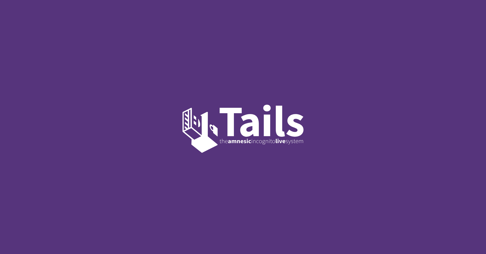

# Tails 6.18 支援 WebTunnel 橋接協定

!!! info ""

    以下內容原文翻譯來自以下文章，主詞角色為 Tor/Tails：

    - [New Release: Tails 6.18 , Tor Blog 2025-07-25](https://blog.torproject.org/new-release-tails-6_18/){target="_blank"}

{style="border-radius: 10px;"}

## 新功能

### WebTunnel 橋接方式

你現在可以使用 **WebTunnel 橋接**從 Tails 連接到 Tor 網路。

[WebTunnel](https://blog.torproject.org/introducing-webtunnel-evading-censorship-by-hiding-in-plain-sight/){target="_blank"} 是一種橋接技術，特別擅長繞過審查，在 obfs4 橋接器被封鎖的地方能有效運作。WebTunnel 將你的連接偽裝成普通的網頁流量。

取得 WebTunnel 橋接節點，請參考 [https://bridges.torproject.org/](https://bridges.torproject.org/){target="_blank"}。

{style="border-radius: 10px;"}

!!! note "翻譯說明"

    我們目前還沒有針對「**Bridge 橋接類型**」作專門的介紹，橋接節點主要是協助無法直接連入 Tor 的洋蔥路由中，透過橋接節點介接連入，目前有一個最快的方式建立橋接點，是透過偽裝成**線上視訊**的連線方式協助轉接，僅使用**瀏覽器**就可以協助建立，詳細或試用可以參考「[Tor Snowflake 橋接點建立（網頁版）](../../tor-snowflake.md){target="_blank"}」。

## 其他更新

- Tor 瀏覽器更新到 [14.5.5](https://blog.torproject.org/new-release-tor-browser-1455){target="_blank"} 版本。
- Thunderbird 郵件軟體更新到 [128.12.0](https://www.thunderbird.net/en-US/thunderbird/128.12.0esr/releasenotes/){target="_blank"} 版本。

更多更新資訊可以參考[更新日誌](https://gitlab.tails.boum.org/tails/tails/-/blob/master/debian/changelog){target="_blank"}。
