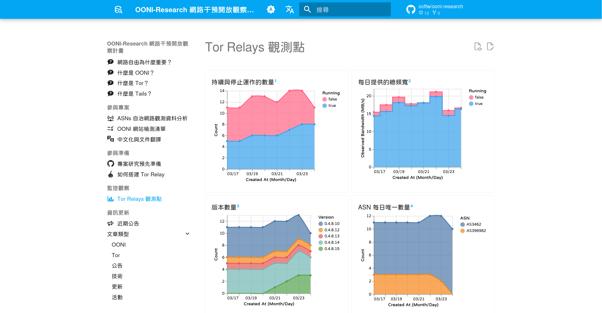

# 2025/03 專案進度更新

時間過的飛快，三月份快過完了！而 2025 第一季也即將告一段落，我們來回顧一下專案目前的進度與一些成果。這一期更新我們會提到工作坊後續規劃、OONI 團隊發佈「匿名憑證」的實作概念、專案目前翻譯成果與 Tor Relays 觀測站的建立！

<!-- more -->

## 工作坊活動

{style="border-radius: 5px; border: 1px solid #cdcdcd;"}

RightsCon 2025 順利在二月最後一週舉辦完畢，我們在活動前一天與 Tor/Tails、OONI 團隊[一同舉辦](./rightscon25-pre-event.md){target="_blank"}工作坊活動，總參加人次達三百多人，是一個稍微有點意外報名人數如此踴躍的活動，也感謝 Tor/Tails、OONI 團隊的支援。而這次活動也感謝志工夥伴的協助，開放文化基金會的其他夥伴都分別協助 RightsCon 的支援，在人手不夠的狀態下給予我們有力的協助！

活動後，我們整理了這場工作坊、講座的重點摘要文章、簡報蒐集，不論你當天是否有參與或是想要回顧活動內容的，都可以參考[這篇文章](./rightscon25-tor-tails-ooni-after.md){target="_blank"}的內容。

### 工作坊的延續

在這次的活動中 Tor/Tails、OONI 工作坊的參與者對於「網路自由」、「匿名網路」議題上有著初步的理解與動手操作工具來提升安全與隱私的抵禦能力，而活動後也收到許多對於工作坊安排的回饋與建議，我們決定申請今年 COSCUP 開源人年會的工作坊議程，繼續將此議題調整更切合臺灣在地的脈絡與語言來繼續推廣使用。

COSCUP 預計 8/9、10 於臺灣科技大學舉辦，我們會在這兩天的其中一天舉辦工作坊活動，在八月前，我們需要針對簡報、教材調整成華語與臺灣用語的內容。另外也需要開始募集工作夥伴籌備工作坊活動與培訓工作坊小幫手。如果你對工作坊活動有興趣的，請記得與我們聯絡，預計在四月的第二週開始啟動籌備。

## 「匿名憑證」

最近我們翻譯了一篇來自 OONI 團隊如何計畫改善與增強匿名資料提供的驗證，如何在保有隱私與資料可信度上作一個增進、抵禦來自惡意上傳髒資料影響整體資料庫的解決辦法。有興趣的可以前往閱讀[這篇文章](./2025-probe-security-without-identification.md){target="_blank"}。

這篇文章提供了相關領域的文獻回顧，以及未來 OONI 團隊要如何實作「匿名憑證」的流程。這篇文章稍微有點專業硬領域，可能不太好閱讀，但非常推薦稍微花點時間瞭解，或與我們討論與建議！

或許與最近由數位發展部推動的[數位皮夾](https://wallet.gov.tw/){target="_blank"}是同一個領域的概念！

## 翻譯文章

除了前面所提到的「匿名憑證」的文章外，我們也會針對 Tor、Tails、OONI 所發佈較重要的文章進行翻譯，例如：你知道嗎？Tor 也打算用 Rust 來實作，其專案名稱為 Arti。Tor 是使用 C 語言的方式建構，但 C 語言在記憶體操作上有一定的技巧，處理不好可能會造成資安問題，因此決定使用 Rust 語言來重新打造一個較為安全的 Tor 應用程式，Arti 專案目前也逐步實作 C 語言 Tor 的功能，有興趣可以參考[這篇已翻譯的文章](./arti-141.md){target="_blank"}。

{style="border-radius: 5px;"}

此外，我們現在也正在翻譯一個專案網站，來自 [EFF](https://www.eff.org/){target="_blank"} 與 Tor 合作推出的 [Tor 大學挑戰賽計畫](https://toruniversity.eff.org/){target="_blank"}，希望可以在三月底前完成，到時候會有更詳細的說明。

## Tor Relays 觀測站

{style="border:1px solid #cdcdcd; border-radius: 5px;"}

在專案頁面新增一個 Tor Relays 觀察站，這頁面主要是觀察目前臺灣的 Tor Relays 中繼站的數量、運作狀況。Tor 官方網站提供一個 [Tor Metrics](https://metrics.torproject.org/){target="_blank"} 的查詢網站，我們每小時會透過擷取網站上的紀錄資訊、回來整理成好閱讀的圖表資訊，方便我們在推廣時能有一個較好說故事的版面。

目前這個頁面還在開發與嘗試中，不保證 24 小時都會運作（我們正在解決穩定性問題 XD），開發的程式碼也還沒有合併到主線上，有興趣的夥伴可以參考 [pulse](https://github.com/ocftw/ooni-research/compare/main...pulse?expand=1){target="_blank"} 與 [api](https://github.com/ocftw/ooni-research/compare/main...api?expand=1){target="_blank"} 這兩個分支，或是可以直接在 [API 文件頁面](https://ooni-research.ocf.tw/api/docs){target="_blank"}隨意嘗試，目前用到 Python 語言的 [FastAPI](https://fastapi.tiangolo.com/){target="_blank"}、[Pydantic](https://docs.pydantic.dev/latest/){target="_blank"} 作為開發的框架。

當然，我們也在找熟悉大量處理資料的夥伴，有興趣也可以直接與我們聯絡！

## 最後

以上，是目前此專案的活動進度，我們會持續翻譯重要的文章、持續匯入 Tor、OONI 的觀察資料，以及準備八月的工作坊活動籌備事項！歡迎持續關注我們或是透過 RSS 的方式[訂閱此頁面](../index.md){target="_blank"}的訊息發佈。
