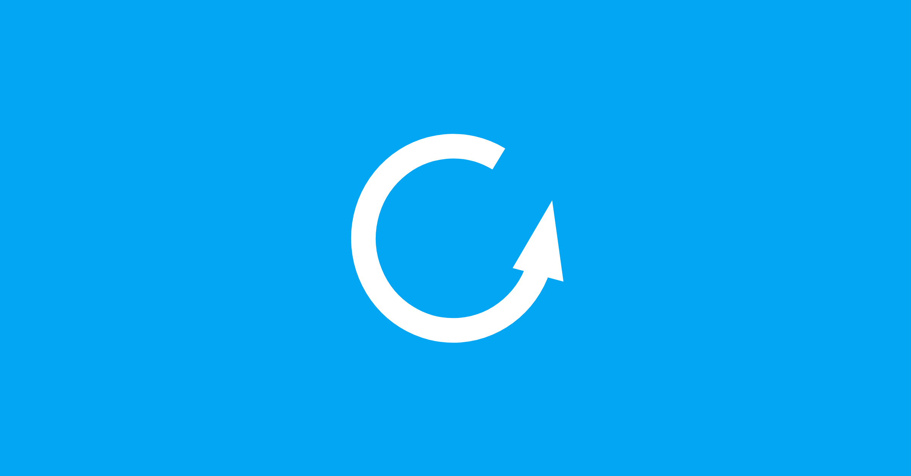

# 2025/08 專案進度更新

{style="border-radius: 10px;box-shadow:1px 1px 0.6rem #00aeff;"}

在 8/9 - 8/10 的[工作坊活動](../../event-workshop-2025.md){target="_blank"}已順利的舉辦完成，我們目前正在準備工作坊後的討論、回顧、思考後續可以努力的方向。不論您是否有在活動二天的參與，都先感謝還持續的關注我們！

接下來與您分享 2025/08 這段期間我們有哪些更新。

## 擺攤、手冊

在工作坊活動結束後，我們也參與了 [HITCON](https://hitcon.org/2025/){target="_blank"}、[PyConTW](https://tw.pycon.org/2025/){target="_blank"} 的研討會活動，雖然我們沒有申請攤位，但我們有製作一本關於「匿名網路」手冊，內容包含社群介紹、Tor/Tails、OONI 的介紹、網路自由、匿名網路議題說明，以及社群目前利用哪些開源軟體來自架服務，於研討會會場中放置索取。

這本手冊未來只會在實體活動參與時才會拿到，每次都會少量印製輸出，隨時增補新的資訊到手冊中。在工作坊活動時，我們也給予每位參與者一本，透過這次活動的觀察，有助於參與者瞭解社群所要傳達「匿名網路、網路自由」的想法。未來如果有類似的研討會或社群活動，我們也會主動申請攤位持續推廣。

<!-- more -->

## 整理共筆內容

工作坊活動後，我們預計在 9/21 召開工作坊工作人員的回顧會議，整理活動共筆內容，您可以透過這裡的[活動議程表](../../event-workshop-2025.md#%E5%AE%8C%E6%95%B4%E6%B4%BB%E5%8B%95%E6%99%82%E7%A8%8B%E8%A1%A8){target="_blank"}上的連結回顧共筆內容，或是也可回信給我們關於你的想法，2025 年底或 2026 一整年的時間區間。

## 翻譯文章

2025/08 我們還是持續更新 Tor/Tails、OONI 官方網站的資訊，不少內容在這個月份發佈，我們會盡可能的在一週內的時間將文章翻譯、校稿後上線，除非您有研究上的需求，也可以直接專注官方網站的訊息發佈。

- [Tails 7.0 發佈第二個最終測試版本（7.0~rc2）](./tails-7-rc.md){target="_blank"} - 2025/08/29
- [OMG！第三屆 Open Measurement Gathering（OMG）的有問必答（AMA）活動總結](./2025-omg.md){target="_blank"} - 2025/08/29
- [貪腐與控管：土庫曼如何將網路審查變成一門生意](./tor-corruption-control.md){target="_blank"} - 2025/08/30
- [Tails 6.18 支援 WebTunnel 橋接協定](./tails-6-18-webtunnel.md){target="_blank"} - 2025/07/31

此外，我們也看到 [The MIT Press Reader](https://thereader.mitpress.mit.edu/){target="_blank"} 發佈了一篇還不錯的文章，也取得 The MIT Press 的同意後翻譯為華文內容。這篇文章我們嘗試不僅僅只有翻譯內容而已，文章內容提及到一些歷史事件的脈絡也透過註解的方式補充。

- [Tor 的秘密歷史：如何從軍事專案到維繫隱私的救命繩索](./tor-military-to-privacy.md){target="_blank"} - 2025/09/07

## 匿名搜尋 SearXNG

    

[SearXNG](https://searxng.org/){target="_blank"} 是一個開源的隱私網路搜尋引擎，主要是保護使用者的隱私。SearXNG 從多個搜尋網站來源彙整搜尋結果、但不追蹤使用者，也不蒐集個人資料。SearXNG 可以自行架設，增加隱私保護，並支援客製化設定，讓使用者選擇想要的搜尋引擎及過濾規則。

有鑑於目前[公開的](https://searx.space/){target="_blank"}伺服器清單中，位在亞洲地區的伺服器服務不多，我們在一週前已經把 SearXNG [架起來](https://search.anoni.net/){target="_blank"}，且[申請](https://github.com/searxng/searx-instances/issues/738){target="_blank"}成為公開伺服器服務，基本的技術要求已經通過，進入到二週的觀察。也歡迎協助我們測試，在這二週的觀察期間，確認主機能耐可承受日常的使用。

## Tor WebTunnel

<figure markdown="span">
    
    <caption>Tor Relay 類型</caption>
</figure>

WebTunnel 是 Tor 橋接類型其中一項，協助 Tor 的使用者無法直接連到 Onion 洋蔥路由網路中時，協助代理轉接連線的伺服器，詳細的介紹與說明可以參考[這篇文章](../../what-is-tor.md#%E4%B8%AD%E7%B9%BC%E7%AF%80%E9%BB%9E%E6%A9%8B%E6%8E%A5%E9%BB%9E){target="_blank"}。自 Tails 6.18 版本，也加入支援 WebTunnel 橋接方式的連線。由於橋接點有其功能的重要性，因此不會在 Tor 官網上查詢到連線參數，需要透過[主動索取](https://bridges.torproject.org/){target="_blank"}的方式取得連線資訊。

也因此，我們無法統計目前有多少台 Tor WebTunnel 的橋接點建立在臺灣，如果您有興趣，可以參考「[WebTunnel Docker setup](https://community.torproject.org/relay/setup/webtunnel/docker/){target="_blank"}」來建立，或是您本身就有一個 nginx 架起來的服務，提供一個路徑給予 WebTunnel 橋接連線來[貢獻一個節點](https://community.torproject.org/relay/setup/webtunnel/){target="_blank"}也非常感謝！

當然，還有更簡單的方式協助貢獻一個橋接點，透過瀏覽器的方式建立 [Tor Snowflake 橋接點](../../tor-snowflake.md){target="_blank"}！

## 最後

以上是目前社群的工作進度，也歡迎給予我們任何建議或意見，感謝！
